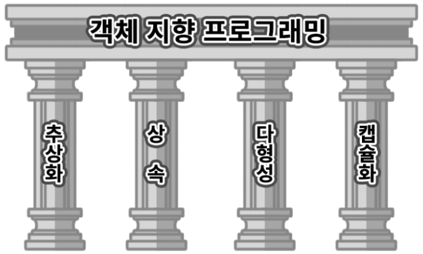
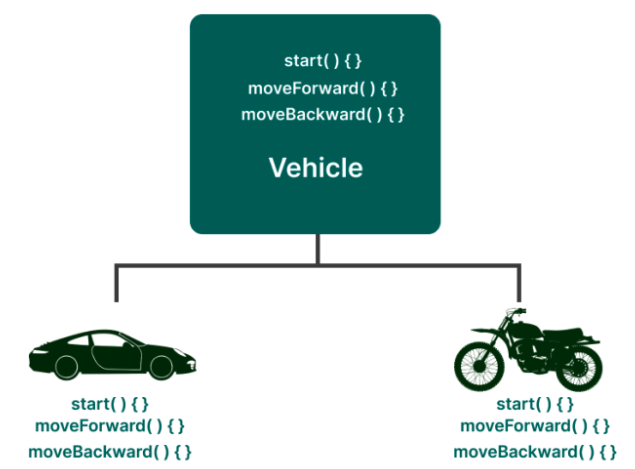
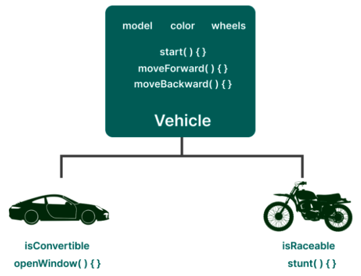
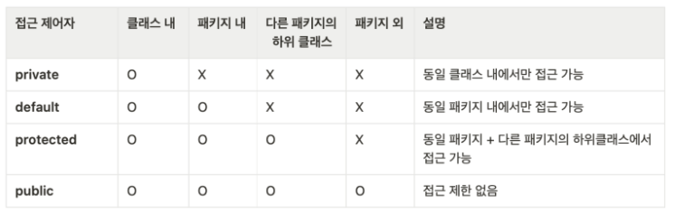

# [객체지향프로그래밍(Object Oriented Programming)](https://www.codestates.com/blog/content/%EA%B0%9D%EC%B2%B4-%EC%A7%80%ED%96%A5-%ED%94%84%EB%A1%9C%EA%B7%B8%EB%9E%98%EB%B0%8D-%ED%8A%B9%EC%A7%95)
객체 지향 프로그래밍(Object-Oriented Programming, OOP)이란 
- 컴퓨터 프로그램을 어떤 데이터를 입력받아 순서대로 처리하고 결과를 도출하는 명령어들의 목록으로 보는 시각에서 벗어나 
- 여러 독립적인 부품들의 조합, 즉 객체들의 유기적인 협력과 결합으로 파악하고자 하는 컴퓨터 프로그래밍의 패러다임을 의미합니다.

---
## 객체(Object)란?
- 책상, 의자, 시계, 전등, 책 등 우리가 주변에서 흔히 볼 수 있는 “모든 실재(實在)하는 대상”을 객체 지향 프로그래밍 언어에서는 객체라고 부릅니다.
- 사실 객체의 범주에는 우리 눈에 보이는 유형의 대상뿐만 아니라 눈에 보이지 않는 어떤 논리, 사상, 철학, 개념, 공식 등과 같은 무형의 대상들도 포함될 수 있습니다. 
- 한 마디로, 객체는 우리가 보고 느끼고 인지할 수 있는 그 모든 것을 의미한다고 할 수 있습니다.

---
객체 지향 프로그래밍에서는 아래와 같은 각각의 객체를 추상화시켜 속성(state)과 기능(behavior)으로 분류한 후에 이것을 다시 각각 변수(variable)와 함수(function)로 정의하고 있습니다.
```java
// 객체(클래스) 정의 
class Car {
  // 속성(변수) 정의 
  String company;
  String color;
  int wheels;
  boolean isConvertible;
  // 기능(함수) 정의 
  void startEngine() {
    System.out.println("시동을 겁니다.");
  }
  void moveEngine() {
    System.out.println("자동차가 앞으로 전진합니다.");
  }
}
```
---
## 클래스 생성자(Constructor) 
- new 연산자와 같이 사용되어 클래스로부터 객체를 생성할 때 호출되어 객체의 초기화를 담당한다. 
- 객체 초기화: 필드를 초기화하거나, 메소드를 호출해서 객체를 사용할 준비를 하는 것 

---
```java
class Car {
  // 속성(변수) 정의 
  String company;
  String color;

  // 기본 생성자(생략 가능)
  public Car() {
  }
  // 생성자 정의
  public Car(String company, String color) {
    this.company = company;
    this.color = color;
  }
}
```
```java
public static void main(String[] args) {
  Car car1 = new Car(); // 기본 생성자를 이용해서 생성 
  Car car2 = new Car("BMW", "Red"); // 생성자 정의를 이용해서 생성 
}
```

---
# 객체 지향 프로그래밍의 특징 



---
## 추상화(Abstration)
- 추상화는 객체에서 공통된 속성과 행위를 추출하는 기법이다.
- 다시 말해 실제 존재하는 객체들을 프로그램으로 만들기 위해 공통적인 특성을 파악하고 불필요한 특성을 제거하는 과정을 말한다.

---
아래 예시를 보면, 자동차와 오토바이는 모두 이동 수단이며 모든 이동 수단은 전진과 후진을 할 수 있다는 공통점을 가집니다.


---
- 위에서 본 살펴본 내용을 코드로 표현해보면 다음과 같습니다. 
- 참고로, 자바에서 추상화를 구현할 수 있는 문법 요소로는 추상 클래스(abstract class)와 인터페이스(interface)가 있는데, 
  - 이번 예제에서는 가장 빈번하게 사용되는 인터페이스를 사용해보겠습니다.

```java
public interface Vehicle {
  public abstract void start();
  void moveForward(); // public abstract 생략 가능 
  void moveBackward();
}
```

---
```java
// Car 클래스 
public class Car implements Vehicle {

  @Override
  public void moveBackward() {
    // TODO Auto-generated method stub
    System.out.println("자동차가 앞으로 전진합니다.");
  }

  @Override
  public void moveForward() {
    // TODO Auto-generated method stub
    System.out.println("자동차가 위로 후진합니다.");
  }

  @Override
  public void start() {
    // TODO Auto-generated method stub
    System.out.println("시동을 겁니다.");
  }
}
```
---
```java
// MotorBike 클래스 
public class MotorBike implements Vehicle {

  @Override
  public void moveBackward() {
    // TODO Auto-generated method stub
    System.out.println("오토바이가  앞으로 전진합니다.");
  }

  @Override
  public void moveForward() {
    // TODO Auto-generated method stub
    System.out.println("오토바이가 위로 후진합니다.");
  }

  @Override
  public void start() {
    // TODO Auto-generated method stub
    System.out.println("시동을 겁니다.");
  }
}
```


---
## 상속(Inheritance)
- 상속이란 상위클래스의 모든걸 하위 클래스가 이어 받는 것이다. 
- 즉, 이미 작성된 클래스(상위 클래스)의 특성을 그대로 이어받아 새로운 클래스(하위 클래스)를 생성하는 기법이다.

---


---
```java
public class Vehicle {

  String model; 
  String color;
  int wheels; 

  void moveForward() {
    System.out.println("전진합니다.");
  }
  void moveBackward() {
    System.out.println("후진합니다.");
  }
}
```
---
```java
public class Car extends Vehicle {

  boolean isConvertible;

  public void openWindow() {
    System.out.println("모든 창문을 엽니다.");
  }
}
```
---
```java
public class MotorBike extends Vehicle {

  boolean isRaceable;

  public void stunt() {
    System.out.println("묘기를 부립니다.");
  }
}
```
---
```java
public static void main(String[] args) {
    
  // 객체 생성 
  Car car = new Car();
  MotorBike bike = new MotorBike();

  // car 객체의 속성 정의 
  car.model = "테슬라";
  car.color = "빨강색";
  System.out.println("나의 자동차는 "+car.color+" "+car.model+"입니다.");

  //객체들의 기능 실행 
  car.moveForward();
  bike.moveForward();
  bike.moveBackward();

}
```
---
## 다형성(Polymorphism)
- 사전적 의미로는 다향한 형태로 나타날 수 있는 능력을 의미한다.
- 다형성은 같은 이름의 메소드를 호출하더라도 객체에 따라 다르게 동작하는 것을 말한다. 
- 상위 클래스의 동작을 하위 클래스에서 다시 정의하여(오버라이딩, Overriding)하는 것 또한 다형성으로 볼 수 있다. 

---


---
```java
public class MotorBike extends Vehicle {

  boolean isRaceable;

  @Override
  public void moveForward() {
    // 메서드 오버라이딩 -> 다형성을 활용한 기능 재정의 
    System.out.println("오토파이가 앞으로 전진합니다.");
  }

  public void stunt() {
    System.out.println("묘기를 부립니다.");
  }
}
```

---
```java
public static void main(String[] args) {
    
  // 객체 생성 
  Car car1 = new Car();
  Car car2 = new Car(); // 다형성을 활용한 객체 생성 
  MotorBike bike = new MotorBike();

  // car 객체의 속성 정의 
  car1.model = "테슬라";
  car1.color = "빨강색";
  System.out.println("나의 자동차는 "+car1.color+" "+car1.model+"입니다.");

  car2.model = "BMW";
  car2.color = "파랑색";
  System.out.println("나의 자동차는 "+car2.color+" "+car2.model+"입니다.");

  //객체들의 기능 실행 
  car1.moveForward();
  bike.moveForward();
  bike.moveBackward();

}
```
---
```java
public static void main(String[] args) {
    
  // 상위 클래스 타입의 객체 배열 생성 
  Vehicle vehicles[] = new Vehicle[2];
  vehicles[0] = new Car();
  vehicles[1] = new MotorBike(); 

  for (Vehicle vehicle: vehicles) {
    System.out.println(vehicle.getClass());
  }
}
```

---
## 캡슐화(Encapsulation)
- 캡슐화란 관련된 필드와 메소드를 하나로 묶고 실제 구현내용을 외부로부터 감추는 기법(private)으로 정보은닉할 수 있다. 
- 외부에서는 공개된 메소드(public)를 통해 접근할 수 있다. 

---
- 자바에서 캡슐화를 구현하는 방법으로 접근제어자(access modifiers)를 활용합니다. 
- 아래의 표에서 확인할 수 있는 것처럼, 접근 제어자의 접근 범위가 각각 클래스 내, 패키지 내, 다른 패키지의 하위 클래스, 그리고 패키지 외까지 각각 다른 것을 확인할 수 있습니다.
  - 보통 private, public을 많이 사용한다. 



---
```java
public class TestClass {
  private int a = 1;
  public int b = 2;

  private void add1() {
    System.out.println(a+b);
  }

  public void add2() {
    System.out.println(a+b);
  }
}
```

---
```java
public static void main(String[] args) {

    TestClass test = new TestClass();

    // System.out.println(test.a); // 오류 발생 
    System.out.println(test.b);
    // test.add1(); // 오류 발생 
    test.add2();
  }
```

---
### getter/setter
- getter/setter를 이용하여 private에 접근할 수 있다. 
```java
public class TestClass {
  private int a = 1;
  public int b = 2;

  private void add1() {
    System.out.println(this.a+this.b);
  }

  public void add2() {
    this.add1();
  }

  public int getA() {
    return a;
  }

  public void setA(int a) {
    this.a = a;
  }
}
```


