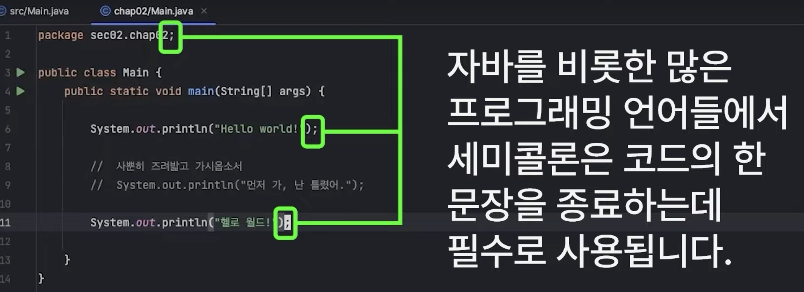

# 코드 종료시에는 세미콜론을 작성한다!

---
# [java 자료형1](./java%20자료형1.md)
- 변수 & 상수 
- 정수형
- 실수형 
- 불리언형 
- 문자형 
---
# [java 자료형2](./java%20자료형2.md)
- array
- list
- map 
- set 

---
# [java 기본함수](./java%20기본함수.md)
- print
- Math
- Random

---
# [java 조건문](./java%20조건문.md)
- if else
  - 3항 연산자
  - 조건: &&, ||, ! 
- switch/case

---
# [java 반복문](./java%20반복문.md)
- for 
- while 
- for each 
- break, continue 

