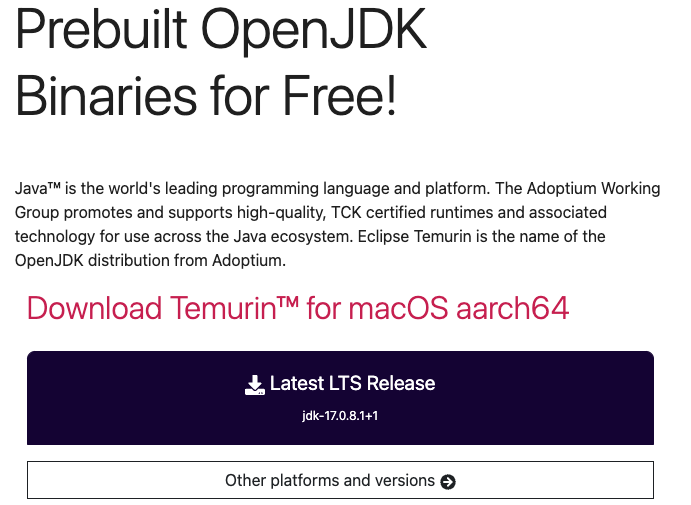
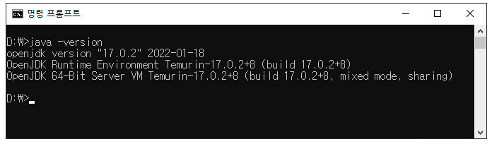
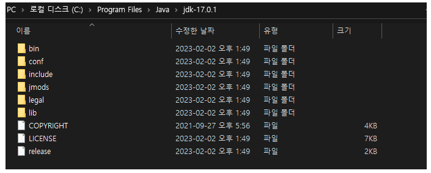
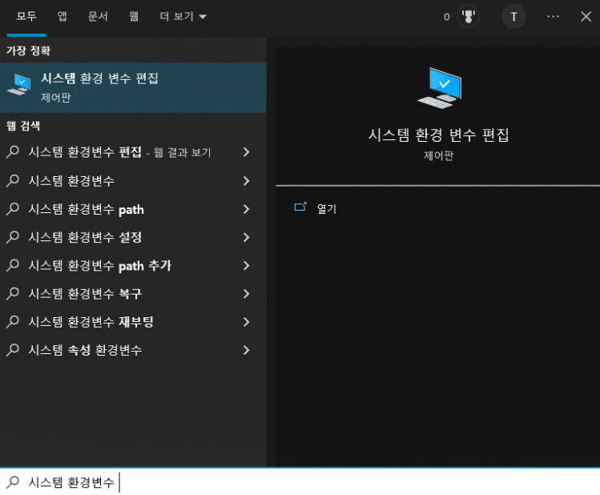
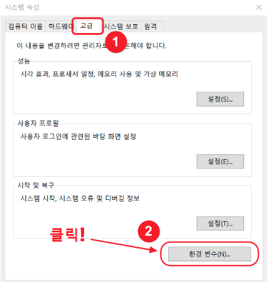
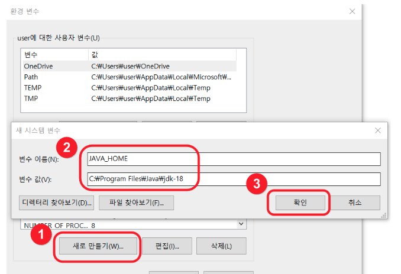
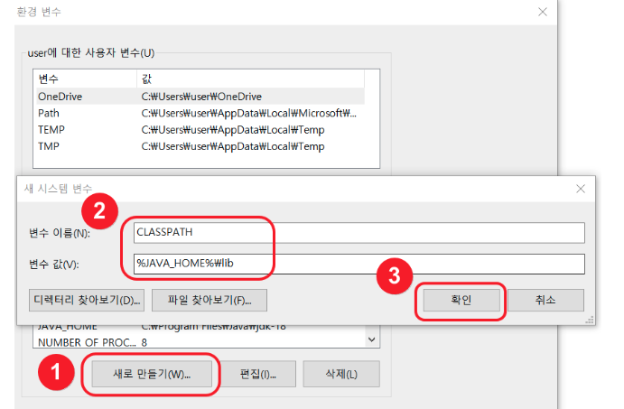
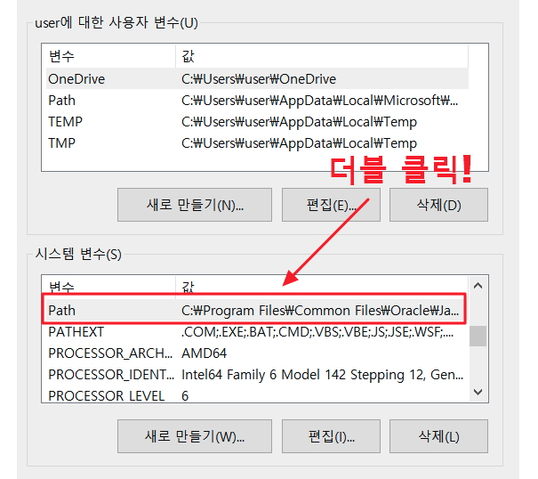
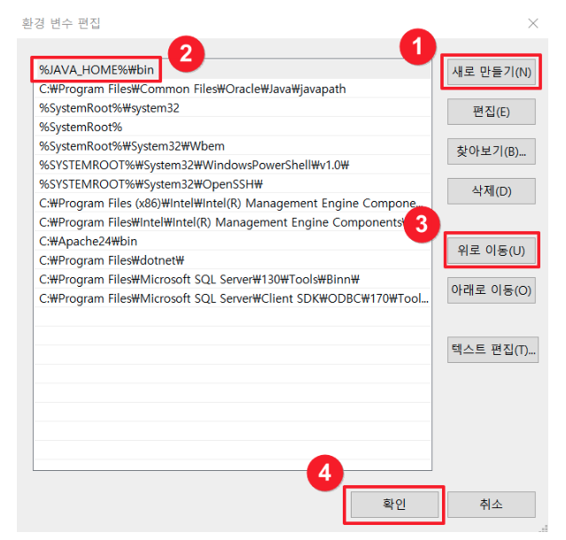

# [Java 설치방법](https://offbyone.tistory.com/436) 
Java가 오라클로 넘아가고 JDK가 유료화된 이후 다운로드를 할 수 있는 곳이 크게 2곳으로 늘어났다. (둘 중에서 편한 것으로 설치해주세요. ) 
- [Adoptium용 다운로드](https://adoptium.net/)
  - IBM, Microsoft, Red Hat 등 업체에서 참여하고 관리하고 있는 OpenJDK(무료버전)
- [Oracle용 다운로드](https://www.oracle.com/java/technologies/javase/jdk17-archive-downloads.html)
  - Oracle에서 관리하고 있는 JDK(유료버전)
  - 교육용은 무료임 

---
- LTS(Long Term Support)의 뜻은 장기 지원 버전의 의미로 장기간에 걸쳐 업데이터 패치등을 제공한다는 뜻입니다.

---
- java 버전확인 
  - Adoptium은 설치를 하면, 자동으로 환경변수 세팅이 됨
  - 버전확인 안된다면, 아래 java 환경변수 설정을 진행함..

---
# [Java 환경변수 설정](https://coding-factory.tistory.com/838)

1. jdk 설치 경로 복사 

---
2. 시스템 환경변수 

---
3. 고급 > 환경변수 

---
4. 환경변수 > 시스템 변수 > 새로 만들기 
- 변수이름: JAVA_HOME
- 변수값: java 설치폴더 

---
- 변수이름: CLASSPATH
- 변수값: %JAVA_HOME%\lib 

---
5. Path 추가 

---

---
- java 버전확인 

