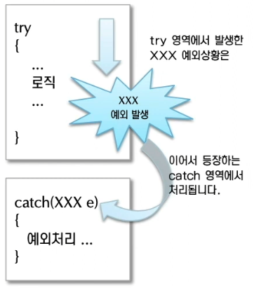
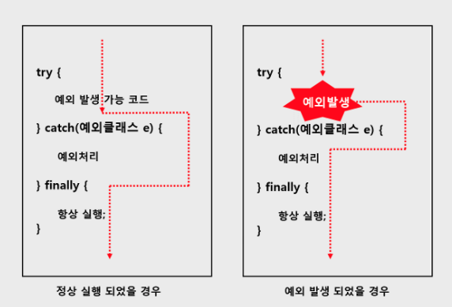
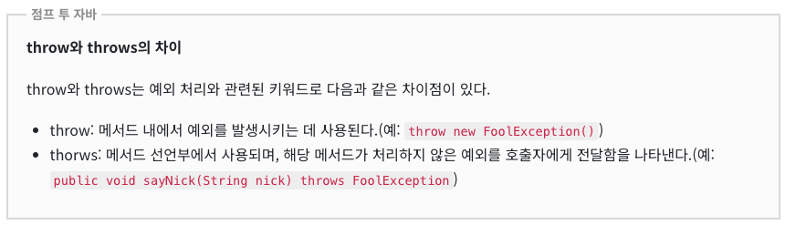
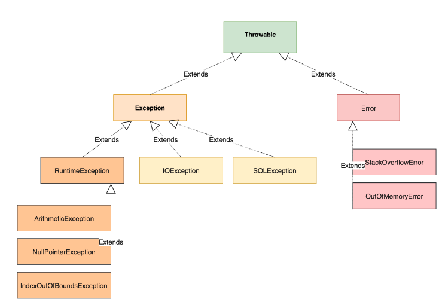

# java 예외처리
예외 처리(exception handling) 이란, 프로그램 실행 시 발생할 수 있는 예기치 못한 예외의 발생에 대비한 코드를 작성하는것이다.

## 참고문서
- [예외처리 문법 & 응용](https://inpa.tistory.com/entry/JAVA-%E2%98%95-%EC%98%88%EC%99%B8-%EC%B2%98%EB%A6%ACException-%EB%AC%B8%EB%B2%95-%EC%9D%91%EC%9A%A9-%EC%A0%95%EB%A6%AC)
- [예외처리](https://wikidocs.net/229)

---
## try - catch 
- try 블록에는 예외발생 가능 코드가 위치하고 만일 코드에 오류가 발생되면, 
  - 오류 종류(예외 클래스)에 맞는 catch 문으로 가서 catch 블록 안에 있는 코드를 실행 시킨다. 
  - 만일 오류가 발생하지 않으면 catch 문은 실행하지 않는다.



---
```java
public class Exception {
  public static void main(String[] args) {
    int a, b, c;
    try {
      a = 10;
      b = 0;
      c = a / b; // 10 나누기 0 → 산술오류 ArithmeticException
    } catch (ArithmeticException e) {
      c = -1;  // 예외가 발생하여 이 문장이 수행된다.
    }
  }
}
```

---
```java
public class Exception {
  public static void main(String[] args) {
    int a, b, c;
    try {
      // ... 길다란 코드
      // ... 길다란 코드
      // ... 길다란 코드
        
    } catch (NumberFormatException e) {
      System.out.println("숫자로 변환할 수 없습니다.");
    } catch (ClassNotFoundException e) {
      System.out.println("클래스가 존재하지 않습니다.");         
    } catch (Exception e) { // 부모 예외 클래스로 한꺼번에 처리했기 때문에 세세한 예외 클래스 종류는 지금은 알 수는 없다.
      System.out.println("NumberFormatException와 ClassNotFoundException 이외에 모르는 어떠한 에러가 발생하였습니다");
    }
  }
}
```

---
## try - catch - finally 
어떤 예외가 발생하더라도 반드시 실행되어야 하는 부분이 있어야 한다면 finally 문으로 처리가 가능하다.



---
```java
public class Sample {
  public void shouldBeRun() {
    System.out.println("ok thanks");
  }

  public static void main(String[] args) {
    Sample sample = new Sample();
    int c;
    try {
      c = 4 / 0;
    } catch (ArithmeticException e) {
      c = -1;
    } finally {
      sample.shouldBeRun();  // 예외에 상관없이 무조건 수행된다.
    }
  }
}

```

---
## 예외 던지기 

아래 코드에서 sayNick 메서드 뒷부분에 throws라는 구문을 이용하여 FoolException을 위로 보낼 수가 있다(이를 ‘예외를 뒤로 미루기’라고도 한다.).

---
```java
class FoolException extends Exception {
}

public class Sample {
  public void sayNick(String nick) throws FoolException {
    if("바보".equals(nick)) {
      throw new FoolException();
    }
    System.out.println("당신의 별명은 "+nick+" 입니다.");
  }

  public static void main(String[] args) {
    Sample sample = new Sample();
    try {
      sample.sayNick("바보");
      sample.sayNick("야호");
    } catch (FoolException e) {
      System.err.println("FoolException이 발생했습니다.");
    }
  }
}

```

---
## 커스텀 예외 만들기 
자바의 예외 클래스의 구성에 대해 완벽히 이해했다면 직접 사용자 커스텀 예외 클래스를 만들어 사용할 수 도 있다.


---
```java
// 사용자 커스텀 예외 클래스를 만들려면 부모 클래스인 Exception 클래스를 상속 하면 된다.
class MyErrException extends Exception {
  private String msg;

  // 사용자 커스텀 예외클래스 생성자
  public MyErrException(String msg) {
    super(msg); // 부모 Exception 클래스 생성자도 호출
    this.msg = msg;
  }

  // 사용자 커스텀 예외클래스 메세지 출력
  public void printMyMessage() {
    System.out.println(this.msg);
  }
}

public class Main {
  public static void main(String[] args) {
    try {
      throw new MyErrException("나의 커스텀 예외 클래스 메세지"); // 커스텀 예외 클래스 발생
    } catch (MyErrException e) {
      e.printMyMessage(); // 커스텀 예외 클래스의 메서드 실행
      e.printStackTrace(); // 상속한 부모클래스의 메서드 실행
    }
  }
}
```
