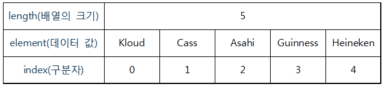
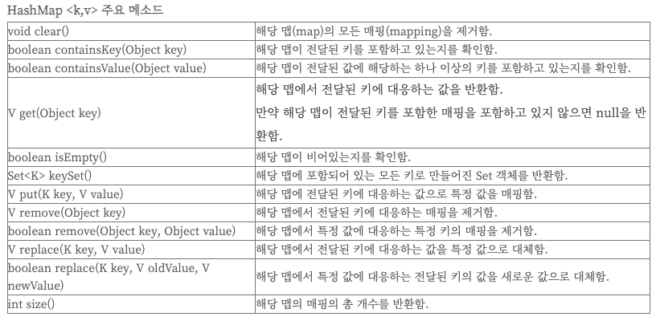

# [java 배열(Array)](https://m.blog.naver.com/heartflow89/220950491600)
동일한 자료형(Data Type)의 데이터를 연속된 공간에 저장하기 위한 자료구조이다. 
즉, 연관된 데이터를 그룹화하여 묶어준다고 생각하면 된다. 

---
- 자료형[] 변수 = {데이터1, 데이터2, 데이터3, ... };

```java
String[] beer = {"Kloud", "Cass", "Asahi", "Guinness", "Heineken"};

System.out.println(beer[0]); // Kloud
System.out.println(beer[1]); // Cass

for (int i=0; i < beer.length; i++) {
  System.out.println(beer[i]);
}
```
---
- 자료형[] 변수 = new 자료형[배열 크기];
```java
int[] score = new int[3]; // 크기가 3인 배열 생성
score[0] = 10; // 0번 index에 값 할당
score[1] = 15; // 1번 index에 값 할당
score[2] = 13; // 2번 index에 값 할당

int sum = 0;
for (int i = 0; i < score.length; i++) { // score.length = 5
  sum += score[i]; // sum = sum + score[i];
}

double avg = (double) sum / score.length; // 형변환
System.out.println("점수 합계 : " + sum);
System.out.println("점수 평균 : " + avg);
```
---
# [java 리스트(list)](https://velog.io/@sunnamgung8/%EC%9E%90%EB%B0%94List%EC%BB%AC%EB%A0%89%EC%85%98)
리스트(List)란 저장된 요소들의 순서가 있고 데이터에 중복이 가능하고 인덱스(index) 번호에 의해서 정렬됩니다. (배열과 비슷한 동작을 합니다.)

## 리스트의 특징 
  - 리스트는 크기 조절이 가능하다. 
  - 리스트는 초기 크기를 지정하지 않아도 된다.
  - 리스트는 LinkedList와 ArrayList로 나눠진다. 

---
## 리스트 사용법 
```java
import java.util.ArrayList;  // ArratList 선언 시
import java.util.LinkedList; // LinkedList 선언 시
import java.util.List;

// 생성방법 
List<자료형> lst1 = new ArrayList<자료형(생략가능)>();
List<자료형> lst2 = new LinkedList<자료형(생략가능)>();

// 삽입 
lst1.add("1");
lst1.add(0, "2"); // 0번째에 "2" 삽입 
// 치환 
lst1.set(0, "5"); // 0번째에 "5"값으로 치환 
// 출력 
lst1.get(0); // 0번째 값 출력 
lst1.size(); // 리스트 크기 출력 
// 삭제 
lst1.remove(0); // 0번째 삭제 
lst1.clear(); // 모든 요소 삭제 

```
---
## ArrayList
ArrayList는 요소를 순차적으로 추가하는 게 특징입니다. 배열과 매우 유사하며 배열은 배열 선언 시 크기도 같이 지정해 줘야 하는 반면 ArrayList는 크기를 지정하지 않아도 되며 추가될 때마다 크기가 정해집니다.

---
```java
List<Integer> lst = new ArrayList<>();
// 데이터 타입 - random 클래스
Random ran = new Random();
for (int i = 0; i < 5; i++) {
  lst.add(ran.nextInt(30) + 1); // random에 +1을 안 해 주면 0 ~ 29까지만 사용된다.
}

lst.add(3, 35);
lst.set(0, 40);
lst.remove(4);

for (int i = 0; i < lst.size(); i++) {
  System.out.println(lst.get(i));
}
```
---
# [java Map](https://devlogofchris.tistory.com/41)
- Map 인터페이스를 구현한 Map 컬렉션 클래스들은 키와 값을 하나의 쌍으로 저장하는 방식(key-value 방식)을 사용합니다.
- 여기서 키(key)란 실질적인 값(value)을 찾기 위한 이름의 역할을 합니다.

## Map 특징 
- 요소의 저장 순서를 유지하지 않는다. 
- key: 중복 허용 X 
- value: 중복 허용 O
---
## Map 사용법 
- put메소드를 이용하여 입력한다.
```java
Map<String, String> map = new HashMap<String, String>();
map.put("people", "사람");
```
- get 메소드를 이용하면 value값을 얻을 수 있다
```java
System.out.println(map.get("people"));
```
---
- containsKey 메소드는 맵(Map)에 해당 키(key)가 있는지를 조사하여 그 결과값을 리턴한다.
```java
System.out.println(map.containsKey("people"));
```
- size 메소드는 Map의 갯수를 리턴한다.
```java
System.out.println(map.size());
```
- remove 메소드는 맵(Map)의 항목을 삭제하는 메소드로 key값에 해당되는 아이템(key, value)을 삭제한 후 그 value 값을 리턴한다.
```java
System.out.println(map.remove("people"));
```
---
## HashMap
- Map 컬렉션 클래스에서 가장 많이 사용되는 클래스 중 하나입니다.
- 해시 알고리즘(hash algorithm)을 사용하여 많은 양의 데이터를 검색하는데 검색 속도가 매우 빠르다.



---
```java
Map<String, String> map = new HashMap<String, String>();
map.put("people", "사람");
map.put("baseball", "야구");

System.out.println(map.get("people"));
System.out.println(map.containsKey("people"));
System.out.println(map.size());
System.out.println(map.keySet());  // [baseball, people] 출력
System.out.println(map.remove("people"));

```
---
# [java Set](https://godsu94.tistory.com/173)
집합(Set) 자료형은 집합과 관련된 것을 쉽게 처리하기 위해 만든 것이다.

## Set 특징 
- 데이터를 비순차적으로 저장할 수 있다. 
- 삽입한 데이터가 순서대로 저장되지 않음 
- 수정 가능 
- 중복해서 삽입이 불가 (동일한 값은 하나만 저장 가능)
---
- 집합 생성 
```java
import java.util.Arrays;
import java.util.HashSet;

public class Sample {
  public static void main(String[] args) {
    HashSet<String> set = new HashSet<>(Arrays.asList("H", "e", "l", "l", "o"));
    System.out.println(set);  //  [e, H, l, o] 출력
  }
}

```

---
- 교집합 
```java
import java.util.Arrays;
import java.util.HashSet;

public class Sample {
  public static void main(String[] args) {
    HashSet<Integer> s1 = new HashSet<>(Arrays.asList(1, 2, 3, 4, 5, 6));
    HashSet<Integer> s2 = new HashSet<>(Arrays.asList(4, 5, 6, 7, 8, 9));

    HashSet<Integer> intersection = new HashSet<>(s1);  // s1으로 intersection 생성
    intersection.retainAll(s2);  // 교집합 수행
    System.out.println(intersection);  // [4, 5, 6] 출력
  }
}

```
---
- 합집합 
```java
import java.util.Arrays;
import java.util.HashSet;

public class Sample {
  public static void main(String[] args) {
    HashSet<Integer> s1 = new HashSet<>(Arrays.asList(1, 2, 3, 4, 5, 6));
    HashSet<Integer> s2 = new HashSet<>(Arrays.asList(4, 5, 6, 7, 8, 9));

    HashSet<Integer> union = new HashSet<>(s1);  // s1으로 union 생성
    union.addAll(s2); // 합집합 수행
    System.out.println(union);  // [1, 2, 3, 4, 5, 6, 7, 8, 9] 출력
  }
}
```
---
- 차집합 
```java
import java.util.Arrays;
import java.util.HashSet;

public class Sample {
  public static void main(String[] args) {
    HashSet<Integer> s1 = new HashSet<>(Arrays.asList(1, 2, 3, 4, 5, 6));
    HashSet<Integer> s2 = new HashSet<>(Arrays.asList(4, 5, 6, 7, 8, 9));

    HashSet<Integer> substract = new HashSet<>(s1);  // s1으로 substract 생성
    substract.removeAll(s2); // 차집합 수행
    System.out.println(substract);  // [1, 2, 3] 출력
  }
}
```
---
- add 메서드는 집합 자료형에 값을 추가할 때 사용한다.
```java
import java.util.HashSet;

public class Sample {
  public static void main(String[] args) {
    HashSet<String> set = new HashSet<>();
    set.add("Jump");
    set.add("To");
    set.add("Java");
    System.out.println(set);  // [Java, To, Jump] 출력
  }
}
```
---
- 값을 한꺼번에 여러 개 추가할 때는 addAll 메서드를 사용한다.
```java
import java.util.Arrays;
import java.util.HashSet;

public class Sample {
  public static void main(String[] args) {
    HashSet<String> set = new HashSet<>();
    set.add("Jump");
    set.addAll(Arrays.asList("To", "Java"));
    System.out.println(set);  // [Java, To, Jump] 출력
  }
}

```
---
- remove 메서드는 특정 값을 제거할 때 사용한다.
```java
import java.util.Arrays;
import java.util.HashSet;

public class Sample {
  public static void main(String[] args) {
    HashSet<String> set = new HashSet<>(Arrays.asList("Jump", "To", "Java"));
    set.remove("To");
    System.out.println(set);  // [Java, Jump] 출력
  }
}

```


