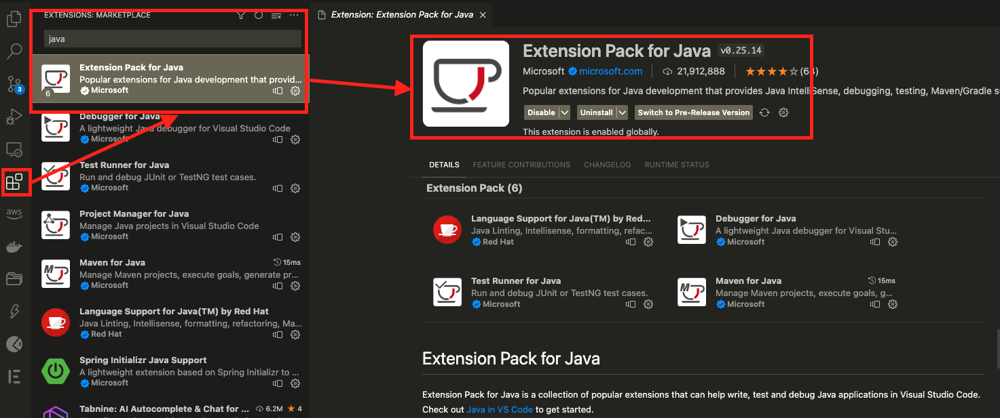
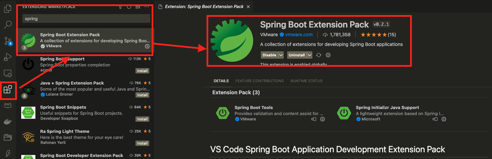
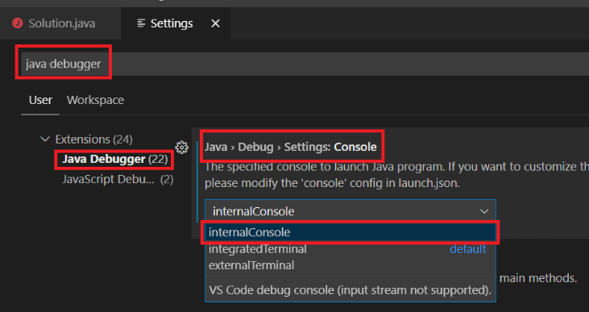
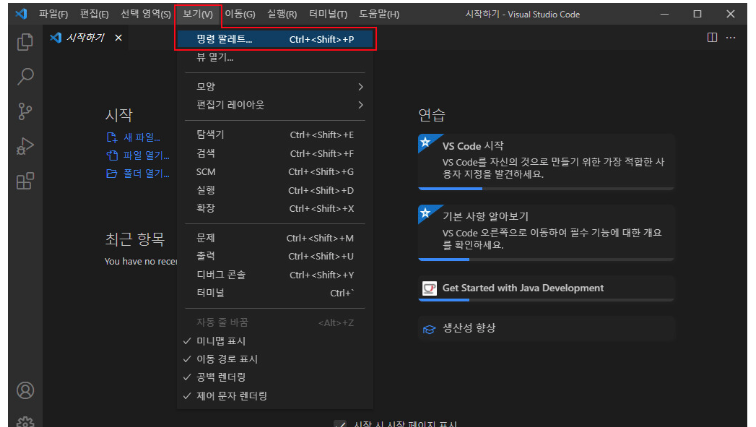
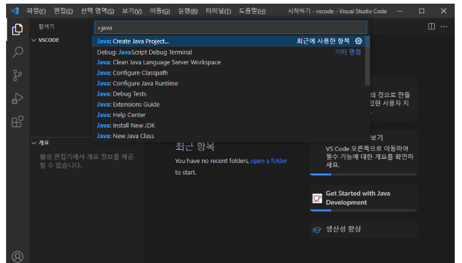
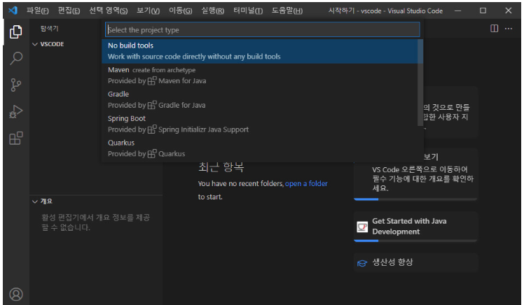

# [vscode with java 세팅](https://kim-oriental.tistory.com/22)

---
- 자바 익스텐션 설치



---
- 스프링 익스텐션 설치



---
- [Debug Console 설정](https://whitexs.tistory.com/72)



---
## [사용법]((https://code.visualstudio.com/docs/java/java-tutorial)) 
- 단축키: Ctrl + Shift + P


---
- Create java project


---
- build 선택 


---
# 단축키 
- psvm + 텝: main 메소드 생성 
- sout + 텝: print 메소드 생성 
```java
public class Main {
  // psvm + 텝 !!
  public static void main(String[] args) {
    
    // sout + 텝 !!
    System.out.println("Hello World");
  }
}
```
---
- Override 단축키
  - Ctr + .
- 자동 import 단축키 
  - Alt + Shift + o
