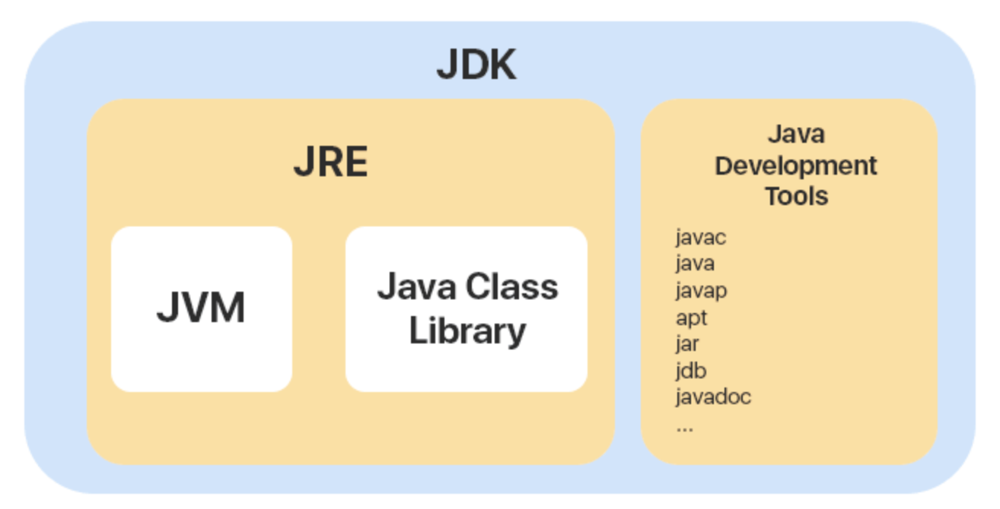
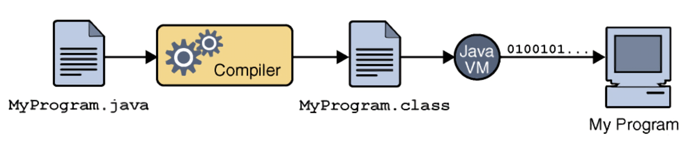
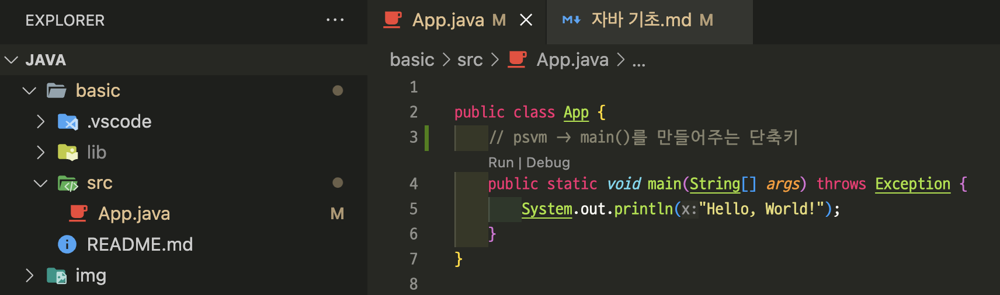
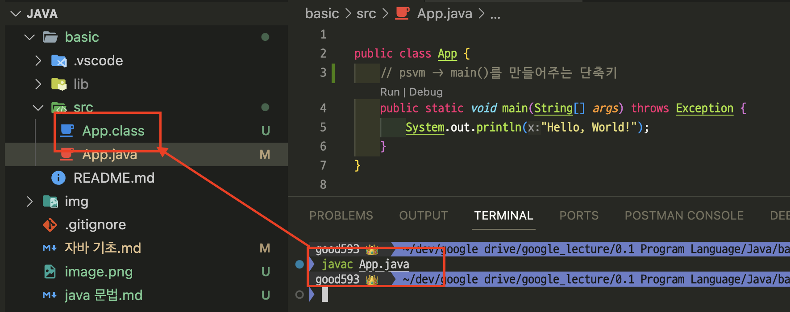
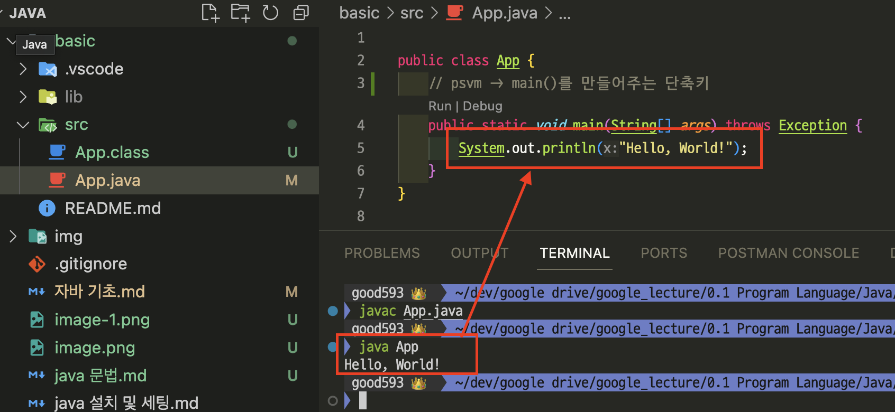
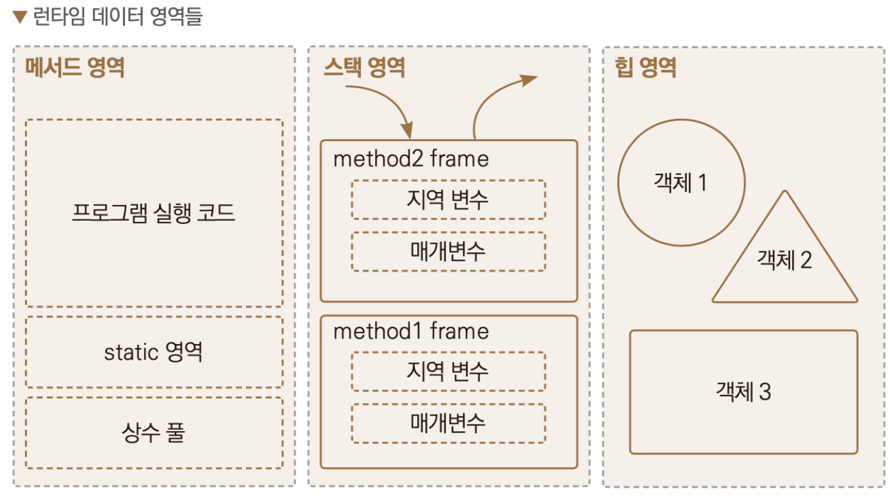

# [Java](http://www.tcpschool.com/java/java_intro_basic)
Java는 웹 애플리케이션 코딩에 널리 사용되는 프로그램 언어입니다.

---
## 자바의 장점 
- 자바는 운영체제와는 독립적으로 실행할 수 있습니다.
  - JVM을 통해서 독집적으로 실행할 수 있음 
- 자바는 자동 메모리 관리 등을 지원하여 다른 언어에 비해 안정성이 높습니다.
  - 가비지 컬렉션을 통해서 메모리 관리를 자동으로 처리할 수 있음 
- 자바에 관한 수 많은 참고 자료를 찾을 수 있습니다.
  - 20년이 넘는 기간동안 웹 애플리케이션에서 가장 많이 사용하는 언어임.

---
# [JDK / JRE / JVM](https://inpa.tistory.com/entry/JAVA-%E2%98%95-JDK-JRE-JVM-%EA%B0%9C%EB%85%90-%EA%B5%AC%EC%84%B1-%EC%9B%90%EB%A6%AC-%F0%9F%92%AF-%EC%99%84%EB%B2%BD-%EC%B4%9D%EC%A0%95%EB%A6%AC)


---
## JDK(Java Development Kit) 
- JDK는 자바 개발키트의 약자로 개발자들이 자바로 개발하는 데 사용되는 도구라고 생각하면 된다.

## JRE(Java Runtime Environment)
- JRE는 자바 실행환경의 약자로서, JVM과 자바 프로그램을 실행시킬 때 필요한 라이브러리들이 있다. 

---
## JVM(Java Virtual Machine)
- JVM은 자바 가상머신의 약자로서, 직역하면 자바를 실행하는 머신이라는 건데, 그냥 자바를 돌리는 프로그램 정도로 이해하면 된다. 
- 컴퓨터의 운영체제(윈도우, 리눅스 등)에 맞는 개발을 해야하지만, 자바는 JVM을 통해서 서로 다른 운영체제에서도 같은 코드로 동작할 수 있게 개발을 진행할 수 있다. 

---


---
## 자바 프로그램의 실행 과정 
- java 파일을 class 파일로 컴파일을 하고, 그 이후에 JVM이 컴퓨터 운영체제가 이해할 수 있는 바이너리 코드(0100100....)로 변환하는 과정을 통해서 실행하게 된다.


---
1. App.java 파일 
- psvm -> main()를 만들어주는 단축키 
- sout -> System.out.println()를 만들어주는 단축키 


---
2. Complier
- `javac App.java` -> App.class 


---
3. JVM 실행(class 파일 실행) 
- `java App` -> Hello, World!


---
- 만약, `java.lang.ClassNotFoundException` 오류가 발생한다면,
```shell
java -cp. Main
```


---
## [Garbage Collection](https://velog.io/@jkijki12/Java-%EA%B0%80%EB%B9%84%EC%A7%80%EC%BB%AC%EB%A0%89%ED%84%B0)
가비지 컬렉션은 자바의 메모리 관리 방법 중의 하나로 JVM의 Heap 영역에서 동적으로 할당했던 메모리 중 필요 없게 된 메모리 객체를 모아 주기적으로 제거하는 프로세스를 말한다.
- 장점
  - 이미 해제된 메모리에 접근하는 버그를 방지해준다.
  - 메모리 누수를 방지한다.
- 단점
  - 메모리가 해제되는 시점을 알 수가 없다.
  - 해제할 메모리를 결정하는데 비용이 든다.

---
## [Java(변수, 객체 등)와 메모리](https://goldenrabbit.co.kr/2021/11/03/%EC%9E%90%EB%B0%94-%EC%BD%94%EB%93%9C%EC%99%80-%EB%A9%94%EC%84%9C%EB%93%9C-%EC%8A%A4%ED%83%9C%ED%8B%B1-%EB%B3%80%EC%88%98-%EB%93%B1%EC%9D%80-%EB%A9%94%EB%AA%A8%EB%A6%AC%EC%9D%98-%EC%96%B4%EB%94%94/) 
- 자바는 메모리 공간의 효율성을 높이기 위해 메모리 공간을 여러 영역으로 나누게 됩니다.
  - 각 영역은 크게 메서드 영역, 스택 영역, 힙 영역으로 구분하여 사용합니다.

### 메서드 영역 
- static, 실행 코드 등이 포함되는 영역입니다.
### 스택 영역 
- 변수 등이 포함되는 영역입니다.
### 힙 영역 
- 클래스, 배열, new 연산자 등을 통해 만들어진 객체들이 포함되는 영역입니다. 
- 가비지 컬렉션이 처리하는 메모리 영역입니다. 

---



