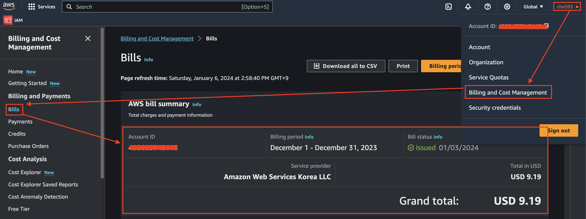
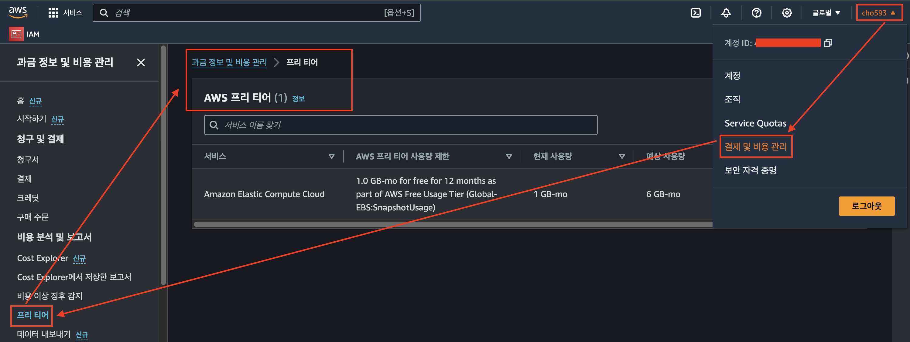
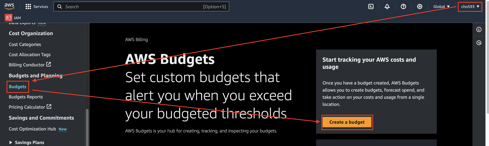
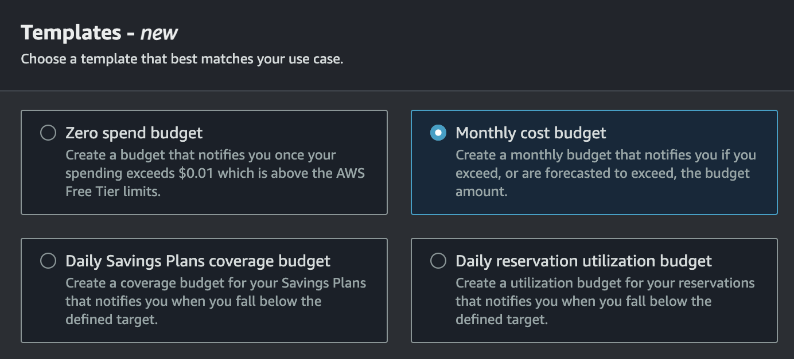
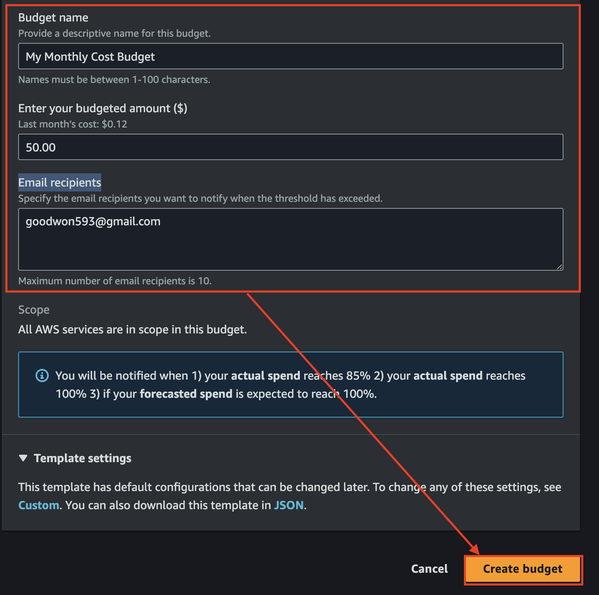
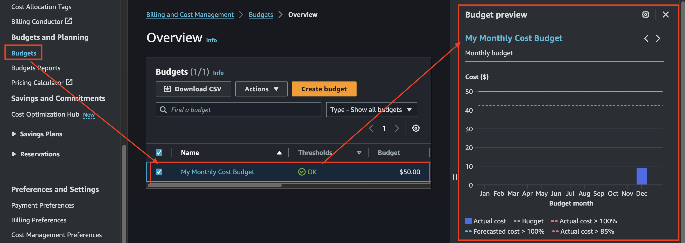
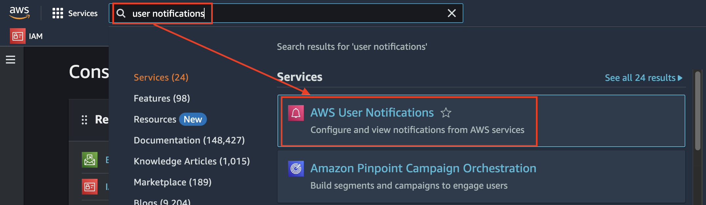
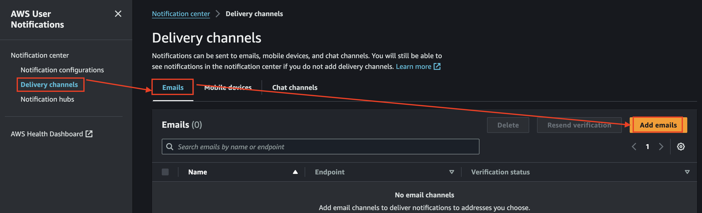
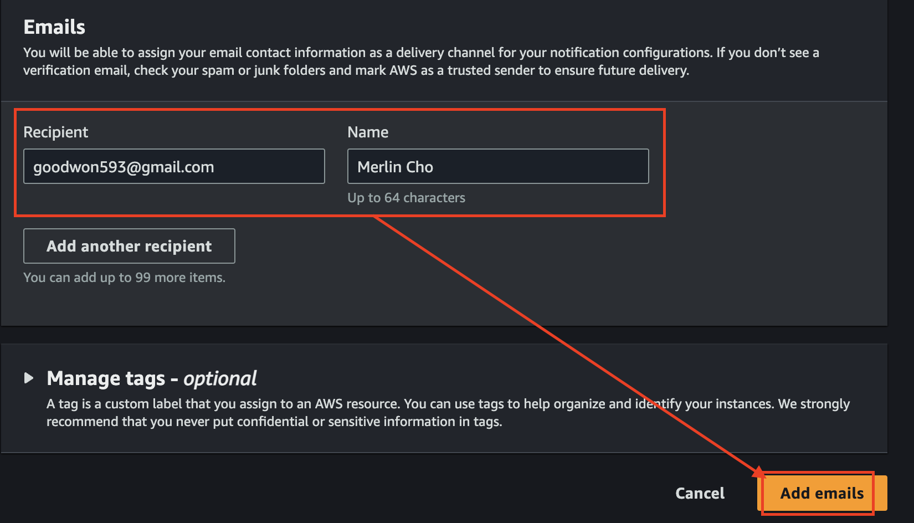

# AWS 기본 트랙픽 요금 정책 
- AWS에서 인터넷으로 데이터 전달은 월 100GB 무료(EC2, S3, ELB 등)
- 인터넷에서 AWS로 들어오는 트래픽은 언제나 무료 

---
# AWS 비용 확인 방법 

---
# [AWS 프리티어](https://aws.amazon.com/ko/free/?all-free-tier.sort-by=item.additionalFields.SortRank&all-free-tier.sort-order=asc&awsf.Free%20Tier%20Types=*all&awsf.Free%20Tier%20Categories=*all) 

### 항상 무료
언제나 월별 일정 사용량은 무료 
- 예: AWS Lambda 월 100만 요청 무료 
- 예: Amazon CloudFront 월 1TB 트래픽 무료, HTTP/HTTPS 천만건, CloudFornt 함수 200만건 무료 
- 예: Amazon DynamoDB(NoSQL DB 서비스) 월 25GB 저장공간, 월별 2억개 처리 용량 무료   

---
### 12개월 무료
AWS 계정 생성 후 12개월동안만 적용되는 혜택 
- 예: Amazon EC2 t3/t2.micro 월 750시간 무료 
- 예: Amazon RDS t2/t3/t4g.micro 월 750시간 무료 
### 무료평가
사용을 시작한 후 일정 기간 혹은 일정 사용량 사용 이후부터 요금을 청구하는 방식 
- Amazon QuickSight(AWS BI 시각화 툴): 처음 30일 무료 
- Amazon Lightsail(AWS의 컴퓨팅 파워를 쉽고 빠르게 프로비전): 처음 3개월, 월 750시간 무료 
- Amazon Chime(AWS의 커뮤니케이션 툴): 30일 동안 PRO 티어 무료 

---
## 프리티어 현재 사용량 확인 방법 

---
# AWS Budgets
- AWS에서 발생한 비용과 사용량을 추적하고 대응하는 서비스
- 사용자가 지정한 비용 이상으로 비용이 발생시 대응 가능 
  - SNS수신 가능 = Lambda를 활용해 다양한 대응 가능 
- 태그별 보고서 작성 가능 

---
## AWS Budgets 설정하기 
- AWS 계정을 바로 생성한 경우에는 사용이 불가(다음날 시도!!)

### 단계 1: Root 계정 접속 > Create budget

---
### 단계 2: Templates > Monthly cost budget

---
### 단계 3: Monthly cost budget 설정 
- Budget name: 생성할 Budget명 
- Enter your budgeted amount: 월 설정 금액 
- Email recipients: 알람받을 이메일 주소 

---
### 단계 4: 생성된 Budget 확인 

---
# AWS User Notification
- AWS의 각 서비스의 다양한 이벤트의 알림을 받아볼 수 있는 서비스
  - 예: EC2 인스턴스의 상태 변경 
  - 예: RDS의 파라메터 그룹 변경 
- 3가지 채널로 알람 가능 
  - Email, Mobile Device(AWS Console App), AWS Chatbot(Slack)

---
### 단계 1: AWS User Notifications 접속

---
### 단계 2: Delivery Channels > add emails 

---
- 알람을 받을 이메일 주소 추가하기 

---
- 등록된 이메일 주소 확인 전 

---

