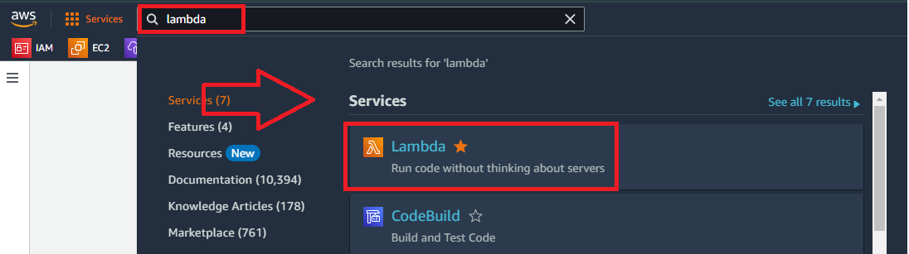
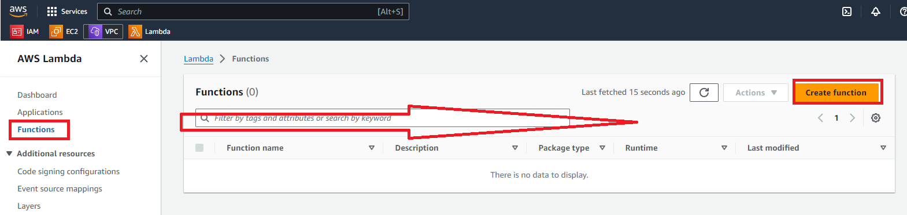
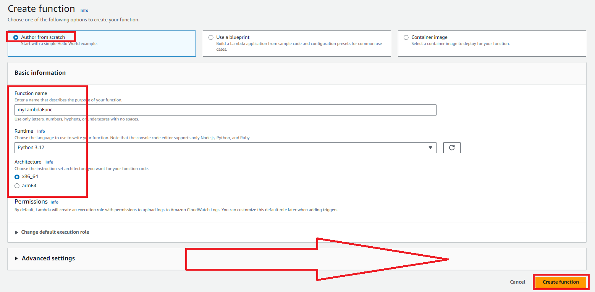
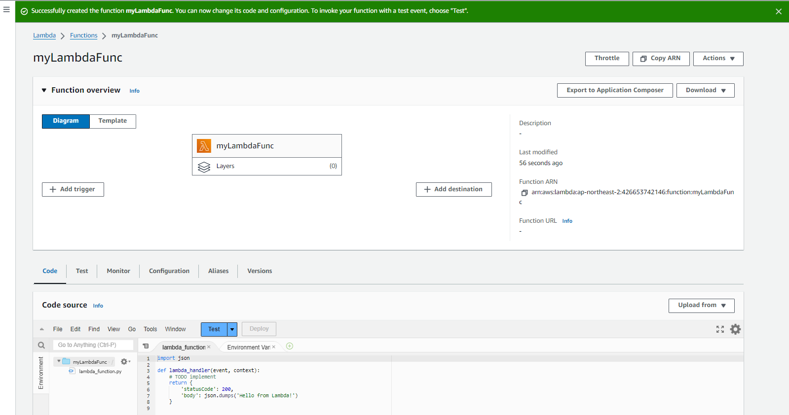
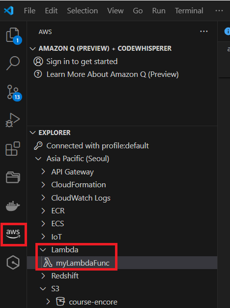
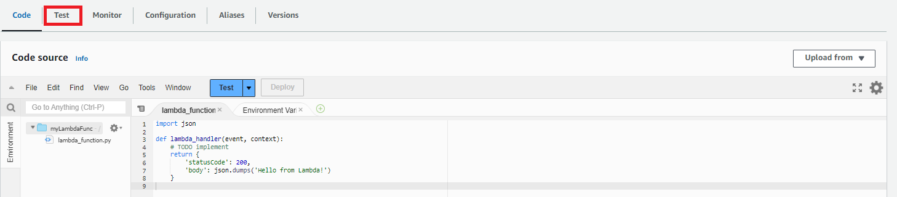
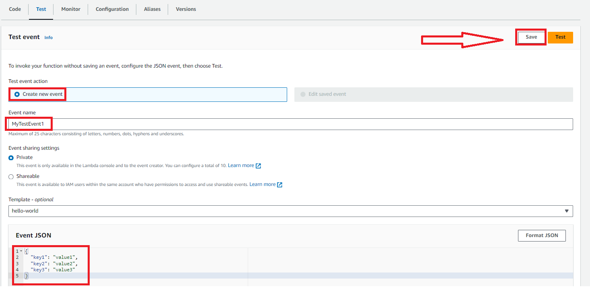
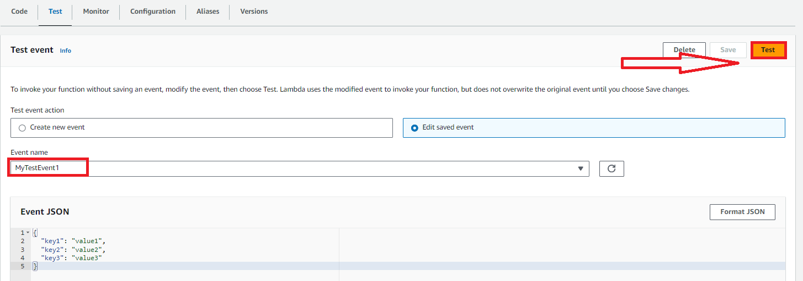
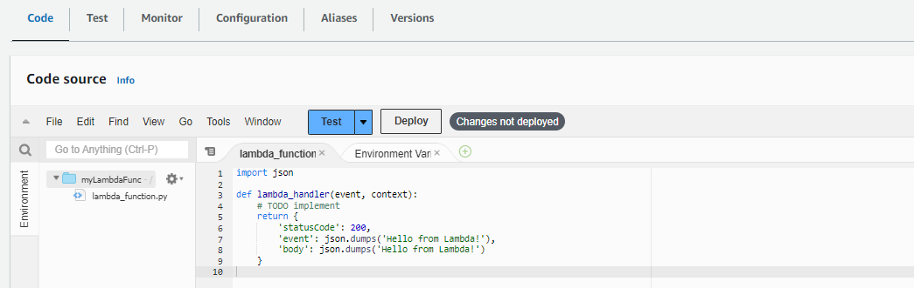
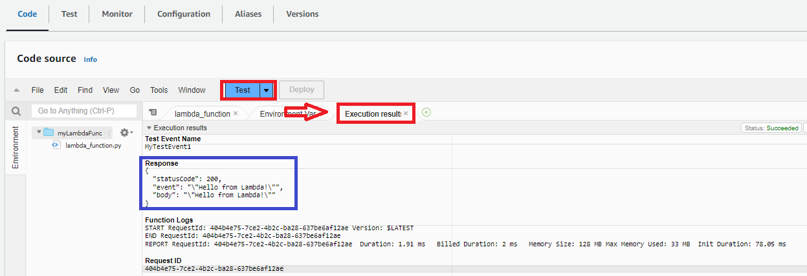

# Lambda 생성

---
### 단계1: aws 콘솔에서 lambda 접속하기 


---
### 단계2: Create function 클릭


---
### 단계3: Basic information 설정 및 생성 
- Function name(함수 이름): myLambdaFunc 
- Runtime(작성할 언어): Python
- Architecture(CPU 종류): x86_64
- execution role(권한): 생략 
 

---


---
### 단계4: VScode에서 생성된 Lambda 확인 


---
# Lambda Test

---
### 단계1: Test 클릭 


---
### 단계2: Test event 생성 


---
### 단계3: Test 실행  


---
### 단계4: Test 결과 확인 


---
# Lambda 소스 수정/배포/테스트

---
### 단계1: 소스 수정 
```python
import json

def lambda_handler(event, context):
    # TODO implement
    return {
        'statusCode': 200,
        'event': json.dumps('Hello from Lambda!'),
        'body': json.dumps('Hello from Lambda!')
    }

```


---
### 단계2: Deploy(배포)


---
### 단계3: 테스트 



