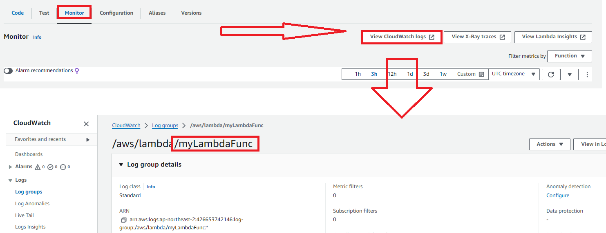
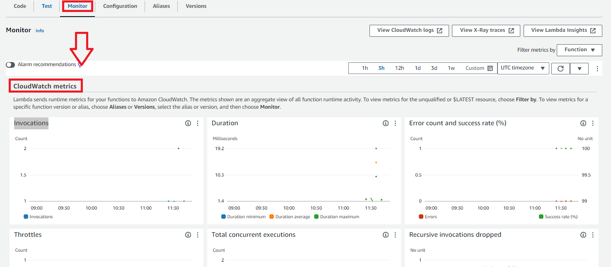

# [CloudWatch](https://docs.aws.amazon.com/ko_kr/AmazonCloudWatch/latest/monitoring/cloudwatch_architecture.html) > Lambda logs 

---
# [CloudWatch metrics](https://docs.aws.amazon.com/ko_kr/lambda/latest/dg/monitoring-metrics.html)

---
## 호출 지표 
- 호출 지표는 Lambda 함수 호출 결과의 이진 표시기입니다. 
- 예를 들어, 함수가 오류를 반환하면 Lambda에서 값이 1인 Errors 지표를 보냅니다. 
- 1분마다 발생한 함수 오류의 수를 확인하려면 1분의 기간에 대한 Sum 지표의 Errors를 확인합니다.

---
### Invocations
- 성공적인 호출 및 함수 오류를 유발하는 호출을 포함하여 함수 코드가 호출된 횟수입니다. 
### Errors
- 함수 오류가 발생하는 호출 수. 함수 오류에는 코드에서 발생하는 예외와 Lambda 런타임에서 발생하는 예외가 포함됩니다. 
### Throttles  
- 제한된 호출 요청 수

---
## 성능 지표
- 성능 지표는 단일 함수 호출에 대한 성능 세부 정보를 제공합니다. 
- 예를 들어, Duration 지표는 함수가 이벤트를 처리하는 데 소요되는 시간(밀리초)을 나타냅니다. 
- 함수가 이벤트를 처리하는 속도를 확인하려면 Average 또는 Max 통계와 함께 이러한 지표를 살펴봅니다.

---
### Duration 
– 함수 코드가 이벤트를 처리하는 데 소요되는 시간.
– Duration에는 콜드 시작 시간이 포함되지 않습니다.
### PostRuntimeExtensionsDuration 
– 함수 코드가 완료된 후 런타임이 확장을 위해 코드를 실행하는 데 소비하는 누적 시간입니다.

