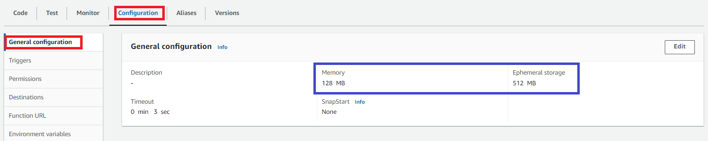
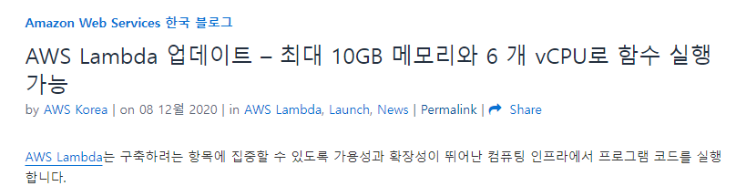
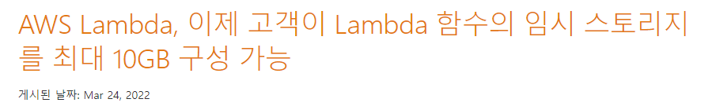
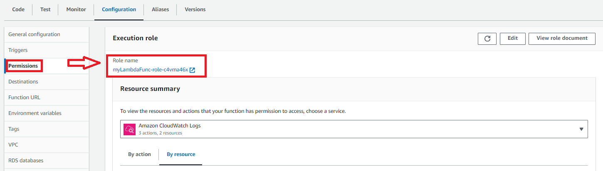
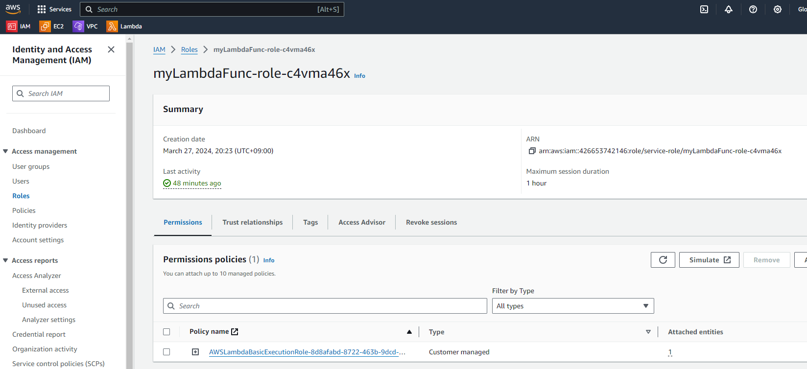
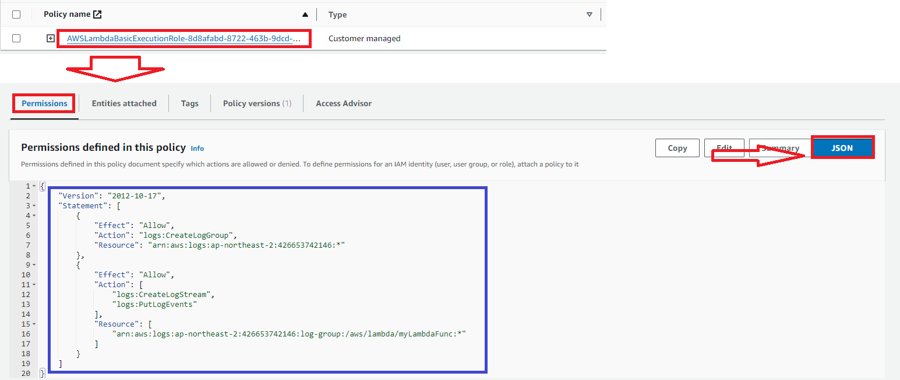

# General configuration

---
### [Lambda Max Memory](https://aws.amazon.com/ko/blogs/korea/new-for-aws-lambda-functions-with-up-to-10-gb-of-memory-and-6-vcpus/) 

### [Lambda Max Storage](https://aws.amazon.com/ko/about-aws/whats-new/2022/03/aws-lambda-configure-ephemeral-storage/)

---
# Execution Role

---
### IAM > Role 확인 

---
- Role 상세 내용 확인 

