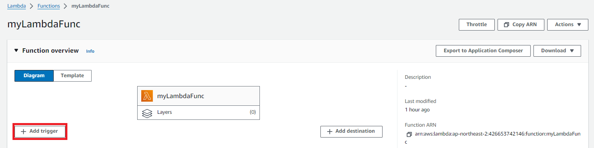
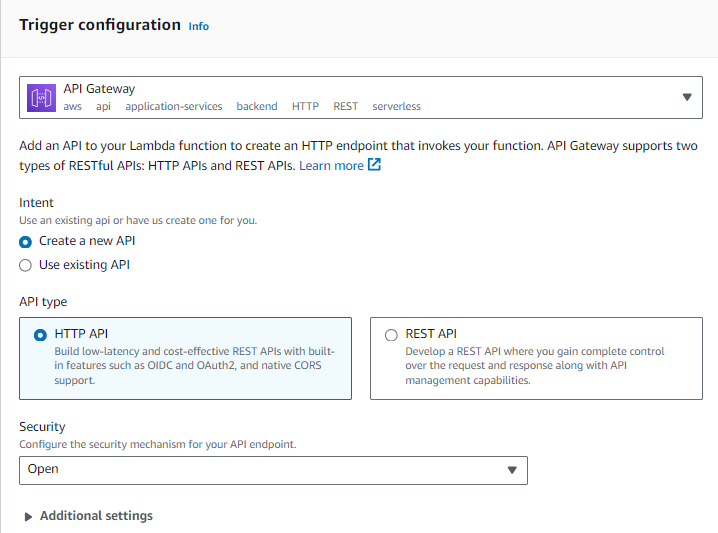
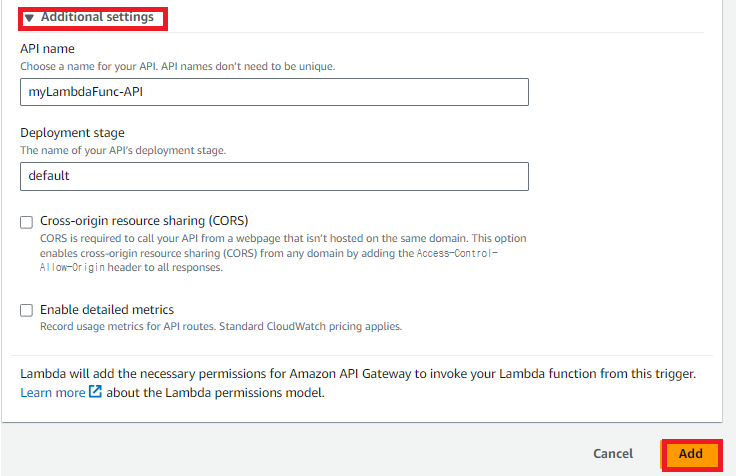
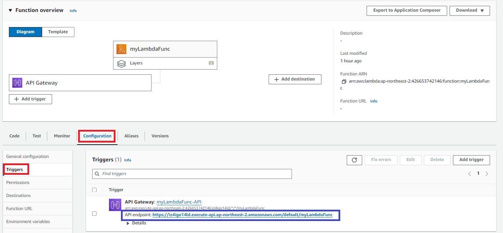
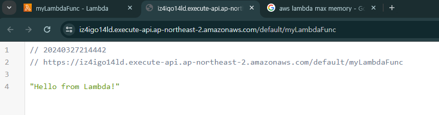
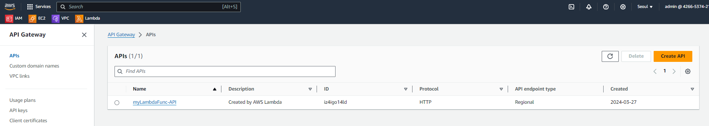

### 단계1: Add trigger

---
### 단계2: Trigger configuration
- Intent: Create a new API
- API type: HTTP API
- Security: Open

---
### 단계3: Additional settings

---
### 단계4: API Gateway > API endpoint 확인 

---
### 단계5: API endpoint 클릭 > 테스트 

---
### 단계6: API Gateway 이동

---
### 단계7: 생성된 API G/W 확인  

