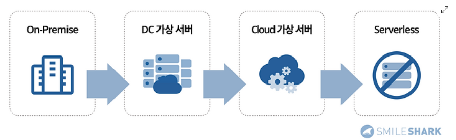
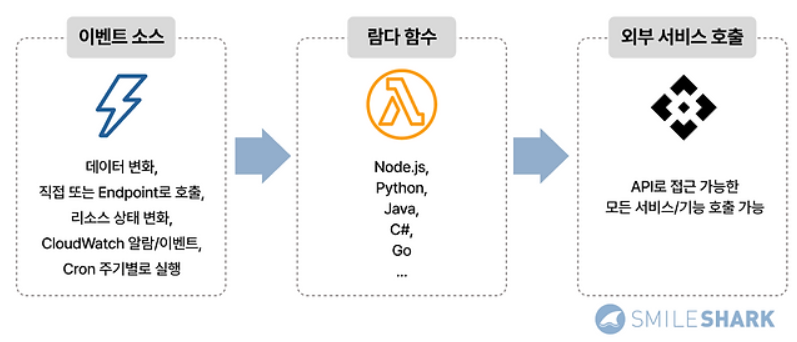
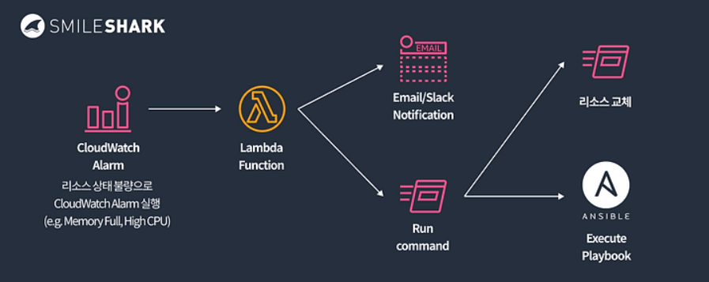
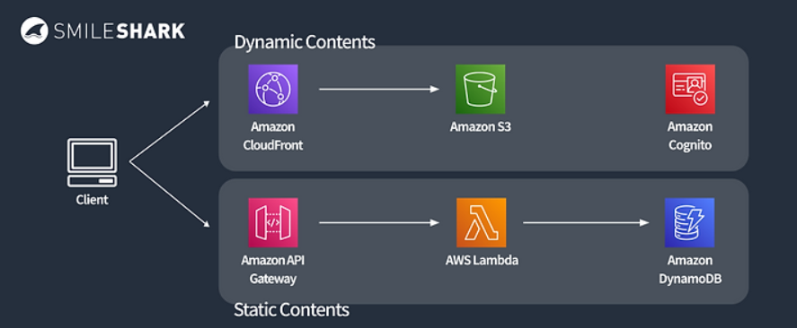
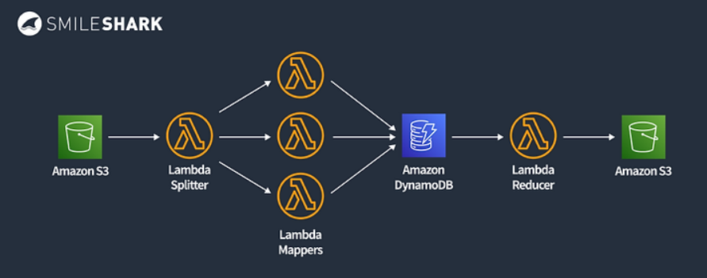
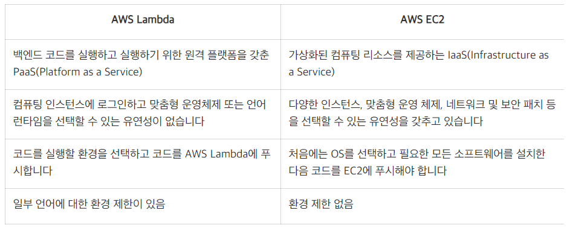

# [AWS Lambda](https://www.smileshark.kr/post/all-about-aws-lambda-the-complete-beginners-guide-1)

---
### 서버리스 컴퓨팅이란?
- AWS 람다(Lambda)는 서버리스 컴퓨팅 서비스입니다. 
- 여기서 서버리스 컴퓨팅이란 서버의 설정과 관리 없이 백엔드 서비스를 운영할 수 있게 해주는 클라우드 컴퓨팅 실행 모델입니다. 

---
### 람다 함수
- 함수는 Lambda에서 코드를 실행하기 위해 호출할 수 있는 리소스입니다.
- 함수에는 함수에 전달하는 이벤트 또는 다른 AWS서비스에서 보낸 이벤트를 처리하는 코드가 포함되어 있습니다.
### 이벤트 트리거(이벤트 소스)
- AWS Lambda는 이벤트를 처리하기 위해 함수 인스턴스를 실행합니다. 함수는 Lambda API를 사용하여 직접 호출할 수 있으며 AWS 서비스 및 리소스를 설정하여 함수를 호출할 수도 있습니다.
- AWS Lambda 함수는 HTTP 요청, 데이터 상태 번역, 파일 업로드 등 다양한 이벤트에 의해 트리거 됩니다.

---
### AWS Lambda 작동 원리
1. 먼저 함수를 생성하고, 해당 함수를 사용되는 프로그래밍 언어와 같은 기본 정보를 서비스에 추가 
2. 그런 다음 람다 편집기에서 코드를 작성하거나 소스 코드를 zip 파일로 업로드 
3. 람다 코드가 업로드되면 서비스가 모든 용량 확장, 패치 및 인프라 관리를 처리

---
### Lambda 장점 
- 서버리스 아키텍처
  - AWS Lambda(람다)를 사용하면 서버 관리에 대한 부담 없이 개발에 집중할 수 있습니다. 
- 비용 효율적
  - AWS Lambda는 실제로 사용한 컴퓨팅 자원에 대해서만 비용을 지불하게 됩니다. 
- AWS 서비스와의 통합
  - 다른 AWS 서비스와 원활하게 통합되어 함수를 호출하거나 다른 작업을 수행합니다.

---
### Lambda 단점 
- 실행 시간 제한
  - 람다의 최대 실행 시간 제한은 15분(=900초), 최대 메모리는 10GB(=10,240MB)로 제한되어 있습니다. 
  - 따라서 15분 이상의 긴 작업의 경우 제한되어 장기 실행 프로세스에는 적합하지 않습니다. 
- Stateless(상태비저장)² 
  - 일반적으로 람다 함수는 상태비저장(Stateless) 코드로 실행됩니다. 
  - 떄문에 별도의 상태를 저장하지 않아 이전 이벤트 실행 컨텍스트에 대한 액세스 권한이 없어 DB Connection을 유지하는 기능을 수행할 수 없습니다.

---
- 동시성 제한  
  - 기본적으로 람다는 동시에 실행할 수 있는 람다 함수의 개수를 각 리전별 최대 1,000개로 제한하고 있습니다. 
  - 따라서 request의 수가 이를 넘어가게 되면 람다가 수행되지 않는 문제가 발생할 수도 있습니다. 
- ColdStart 현상
  - 람다는 서버리스 서비스로 효율적인 리소스 사용을 위해 오랫동안 사용하지 않는 경우 컴퓨팅 파워를 꺼두게 됩니다.

---
# AWS Lambda의 사용 사례

---
### 시스템 운영 자동화 

---
### 웹 애플리케이션

---
### Serverless Batch Processing

---
### 실시간 파일 처리

---
# AWS Lambda와 EC2의 차이점

---
### AWS Lambda를 언제 사용해야 합니까?
- `복잡도가 낮은 코드`: Lambda는 최소한의 변수와 타사 종속성을 사용하여 코드를 실행하기 위한 완벽한 선택입니다. 복잡도가 낮은 코드가 포함된 쉬운 작업을 간소화된 방식으로 처리할 수 있습니다.
- `실행 시간 단축`: Lambda는 가끔식 발생하는 작업을 실행하는 데 적합하며 몇 분 내에 실행될 수 있습니다.
- `드문 트래픽`: 기업은 서버가 유휴 상태일 때 이를 싫어하며 여전히 비용을 지불해야 합니다. 기능별 지불 모델은 컴퓨팅 비용을 크게 절감하는 데 도움이 될 수 있습니다.
- `실시간 처리`: AWS Kinesis와 함께 사용되는 Lambda는 실시간 배치 처리에 가장 적합합니다.
- `예약된 CRON 작업`: AWS Lambda 기능은 예약된 이벤트가 정해진 예약 시간에 작동하도록 하는 데 적합합니다. 

---
### AWS EC2를 언제 사용해야 합니까?
- `고성능 컴퓨팅`: 다수의 EC2 인스턴스를 통해 기업은 요구 사항을 충족하는 가상 서버를 생성할 수 있습니다. 이로 인해 EC2는 복잡한 작업을 처리하는 데 완벽하게 적합합니다.
- `재해 복구`: EC2는 능동환경과 수동환경 모두에서 재해 복구를 위한 매체로 활용되고 있습니다. 긴급 상황 발생 시 쉽게 켤 수 있어 가동 중지 시간이 최소화됩니다. 
- `DevOps`: DevOps 프로세스는 EC2와 관련하여 완전한 방식으로 개발되었습니다. 
- `개발 및 테스트`: EC2는 온디맨드 컴퓨팅 리소스를 제공하므로 기업은 하드웨어에 대한 사전 투자가 없더라도 대규모 테스트 환경을 배포할 수 있습니다.
- `보안 환경`: EC2는 뛰어난 보안을 제공하는 것으로 알려져 있습니다. 

