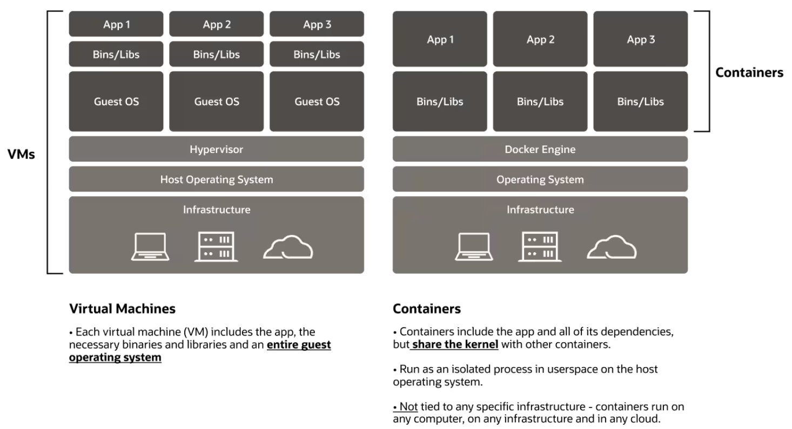
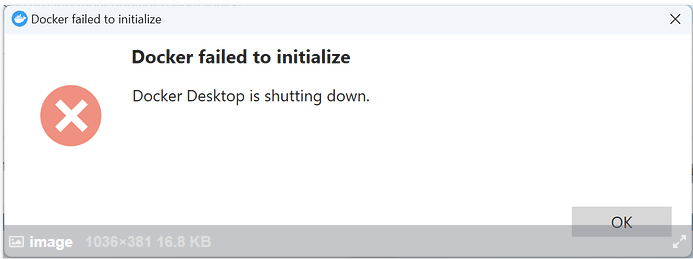
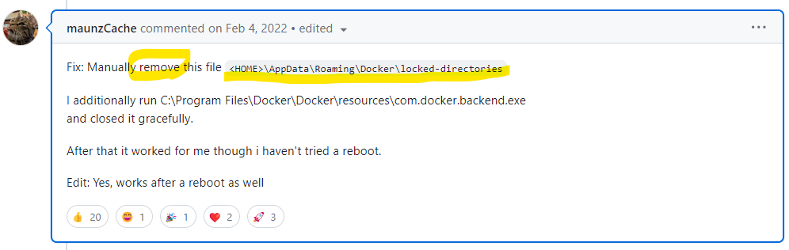

# [Docker](https://www.docker.com/)
- Docker는 개발자가 컨테이너를 빌드, 배포, 실행, 업데이트, 관리할 수 있는 오픈 소스 플랫폼입니다. 
- 컨테이너란 표준화되고 실행 가능한 구성요소로 애플리케이션 소스 코드와 이 코드를 임의의 환경에서 실행하는 데 필요한 운영 체제(OS) 라이브러리 및 종속 항목을 조합한 것입니다.

## 참고문서
- https://www.ibm.com/kr-ko/topics/docker
- https://www.oracle.com/kr/cloud/cloud-native/container-registry/what-is-docker/

---
## 주요 용어 정리 
- DockerFile
  - Docker 이미지의 빌드 방법에 관한 지시사항이 포함된 파일입니다.
- Docker 이미지
  - 소프트웨어 실행시 필요한 모든 것들(소스코드, 라이브러리 등)이 포함되어 있습니다.
- Docker 컨테이너 
  - Docker 이미지의 현재 실행 중인 라이브 인스턴스입니다. 
- Docker Hub 
  - Docker Hub는 공용 Docker 이미지 저장소입니다. 

---
## Virtual Machines vs Containers
- Containers는 Virtual Machines와 달리 호스트 운영체제의 커널에서 실행됩니다. 
- 즉, Docker Contianer는 OS(운영체제)가 필요없습니다. 

아래는 Virtual Machines고 Docker Containers의 비교 이미지입니다.

---

---
# [Docker 설치하기](./docker_install.md) 

---
# [Docker 기본명령어](./docker_basic.md) 
## 사용법 
- https://cultivo-hy.github.io/docker/image/usage/2019/03/14/Docker%EC%A0%95%EB%A6%AC/
- https://pyrasis.com/Docker/Docker-HOWTO

---
# [Dockerfile](./docker_file.md)

---
# [Docker Compose](./docker_compose.md)

---
# [Docker failed to initailize](https://github.com/docker/for-win/issues/12523#issuecomment-1029156833)

---
## 예제 
- https://subicura.com/2017/01/19/docker-guide-for-beginners-1.html
- https://khj93.tistory.com/entry/Docker-Docker-%EA%B0%9C%EB%85%90

