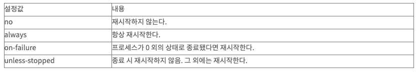
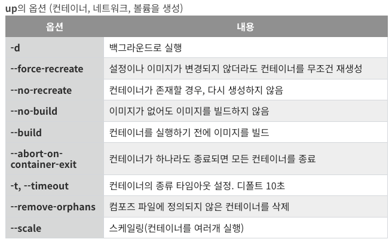
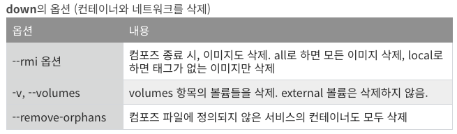

# [Docker Compose](https://docs.docker.com/compose/compose-file/)
- 여러 개의 명령어를 하나의 yaml파일로 정리해서, 한번에 시스템 전체를 실행하고 종료와 폐기까지 시키는 방식.
- Dockerfile과의 차이점 
  - Dockerfile은 하나의 이미지를 만드는 방법이고, Docker Compose는 컨테이너+환경설정, 네트워크, 볼륨을 한 번에 만드는 방식이다. 
  - Dockerfile에서는 네트워크와 볼륨 생성 및 설정이 불가능하다.
- 쿠버네티스와의 차이점 
  - 쿠버네티스는 컨테이너를 관리하는 도구이지만, 도커 컴포즈는 컨테이너를 생성하고 삭제하는 것 뿐이다. (관리 불가능)

---
## 참고문서
- https://cultivo-hy.github.io/docker/image/usage/2019/03/14/Docker%EC%A0%95%EB%A6%AC/#9-volume
- https://dev.gmarket.com/72
- https://data-newbie.tistory.com/930
- https://darrengwon.tistory.com/793

---
# [작성방법(yml)](https://devzzi.tistory.com/76)



---
## [예제](https://unpasoadelante.tistory.com/197) 
### 예제1
```yml
version: "3"

services:
  db:
    image: mysql:5.7
    restart: always
    command:
      - --character-set-server=utf8mb4
      - --collation-server=utf8mb4_unicode_ci
    volumes:
      - ./database:/var/lib/mysql
    environment:
      MYSQL_ROOT_PASSWORD: "root1234"
      MYSQL_DATABASE: "examplesdb"
      MYSQL_USER: "urstory"
      MYSQL_PASSWORD: "u1234"
    ports:
      - "3306:3306"
```

---
### 예제1 설명 
- version: docker compose의 파일 버전 
- services: 한개 또는 여러 개의 docker container를 설정 
- image: docker container의 이름 정의 
- restart: docker container가 다운되었을 경우, 항상 재시작하라는 설정 
- volumes: docker run 명령의 -v 옵션과 동일한 역할
- environment: docker run 명령의 -v 옵션과 동일한 역할

---
### 예제2
```yml
version: "3"

services:
  app:
    build:
      context: ./01_FLASK_DOCKER
      dockerfile: Dockerfile
    ports:
      - "80:8080"
    container_name: appcontainer
    depends_on:
      - db
  db:
    image: mysql:5.7
    restart: always
    command:
      - --character-set-server=utf8mb4
      - --collation-server=utf8mb4_unicode_ci
    volumes:
      - ./mysqldata:/var/lib/mysql
    environment:
      - MYSQL_ROOT_PASSWORD=root1234
      - MYSQL_DATABASE=examplesdb
    ports:
      - "3306:3306"
    container_name: dbcontainer
```

---
### 예제2 설명 
- ports: docker run 명령의 -p 옵션과 동일한 역할
- networks: docker container 간의 네트워크 분리를 위해 추가로 설정을 한다.
- build: docker image를 Dockerfile 기반으로 작성 시 사용한다.
  - 참고로, context는 Dockerfile이 있는 디렉토리를 의미하며 dockerfile은 Dockerfile의 파일명을 의미한다.
- links: docker run 명령의 -link 옵션과 유사한 기능
  - 기본적으로 docker-compose 내부에선 모든 컨터네이너가 소통할 수 있기 때문에 사용되지 않음.
- container_name: docker container를 만들 때, 해당 컨테이너 이름을 설정할 수 있다.
- depends_on: depend_on을 사용하여 컨테이너가 실행되는 순서를 제어할 수 있다.


---
# [실행방법](https://blockchainstudy.tistory.com/62) 

```shell
#컨테이너, 볼륨, 네트워크를 생성하고 실행
docker-compse up {옵션값}
```


---
```shell
#컨테이너와 네트워크를 종료 및 삭제. 볼륨과 이미지는 삭제되지 않는다.
docker-compose down {옵션}
```


