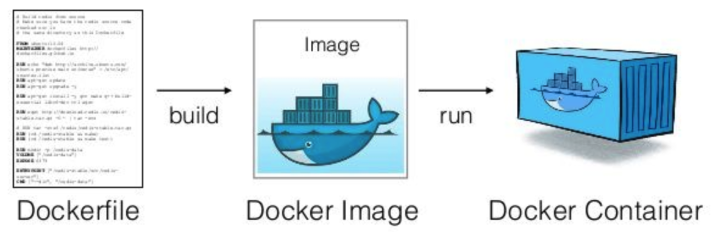
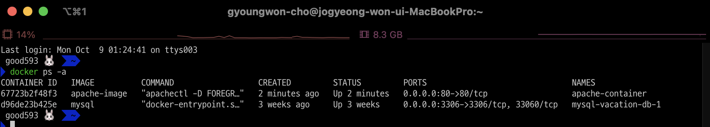

# [Dockerfile](https://docs.docker.com/engine/reference/builder/)
- Dockerfile은 컨테이너에 설치해야하는 패키지, 소스코드, 명령어, 환경변수설정 등을 기록한 하나의 파일입니다. 
- 그리고 이를 빌드하면 자동으로 이미지가 생성됩니다. 
- 이렇게 되면 앞으로는 애플리케이션 빌드 및 배포를 자동화할 수 있게됩니다.



---
## 참고문서
- https://wooono.tistory.com/123
- https://velog.io/@ckstn0777/%EB%8F%84%EC%BB%A4%ED%8C%8C%EC%9D%BCDockerfile
- https://velog.io/@fj2008/Dockerfile-%EA%B8%B0%EB%B3%B8-%EB%AC%B8%EB%B2%95
- https://seosh817.tistory.com/381#.dockerignore%20%ED%8C%8C%EC%9D%BC-1

---
## Dockerfile 작성법 
- FROM: 베이스 이미지 
  - 어느 이미지에서 시작할건지를 의미한다.
- LABEL: 이미지에 메타데이터를 추가
  - key-value 형태 
- RUN: 새로운 레이어에서 명령어를 실행하고, 새로운 이미지를 생성한다. 
  - RUN 명령에 apt-get update와 install을 함께 실행해야 한다. 
  - RUN 명령과 apt-get update를 따로 실행하면, 최신 패키지를 설치하지 않을 수도 있다. 

---
- WORKDIR: 작업 디렉토리를 지정한다. 해당 디렉토리가 없으면 새로 생성한다. 
  - 작업 디렉토리를 지정하면 그 이후 명령어는 해당 디렉토리를 기준으로 동작한다. 
- EXPOSE: Dockerfile의 빌드로 생성된 이미지에서 열어줄 포트를 의미한다. 
  - 호스트 머신과 컨테이너의 포트 매핑시에 사용된다.
  - 컨테이너 생성 시 `-p` 옵션의 컨테이너 포트 값으로 EXPOSE 값을 적어야 한다. 
- USER: 이미지를 어떤 계정에서 실행 하는지 지정 
  - 기본적으로 root에서 해준다.
- ENV: 이미지에서 사용할 환경 변수 값을 지정한다. 
  - path 등 

---
- COPY / ADD: build 명령 중간에 호스트의 파일 또는 폴더를 이미지에 가져오는 것 
  - ADD 명령문은 좀 더 파워풀한 COPY 명령문이라고 생각할 수 있다. 
  - ADD 명령문은 일반 파일 뿐만 아니라 압축파일이나 네트워크 상의 파일도 사용할 수 있다. 
  - 이렇게 특수한 파일을 다루는게 아니라면 COPY 명령문을 사용하는 것이 권장된다. 
- CMD / ENTRYPOINT: 컨테이너를 생성 및 실행할 때 실행할 명령어 
  - CMD: 컨테이너를 생성할 때만 실행된다. (docker run) 
  - ENTRYPOINT: 컨테이너를 시작할 때마다 실행된다. (docker start)

---
### Dockerfile 예제 

```Dockerfile
# server image는 ubunutu 18.04를 사용
FROM ubuntu:18.04 

# image가 올라갔을 때 수행되는 명령어들
# -y 옵션을 넣어서 무조건 설치가 가능하도록 한다.
RUN \
    apt-get update && \
    apt-get install -y apache2

# 파일 복사 
COPY hello.html /var/www/html

# 작업공간 이동 (=cd)
WORKDIR /var/www/html

# apache가 기본적으로 80포트를 사용하기 때문에 expose를 이용해 apache server로 접근이 가능하도록 한다.
EXPOSE 80 

# 컨테이너가 생성 된 이후에 내부의 아파치 서버는 항상 실행중인 상태로 만들어준다.
# apachectl을 foreground(즉, deamon)상태로 돌아가도록 한다.
CMD ["apachectl", "-D", "FOREGROUND"]
```

---
## Dockerfile build
- 이미지 빌드 명령어 
```shell
# docker build -t [이미지 이름:이미지 버전] [Dockerfile의 경로]
docker build -t apache-image .
```

---
## Container 생성
```shell
docker run -d -p 80:80 --name apache-container apache-image
```



