# [윈도우용 Docker 설치방법](https://www.lainyzine.com/ko/article/a-complete-guide-to-how-to-install-docker-desktop-on-windows-10/) 

---
## [WSL 설치 가능 여부 확인](https://www.lainyzine.com/ko/article/how-to-install-wsl2-and-use-linux-on-windows-10/) 
1. 검색창에서 `PC 정보` 입력 후 실행 
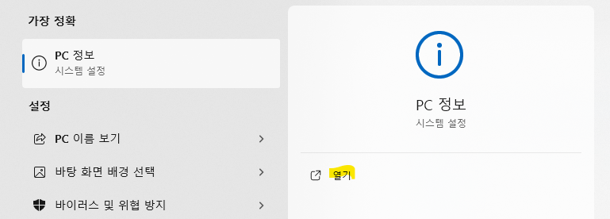

---
2. 여기서 버전이 20H1, 20H2, 21H1 혹은 그보다 높은 버전인지 확인합니다.
    - 만약 낮다면, 윈도우 업그레이드를 진행 후 설치해야 합니다. 
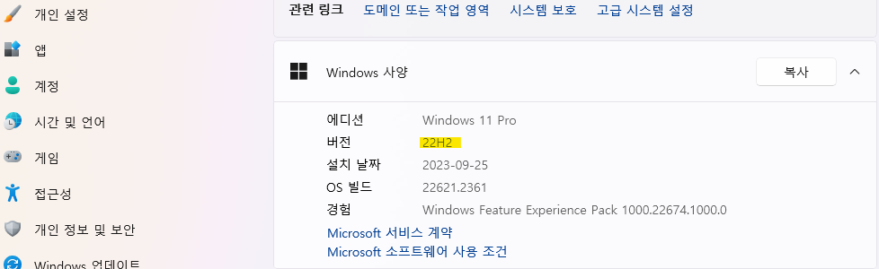

---
## WSL2를 설치하고 활성화하는 방법 

1. 검색창에서 `PowerShell` 입력 후 관리자로 실행 
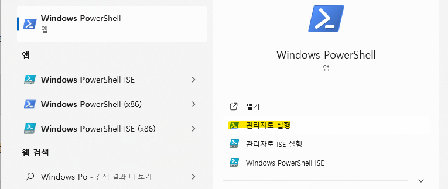

---
2. `wsl --install` 입력 후 엔터 
    - WSL 설치 

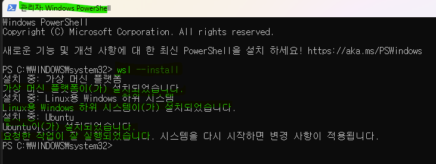

---
3. `wsl --set-default-version 2` 입력 후 엔터
    - WSL버전의 기본값을 2로 변경 

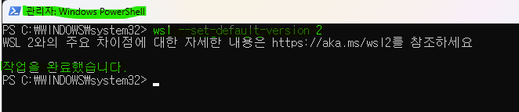

---
## Docker Desktop 다운로드 및 설치 

1. [docker 다운로드](https://www.docker.com/products/docker-desktop/)

---
2. 설치 파일 실행 후 예를 클릭!!
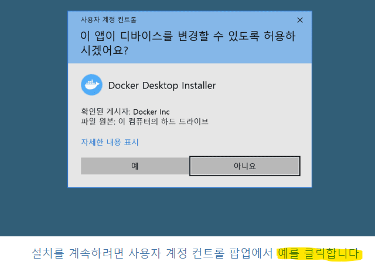

---
3. ok 클릭!!
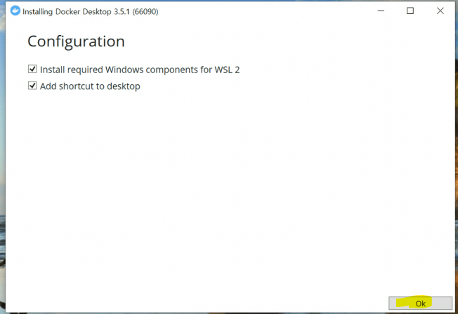

---
4. 설치가 완료되면 Close and restart 버튼 클릭!!
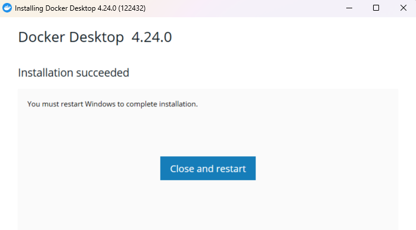

---
5. 검색창에서 `Docker Desktop` 작성 후 실행 
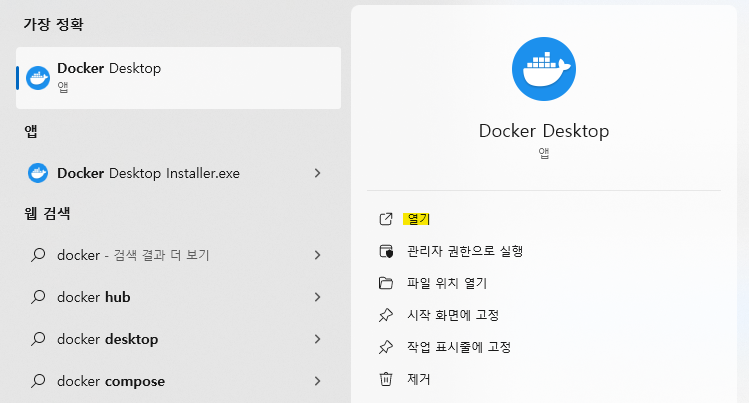

---
6. 설정에서 WSL2 based engine 사용 여부가 체크되어있는지 확인합니다
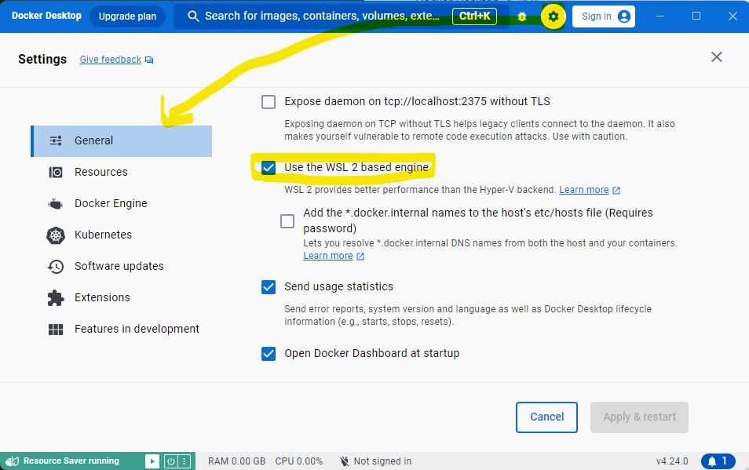

---
7. 설정에서 WSL2 통합 기능이 활성화 되어있는지 확인해봅니다
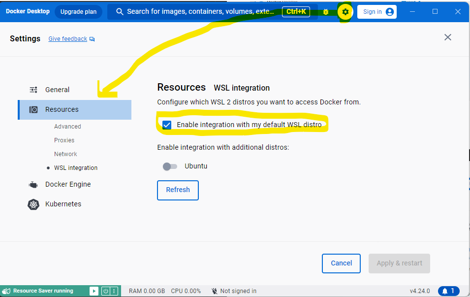

---
## 설치가 잘되었는지 확인 
- PowerShell 탭을 하나 열고 wsl 명령어로 Docker 전용 머신이 실행중인 것을 확인할 수 있습니다.

`wsl -l -v`
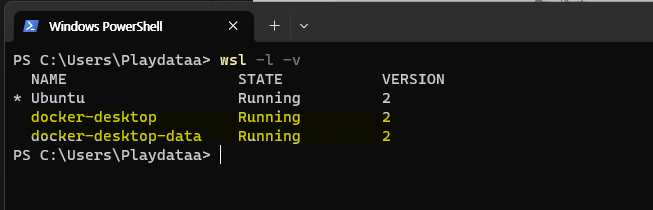

---
- wsl로 docker-desktop 리눅스에 명령어를 실행해볼 수 있습니다.  
    - docker-desktop은 BusyBox가 포함된 LinuxKit 기반의 경량 리눅스인 것을 확인해볼 수 있습니다.

`wsl -d docker-desktop busybox`
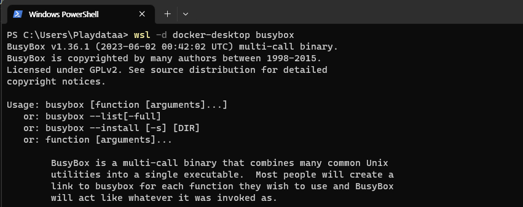

---
- docker version 명령으로 Docker 서버와 클라이언트 정보를 확인해봅니다.

`docker --version`
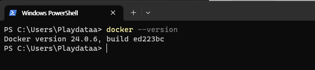

