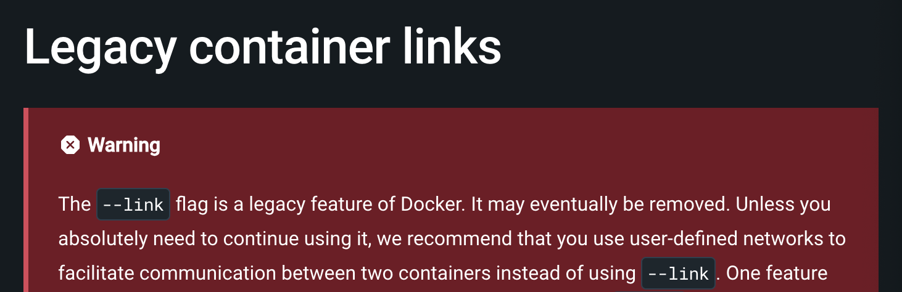
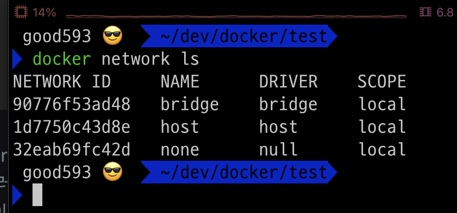
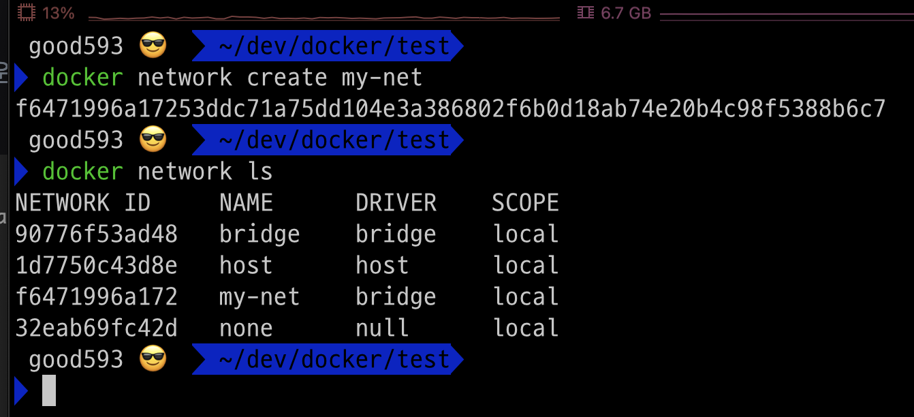
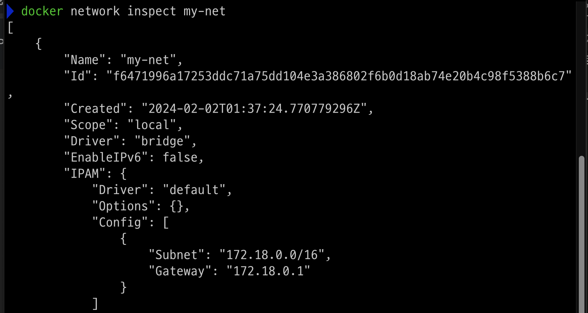
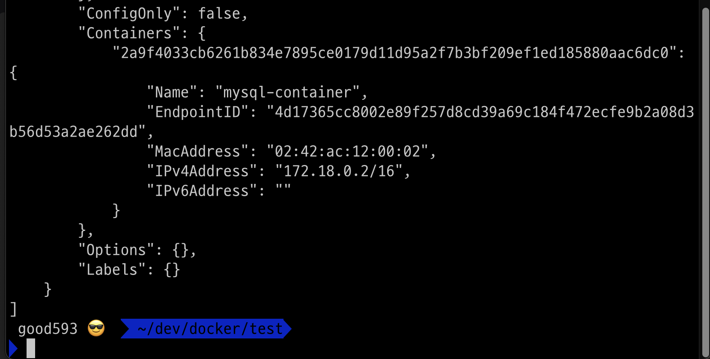
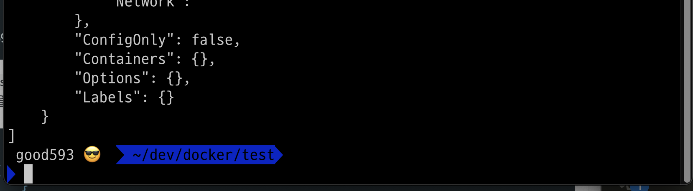
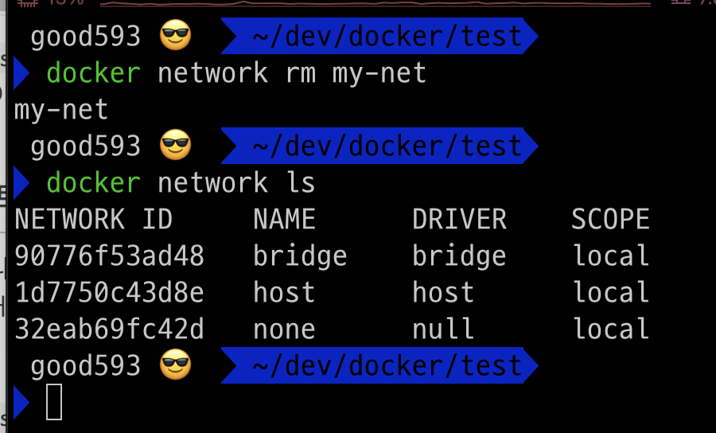
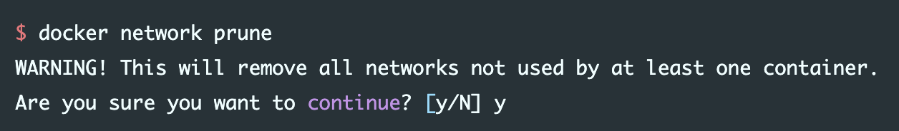

# [Docker Network](https://www.daleseo.com/docker-networks/)
- Docker 컨테이너(container)는 격리된 환경에서 돌아가기 때문에 기본적으로 다른 컨테이너와의 통신이 불가능합니다.
- 하지만 여러 개의 컨테이너를 하나의 Docker 네트워크(network)에 연결시키면 서로 통신이 가능해집니다. 

---
### [docker -link 옵션](https://docs.docker.com/network/links/)
- 과거에는 docker –link 옵션을 사용해서 컨테이너를 서로 연결해 주었습니다. 
- 이제는 docker network가 그 기능을 대신하고 있으므로 이제 –link 옵션은 deprecated 상태로 레거시(lagacy)입니다.



---
### 네트워크 종류 
- `bridge`: 하나의 호스트 컴퓨터 내에서 컨테이너들간 소통할 수 있도록 한다.
- `host`: 컨터이너를 호스트 컴퓨터와 동일한 네트워크 상에 올린다.
- `overlay`: 여러 호스트에 분산되어 있는 컨테이너들 간에 연결을 위해 사용한다.

기본값은 `bridge` 네트워크이다.

---
# 네트워크 명령어 
### 단계1: 네트워크 조회 
- bridge, host, none은 Docker 데몬(daemon)이 실행되면서 디폴트로 생성되는 네트워크입니다. 
```shell
docker network ls
```


---
### 단계2: 네트워크 생성 
- 명령어: docker network create <네트워크이름>
```shell
docker network create my-net
docker network ls
```


---
### 단계3: 네트워크 상세 정보 
- 명령어: docker network inspect <네트워크이름>
- IPAM > Config: 네트워크 정보 확인 
- Containers: 연결된 컨테이너 정보 확인 
```shell
docker network inspect my-net
```


---
### 단계4: 네트워크에 컨테이너 연결 
- 명령어: docker network connect <네트워크명> <컨테이너명>
```shell
docker network connect my-net mysql-container
docker network inspect my-net # 연결확인 
```


---
### 단계5: 네트워크에서 컨테이너 연결 해제 
- 명령어: docker network disconnect <네트워크명> <컨테이너명>
```shell
docker network disconnect my-net mysql-container
docker network inspect my-net # 연결확인 
```


---
### 단계6: 네트워크 제거 
- 만약 네트워크에서 작동중인 컨테이너가 있다면, 중지해야함
- 명령어: docker network rm <네트워크명>
```shell
docker network rm my-net
docker network ls # 확인 
```


---
### 단계7: 네트워크 청소 
- 여러번의 프로젝트를 비롯한 여러 작업을 하다보면 아무 컨테이너도 연결되지 않은 불필요한 네트워크가 생기게 된다. 
- 이때 docker network prune 명령어로 이러한 네트워크를 모두 제거할 수 있다.
```shell
docker network prune
```



