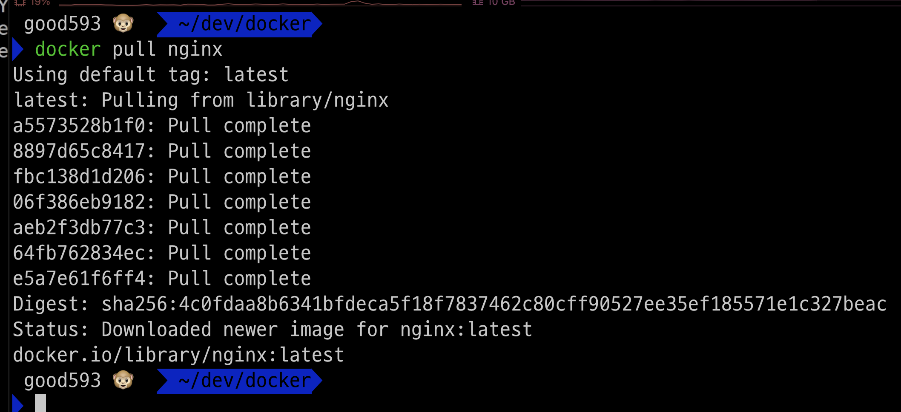
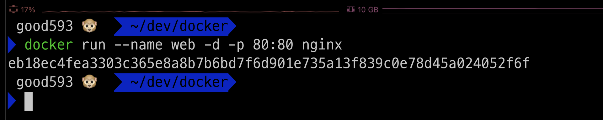
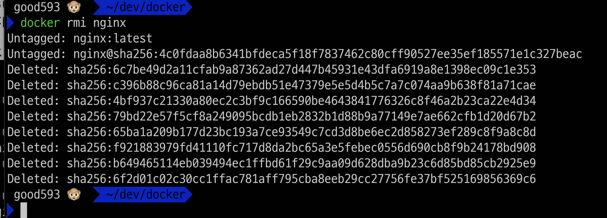

### 단계1: 도커 버전 확인
```shell
docker --version
```


---
### 단계2: 도커 이미지 조회 
```shell
docker images
```


---
### 단계3: Docker Hub > nginx 이미지 조회
- 명령어: docker search <이미지이름>
```shell
docker search nginx
```


---
### 단계4: Docker Hub > nginx 이미지 다운로드 
- 명령어: docker pull <이미지이름>
```shell
docker pull nginx
```


---
### 단계5: 도커 이미지 조회 > nginx 이미지 확인  
```shell
docker images
```


---
### 단계6: nginx 이미지 > 컨테이너 생성
- 명령어: docker run --name <컨테이너이름> -d -p 80:80 <이미지이름>
  - `-d`: 백그라운드 모드로 실행 
  - `-p`: 포트 연결 
```shell
docker run --name web -d -p 80:80 nginx
```


---
### 단계7: 실행 중인 컨테이너 > nginx 컨테이너 확인 
```shell
docker ps
```


---
### 단계8: nginx 서버 접속 
- http://localhost:80/


---
### 단계9: nginx 컨테이너 중지 
- 명령어: docker stop <컨테이너이름>
```shell
docker stop web
docker ps # 실행중인 컨테이너들 중에 web(nginx) 없음
```


---
### 단계10: nginx 서버 접속 불가 
- http://localhost:80/


---
### 단계11: 중지된 nginx 컨테이너 확인 
```shell
docker ps -a
```


---
### 단계12: 중지된 nginx 컨테이너 삭제 
- 명령어: docker rm <컨테이너이름>
```shell
docker rm web
docker ps -a # 삭제 확인 
```


---
### 단계13: nginx 이미지 삭제
- 명령어: docker rmi <이미지이름> 
```shell
docker rmi nginx
```


---
### 단계14: nginx 이미지 삭제 확인 
```shell
docker image ls
```


