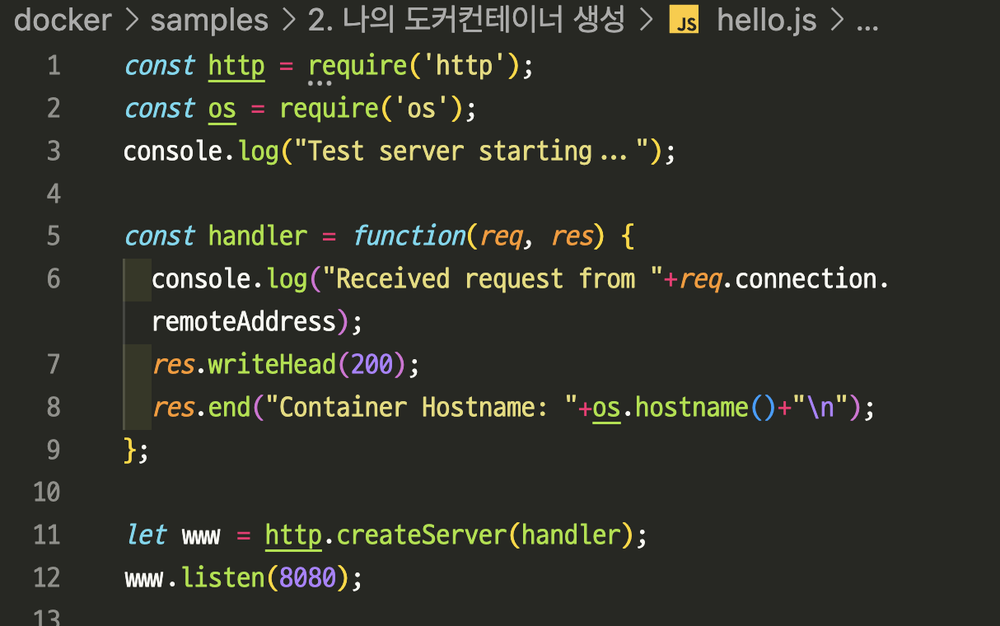
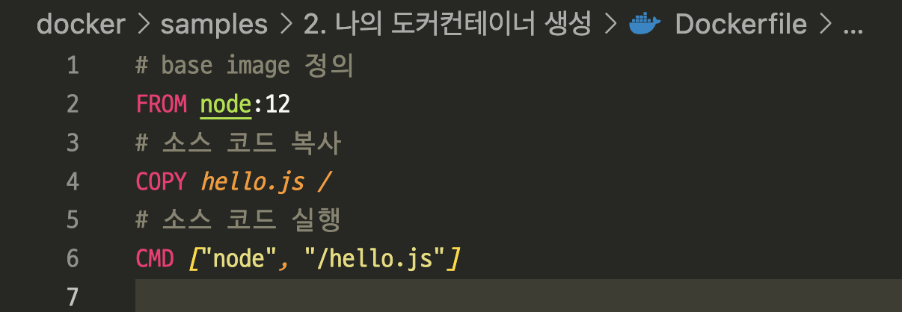
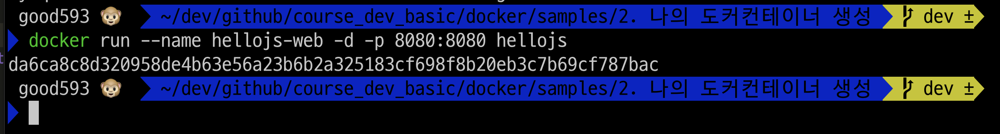
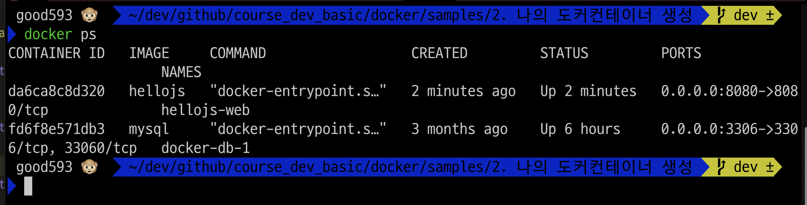
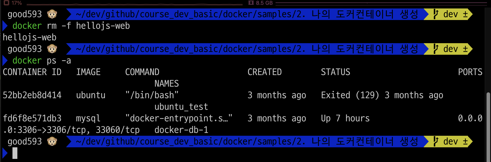
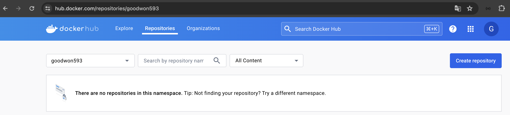
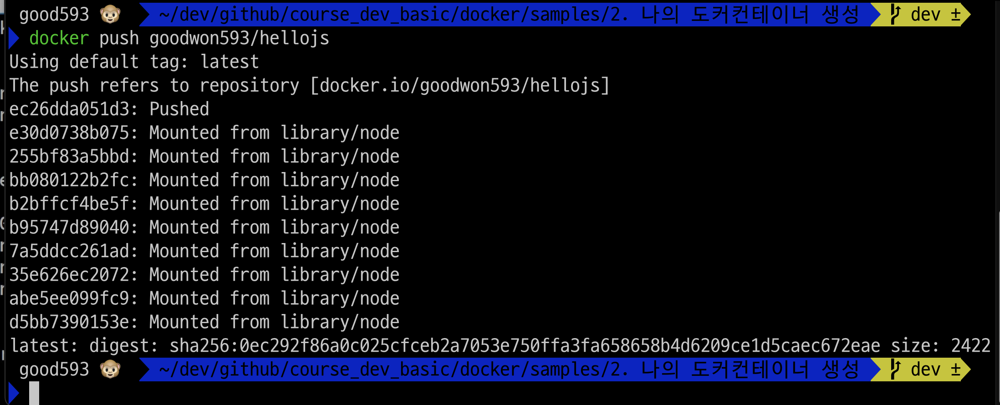

### 단계1: hello.js 확인


---
### 단계2: Dockerfile 확인 


---
### 단계3: Dockerfile과 hello.js이 있는 폴더로 이동 
```shell
ls # 파일 확인 
```


---
### 단계4: Dockerfile을 이용하여 hellojs 이미지 생성
- 명령어: docker build -t <이미지명>:<테그> <기준이되는 폴더위치>
```shell
docker build -t hellojs:latest .
```


---
### 단계5: 생성된 hellojs 이미지 확인
```shell
docker image ls
```


---
### 단계7: hellojs-web 컨테이너 생성 
- 테그가 latest인 경우는 생략 가능 
```shell
docker run --name hellojs-web -d -p 8080:8080 hellojs
```


---
### 단계8: 작동중인 hellojs-web 컨테이너 확인 
```shell
docker ps
```


---
### 단계9: hellojs-web에 접속 
- http://localhost:8080/


---
### 단계10: 실행중인 컨테이너 삭제 
```shell
docker rm -f hellojs-web
docker ps -a
```


---
### 단계11: 도커허브 > repositories > 아이디 확인 
- 도커허브: https://hub.docker.com/


---
### 단계12: 도커 로그인 
```shell
docker login
```


---
### 단계14: 도커허브아이디/이미지명 
- 명령어: docker tag <이미지명>:<테그> <도커허브아이디>/<이미지명>:<테크>
```shell
docker tag hellojs:latest goodwon593/hellojs:latest
docker image ls # 생성된 이미지 확인 
``` 


---
### 단계15: 도커허브로 이미지 업로드 
- 명령어: docker push <도커허브아이디>/<이미지명>:<테크>
```shell
docker push goodwon593/hellojs
```


---
### 단계16: 도커허브에서 이미지 업로드 확인 


