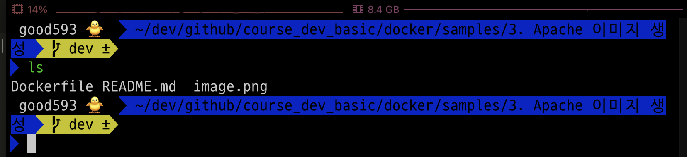
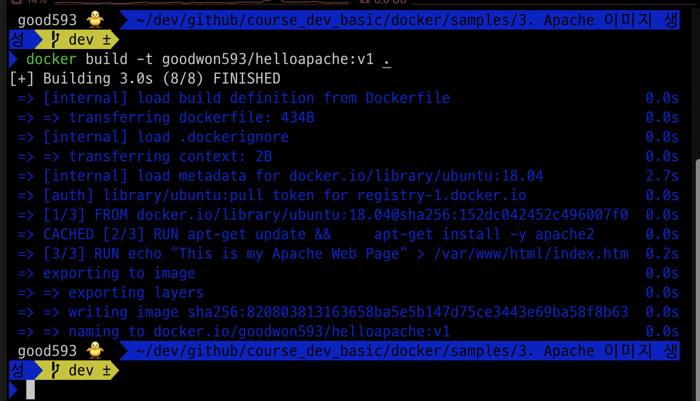
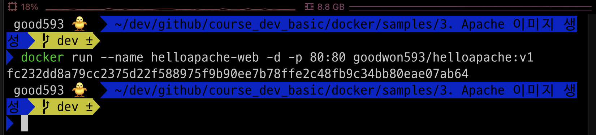
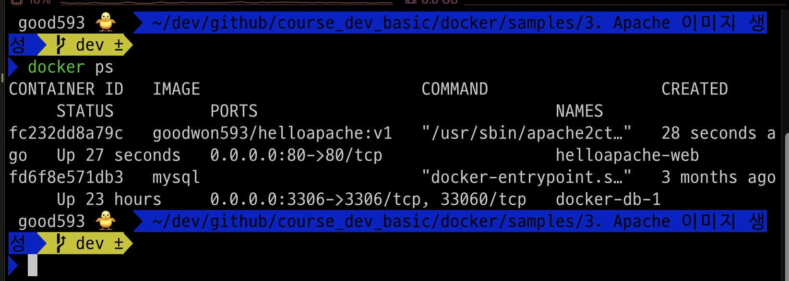
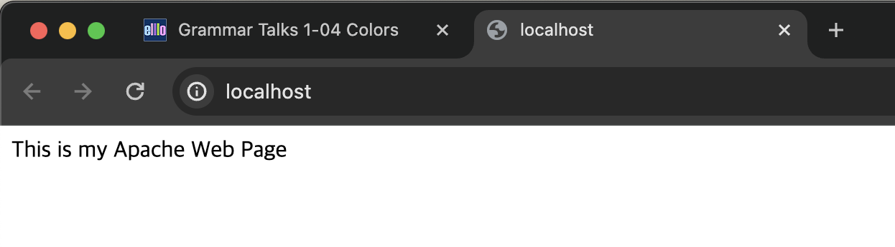
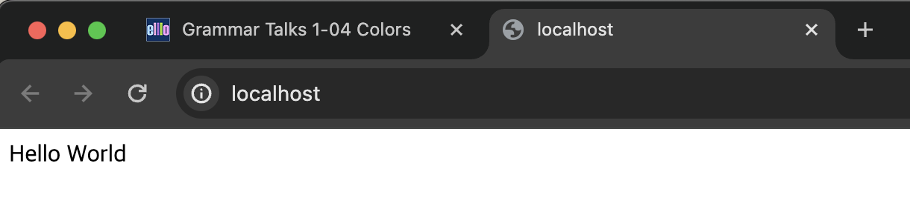
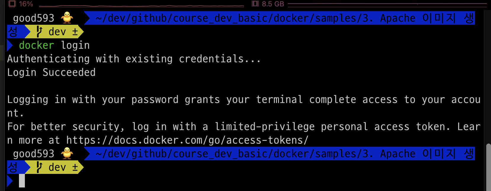
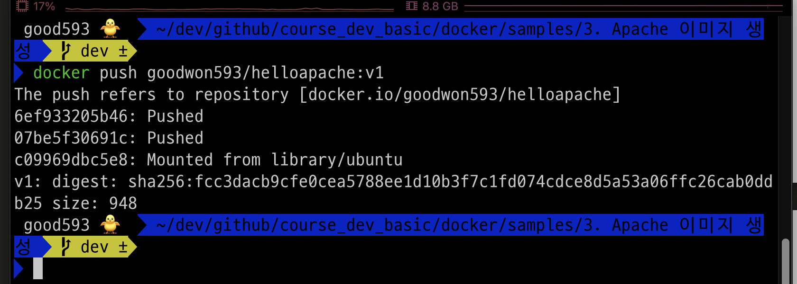
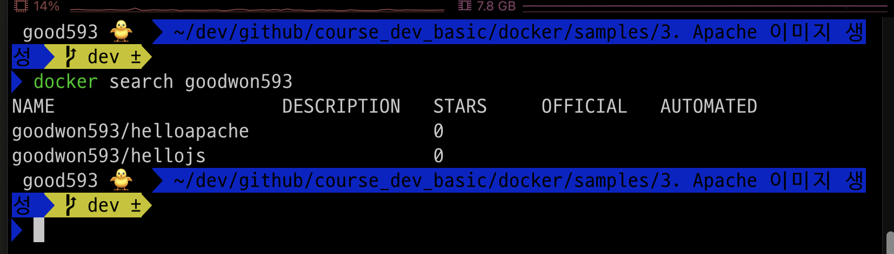
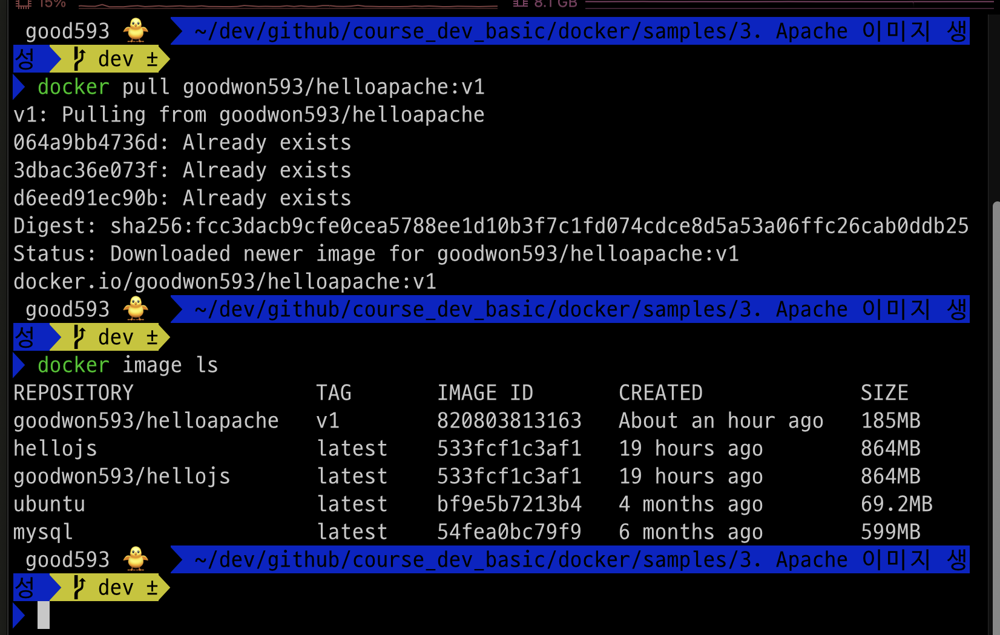

### 단계1: Dockerfile 확인


---
### 단계2: Dockerfile이 있는 폴더로 이동 
```shell
ls
```


---
### 단계3: Dockerfile을 이용하여 이미지 생성
```shell
docker build -t goodwon593/helloapache:v1 .
```


---
### 단계4: 생성된 이미지 확인 
```shell
docker image ls
```


---
### 단계5: 컨테이너 생성 
```shell
docker run --name helloapache-web -d -p 80:80 goodwon593/helloapache:v1
```


---
### 단계6: 작동중인 컨테이너 확인 
```shell
docker ps
```


---
### 단계7: Apache 웹 접속 
- http://localhost:80/


---
### 단계8: Apache 컨테이너 접속 
- 명령어: docker exec -it <컨테이너이름> /bin/bash
```shell
docker exec -it helloapache-web /bin/bash
```


---
### 단계9: index.html 수정 
```shell
echo "Hello World" > /var/www/html/index.html
exit
```


---
### 단계10: Apache 컨테이너 접속 > 수정 내용 확인 
- http://localhost:80/


---
### 단계11: 실행중인 컨테이너 삭제 
```shell
docker rm -f helloapache-web
docker ps -a
```


---
### 단계12: 도커 로그인 
```shell
docker login
```


---
### 단계13: 도커허브로 이미지 업로드 
```shell
docker push goodwon593/helloapache:v1
```


---
### 단계14: 도커허브에서 이미지 업로드 확인 


---
### 단계15: 생성한 이미지 삭제 
```shell
docker rmi goodwon593/helloapache:v1
docker image ls
```


---
### 단계16: 도커허브에서 나의 이미지 조회
- 명령어: docker search <도커허브아이디>
```shell
docker search goodwon593
``` 


---
### 단계17: 도커허브에 있는 나의 이미지 다운로드 
```shell
docker pull goodwon593/helloapache:v1
docker image ls
```



