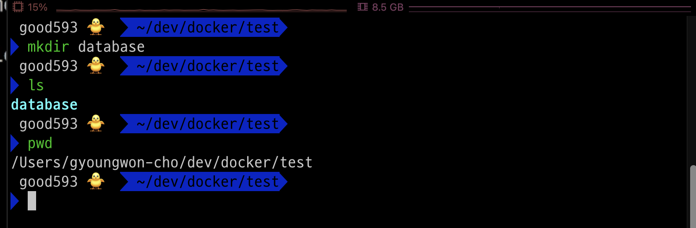
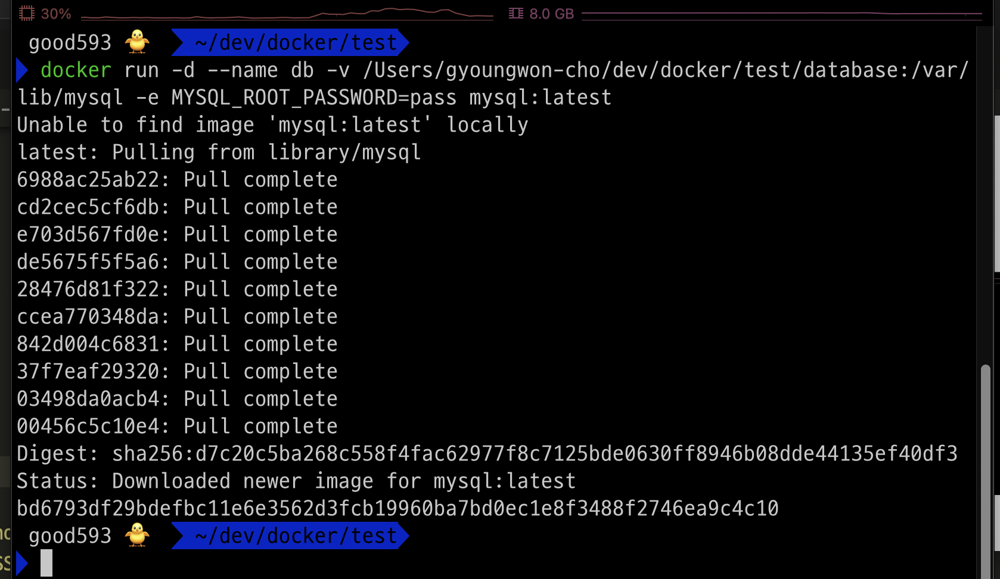
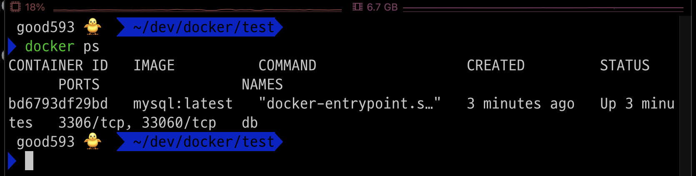
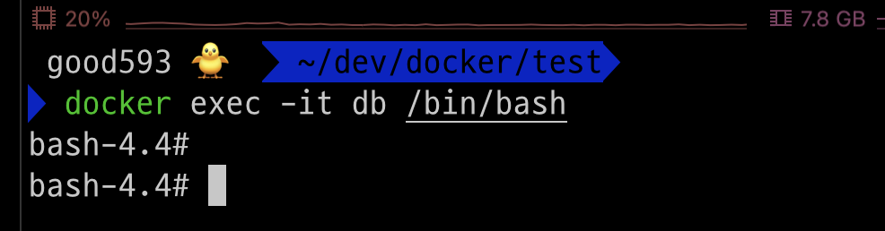
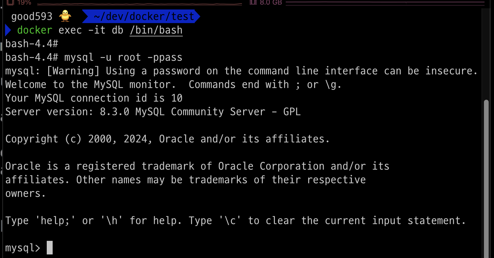
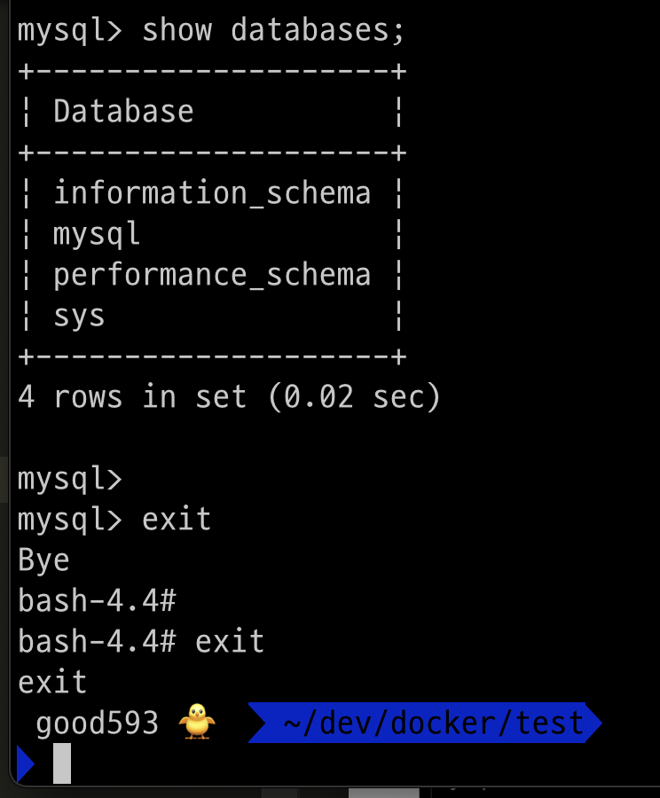
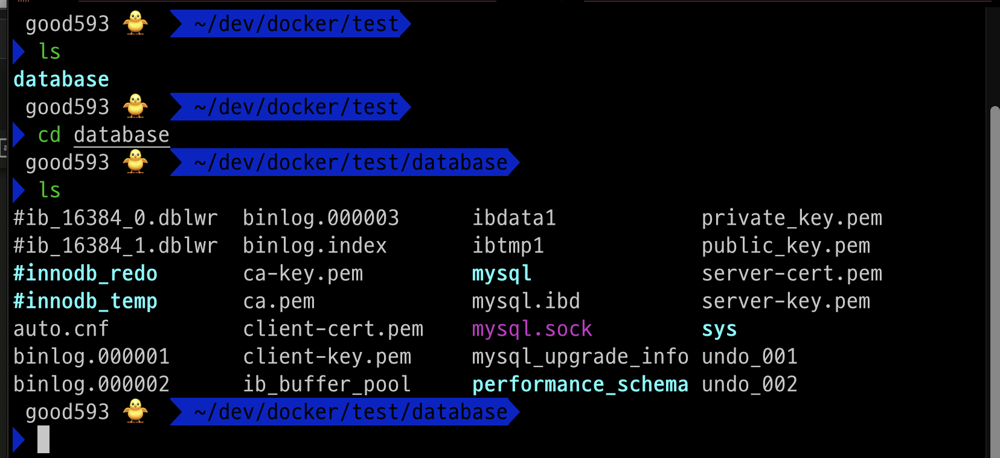
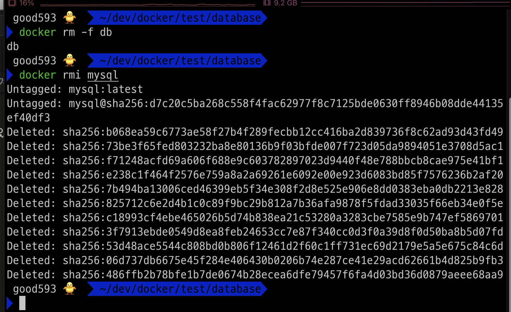
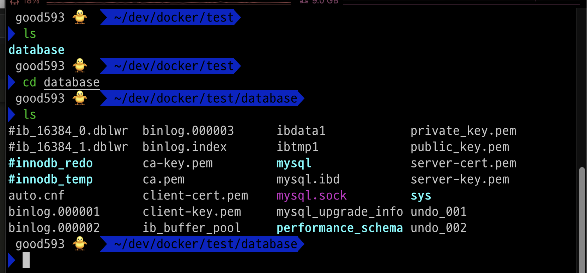

### 단계1: database 디렉토리 생성 
1. 테스트할 폴더로 이동 
2. database 디렉토리(폴더) 생성 



---
### 단계2: mysql 컨테이너 생성 
- 명령어: docker run -d --name <컨테이너이름> -v <database 디렉토리 절대경로>:/var/lib/mysql -e MYSQL_ROOT_PASSWORD=<root 비밀번호> mysql:latest
- `-v <호스트 OS 디렉토리>:<컨테이너 디렉토리>`: 호스트 OS 디렉토리와 컨테이너 디렉토리를 연결  
- `/var/lib/mysql`: mysql database의 데이터가 저장되어 있는 디렉토리 
```shell
docker run -d --name db -v /Users/gyoungwon-cho/dev/docker/test/database:/var/lib/mysql -e MYSQL_ROOT_PASSWORD=pass mysql:latest
```
---


---
### 단계3: 작동중인 mysql 컨테이너 확인 
```shell
docker ps
```


---
### 단계4: mysql 컨테이너 접속 
```shell
docker exec -it db /bin/bash
```


---
### 단계5: mysql 접속
- 명령어: mysql -u <계정명> -p<계정비번> 
```shell
mysql -u root -ppass
```


---
### 단계6: sql 명령어 실행 및 컨테이너에서 나오기 
```sql
show databases;
```
```shell
exit # mysql에서 나오기 
exit # mysql 컨테이너에서 나오기 
```


---
### 단계7: database 디렉토리 확인
- mysql database에서 사용하는 모든 데이터가 저장되어 있음 
```shell
cd database
ls 
```


---
### 단계8: mysql 컨테이너 & 이미지 삭제 
```shell
docker rm -f db
docker rmi mysql
```


---
### 단계9: mysql database의 데이터는 삭제되지 않음 
- 즉, 컨테이너가 삭제가 되더라도 관련 데이터는 보존할 수 있음 
```shell
cd database
ls
```


