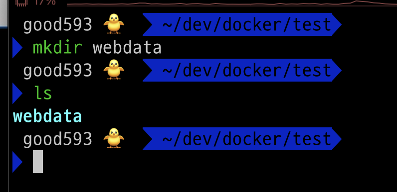
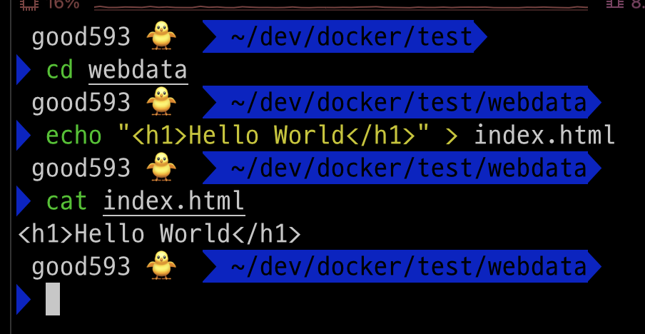
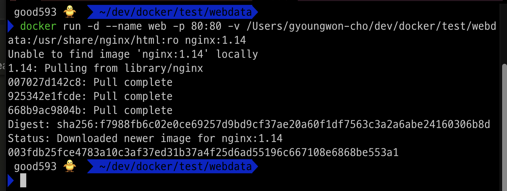
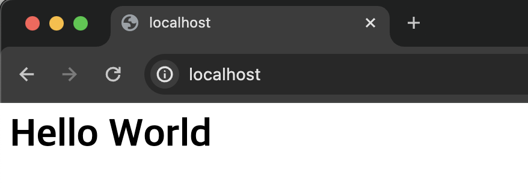
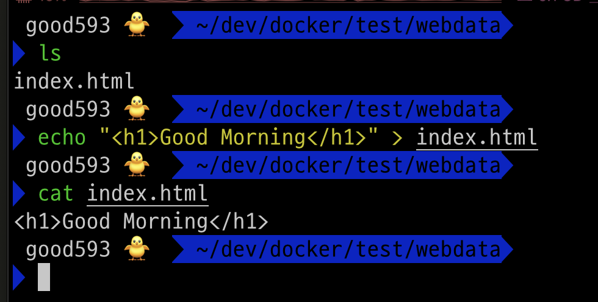
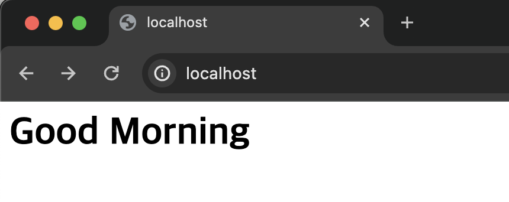
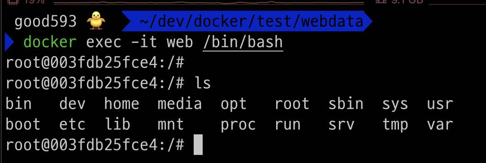
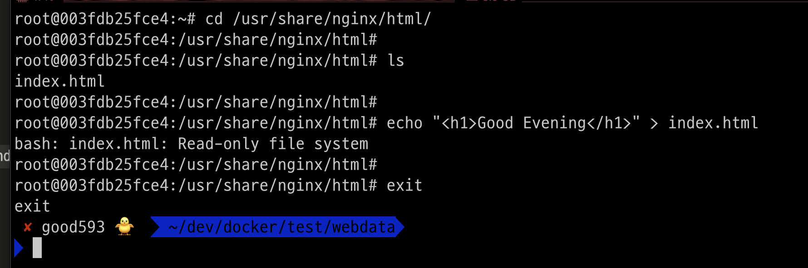

### 단계1: webdata 폴더 만들기 
```shell
mkdir webdata
ls
```


---
### 단계2: index.html 생성
```shell
cd webdata
echo "<h1>Hello World</h1>" > index.html
cat index.html
```


---
### 단계3: nginx 컨테이너 생성 및 실행 
- 명령어: docker run -d --name <컨테이너이름> -p 80:80 -v <호스트 디렉토리>:<컨테이너 디렉토리>:ro <이미지명>
  - `ro`: read only
```shell
docker run -d --name web -p 80:80 -v /Users/gyoungwon-cho/dev/docker/test/webdata:/usr/share/nginx/html:ro nginx:1.14
```


---
### 단계4: nginx 접속 
- http://localhost:80/


---
### 단계5: 호스트 OS > index.html 수정 
```shell
cd webdata
echo "<h1>Good Morning</h1>" > index.html
cat index.html
```


---
### 단계6: nginx 접속 > 수정내용 확인 
- http://localhost:80/


---
### 단계7: nginx 컨테이너 접속 
```shell
docker exec -it web /bin/bash
ls
```


---
### 단계8: nginx 컨테이너 > index.html 수정시 오류발생
```shell
cd /usr/share/nginx/html
# index.html 수정시 오류 발생 
echo "<h1>Good Evening</h1>" > index.html
exit
```


