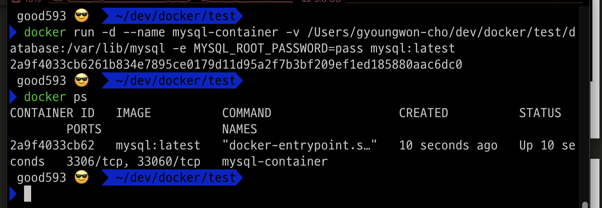
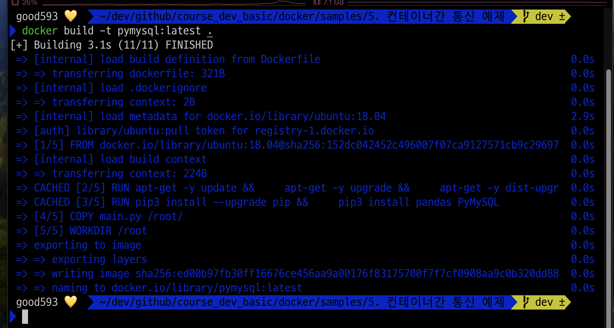
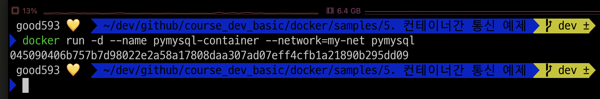

### 단계1: 네트워크 생성 
```shell
docker network create my-net
docker network ls
```


---
### 단계2: database 디렉토리 생성 
1. 테스트할 폴더로 이동 
2. database 디렉토리(폴더) 생성 


---
### 단계3: mysql 컨테이너 생성 및 실행 
```shell
docker run -d --name mysql-container -v /Users/gyoungwon-cho/dev/docker/test/database:/var/lib/mysql -e MYSQL_ROOT_PASSWORD=pass mysql:latest

docker ps
```


---
### 단계4: mysql > 네트워크 연결 
```shell
docker network connect my-net mysql-container
```


---
### 단계5: pymysql 이미지 생성 
- Dockerfile이 있는 폴더로 이동 후 실행 
```shell
docker build -t pymysql:latest .
```


---
### 단계6: pymysql 컨테이너 생성/실행 및 네트워크 연결 
```shell
docker run -d --name pymysql-container --network=my-net pymysql
```


---
### 단계7: main.py > 결과 확인 
```shell
docker logs pymysql-container
```


