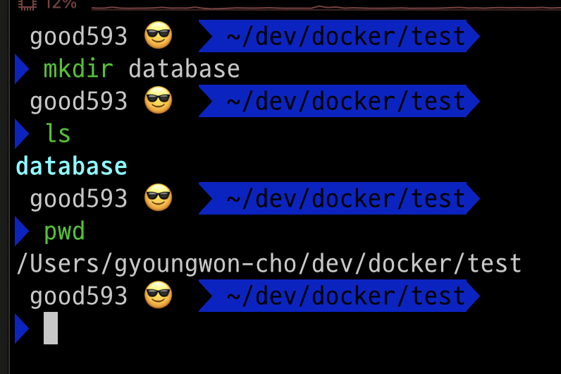

### 단계1: database 디렉토리 생성 
1. 테스트할 폴더로 이동 
2. database 디렉토리(폴더) 생성 


---
### 단계2: mysql 컨테이너 생성 및 실행 
```shell
docker run -d --name mysql-container -v /Users/gyoungwon-cho/dev/docker/test/database:/var/lib/mysql -e MYSQL_ROOT_PASSWORD=pass mysql:latest

docker ps
```


---
### 단계3: 
docker run -it --name python-container --link mysql-container:mysqldb pythontest /bin/bash

---
- https://youtu.be/CXrrkl4Zamc?si=hOyD5LdJKeHNO9wI


