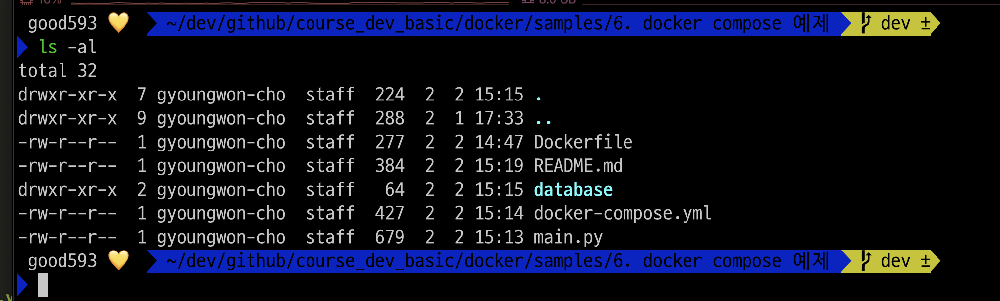
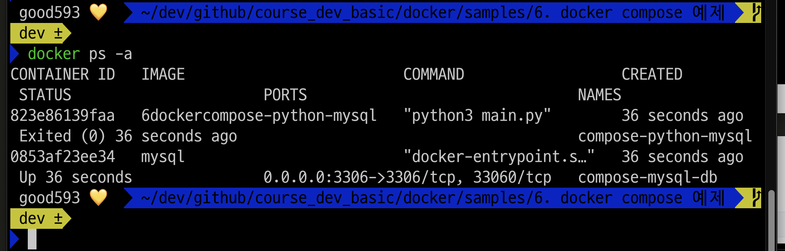
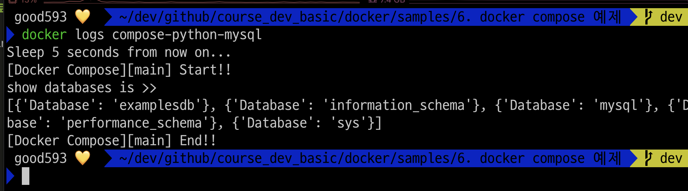
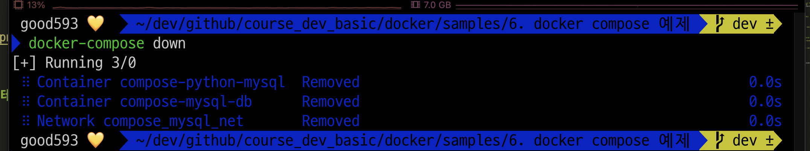
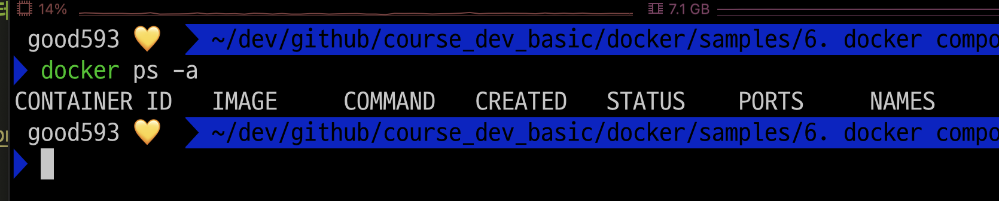
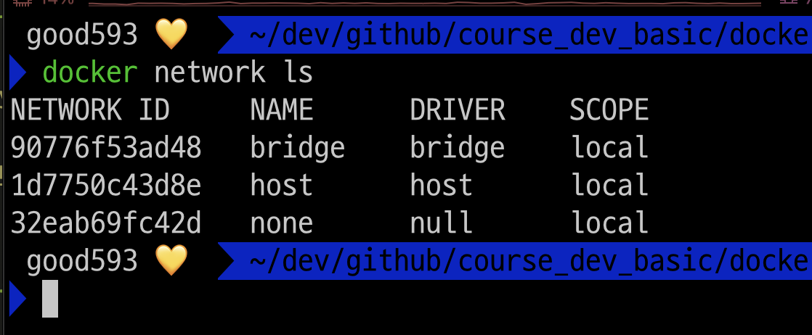
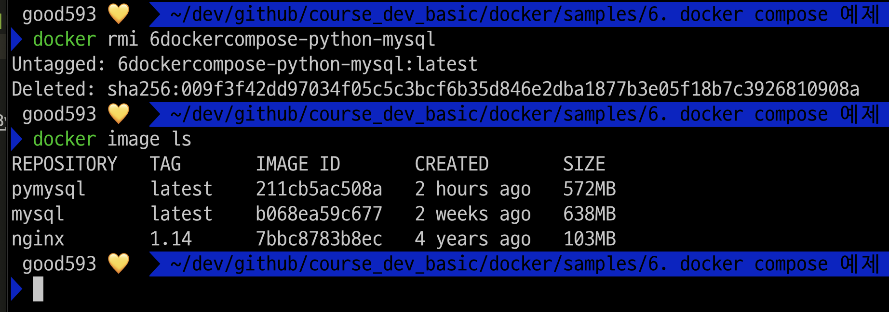

### 단계1: docker-compose.yml 디렉토리로 이동 
- 디렉토리에 존재해야할 것들
  - docker-compose.yml, Dockerfile, main.py, database(폴더)
```shell
ls -al
```


----
### 단계2: docker compose 실행 
```shell
docker-compose up -d
```


---
### 단계3: 생성된 컨테이너 확인 
```shell
docker ps -a
```


---
### 단계4: compose-python-mysql 실행 결과 확인 
```shell
docker logs compose-python-mysql
```


---
### 단계5: compose에 포함된 컨테이너 모두 stop
```shell
docker-compose stop
docker ps -a
```


---
### 단계6: compose에 포한된 리소스 모두 제거 


---
### 단계7: 제거된 리소스 확인 
- container
```shell
docker ps -a
```


---
- network
```shell
docker network ls
```


---
### 단계8: compose 이미지 삭제 
```shell
docker rmi 6dockercompose-python-mysql
docker image ls
```



