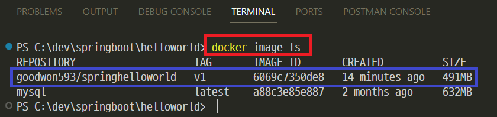
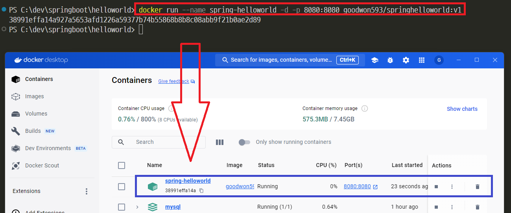

### 단계1: docker build
```shell
docker build -t goodwon593/springhelloworld:v1 .
```


---
### 단계2: docker image 확인 
```shell
docker image ls
```


---
### 단계3: docker container 
```shell
docker run --name spring-helloworld -d -p 8080:8080 goodwon593/springhelloworld:v1
```


---
### 단계4: docker container 확인 
```shell
docker ps
```


---
### 단계5: 테스트 
- http://localhost:8080/api/v1/hello


---
# 참고자료 
- https://sangchul.kr/entry/%EC%9B%90%EB%8F%84%EC%9A%B0-Spring-Boot-%ED%94%84%EB%A1%9C%EC%A0%9D%ED%8A%B8-Gradle%EB%A1%9C-Docker-%EC%9D%B4%EB%AF%B8%EC%A7%80-%EB%B9%8C%EB%93%9C%ED%95%98%EA%B8%B0
