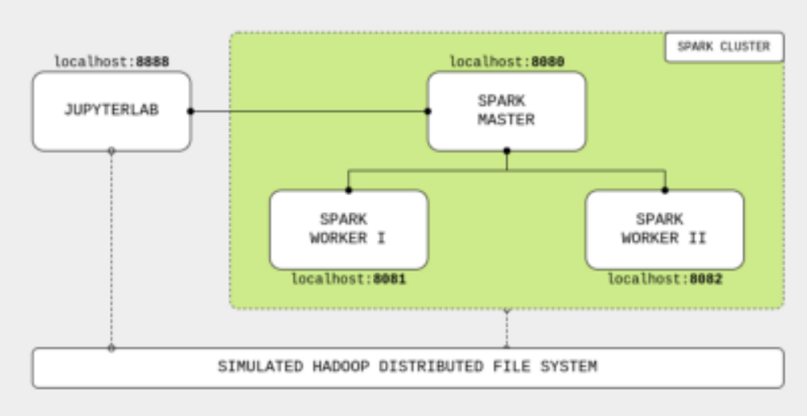
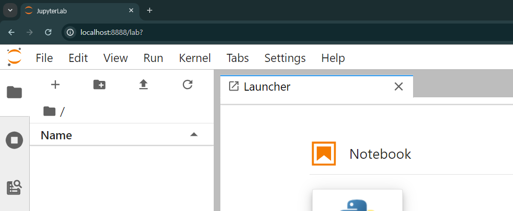

## Spark 구성도 
- 먼저 Spark Master를 생성해 주고 이를 Localhost에 8080 Port에 얹어 준다. 
- 그 다음 두개의 Worker를 구성하여 각각 8081 / 8082 Port에 얹어 준다. 
- 그리고 Spark Code를 원활하게 실행할 JupyterLab을 8888포트에 올려 준비한다.



---
## Docker 구성도 


---
## Docker File 생성 

---
### 단계1: cluster-base
```docker
ARG debian_buster_image_tag=8-jre-slim
FROM openjdk:${debian_buster_image_tag}

# -- Layer: OS + Python 3.7

ARG shared_workspace=/opt/workspace

RUN mkdir -p ${shared_workspace} && \
    apt-get update -y && \
    apt-get install -y python3 && \
    apt-get install -y python3-pip && \
    ln -s /usr/bin/python3 /usr/bin/python && \
    rm -rf /var/lib/apt/lists/*

ENV SHARED_WORKSPACE=${shared_workspace}

# -- Runtime

VOLUME ${shared_workspace}
CMD ["bash"]
```
---
### 단계2: spark-base
```docker
FROM cluster-base

# -- Layer: Apache Spark

ARG spark_version=3.1.1
ARG hadoop_version=3.2

RUN apt-get update -y && \
    pip3 install --upgrade pip setuptools wheel &&\
    pip3 install pandas &&\
    apt-get install -y curl && \
    curl https://archive.apache.org/dist/spark/spark-${spark_version}/spark-${spark_version}-bin-hadoop${hadoop_version}.tgz -o spark.tgz && \
    tar -xf spark.tgz && \
    mv spark-${spark_version}-bin-hadoop${hadoop_version} /usr/bin/ && \
    mkdir /usr/bin/spark-${spark_version}-bin-hadoop${hadoop_version}/logs && \
    rm spark.tgz

ENV SPARK_HOME /usr/bin/spark-${spark_version}-bin-hadoop${hadoop_version}
ENV SPARK_MASTER_HOST spark-master
ENV SPARK_MASTER_PORT 7077
ENV PYSPARK_PYTHON python3

# -- Runtime

WORKDIR ${SPARK_HOME}
```
---
### 단계3: spark-master
```docker
FROM spark-base

# -- Runtime

ARG spark_master_web_ui=8080

EXPOSE ${spark_master_web_ui} ${SPARK_MASTER_PORT}
CMD bin/spark-class org.apache.spark.deploy.master.Master >> logs/spark-master.out
```

### 단계4: spark-worker
```docker
FROM spark-base

# -- Runtime

ARG spark_worker_web_ui=8081

EXPOSE ${spark_worker_web_ui}
CMD bin/spark-class org.apache.spark.deploy.worker.Worker spark://${SPARK_MASTER_HOST}:${SPARK_MASTER_PORT} >> logs/spark-worker.out
```
---
### 단계5: jupyterlab
```docker
FROM cluster-base

# -- Layer: JupyterLab

ARG spark_version=3.1.1
ARG jupyterlab_version=2.1.5

RUN apt-get update -y && \
    apt-get install -y python3-pip && \
    pip3 install --upgrade pip setuptools wheel &&\
    pip3 install pandas &&\
    pip3 install wget pyspark==${spark_version} jupyterlab==${jupyterlab_version}

# -- Runtime

EXPOSE 8888
WORKDIR ${SHARED_WORKSPACE}
CMD jupyter lab --ip=0.0.0.0 --port=8888 --no-browser --allow-root --NotebookApp.token=
```

---
## Docker Image 생성 
```shell
# -- Building the Images

docker build -f cluster-base.Dockerfile -t cluster-base .

docker build --build-arg spark_version="3.1.1" --build-arg hadoop_version="3.2" -f spark-base.Dockerfile -t spark-base .

docker build -f spark-master.Dockerfile -t spark-master .

docker build -f spark-worker.Dockerfile -t spark-worker .

docker build --build-arg spark_version="3.1.1" --build-arg jupyterlab_version="2.1.5" -f jupyterlab.Dockerfile -t jupyterlab .
```
---
## Docker-compose

---
### 단계1: Docker-compose file 생성 
```yaml
version: "3.6"
volumes:
  shared-workspace:
    name: "hadoop-distributed-file-system"
    driver: local
services:
  jupyterlab:
    image: jupyterlab
    container_name: jupyterlab
    ports:
      - 8888:8888
    volumes:
      - shared-workspace:/opt/workspace
  spark-master:
    image: spark-master
    container_name: spark-master
    ports:
      - 8080:8080
      - 7077:7077
    volumes:
      - shared-workspace:/opt/workspace
  spark-worker-1:
    image: spark-worker
    container_name: spark-worker-1
    environment:
      SPARK_WORKER_CORES: "1"
      SPARK_WORKER_MEMORY: "1024m"
    ports:
      - 8081:8081
    volumes:
      - shared-workspace:/opt/workspace
    depends_on:
      - spark-master
  spark-worker-2:
    image: spark-worker
    container_name: spark-worker-2
    environment:
      SPARK_WORKER_CORES: "1"
      SPARK_WORKER_MEMORY: "1024m"
    ports:
      - 8082:8081
    volumes:
      - shared-workspace:/opt/workspace
    depends_on:
      - spark-master
```
---
### 단계2: Docker-compose 실행
```shell
docker-compose up -d

# 결과 확인 
docker images
```


---
### 단계3: docker ps
```shell
docker ps
```


---
### 단계4: jupyter Lab 접속 
- localhost:8888



---
# 참고문서
- https://todaycodeplus.tistory.com/31