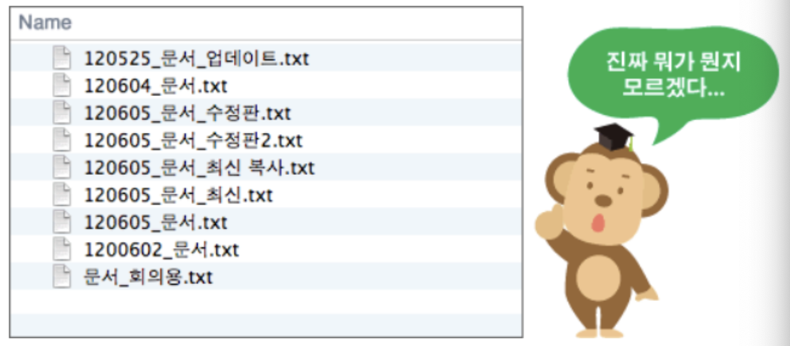
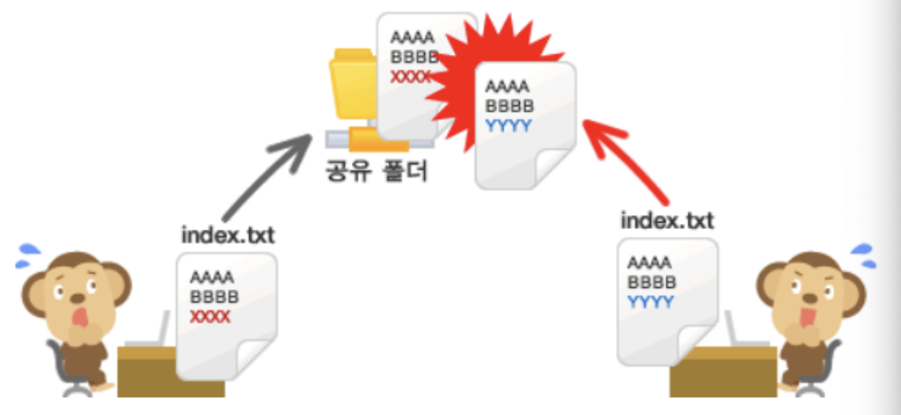
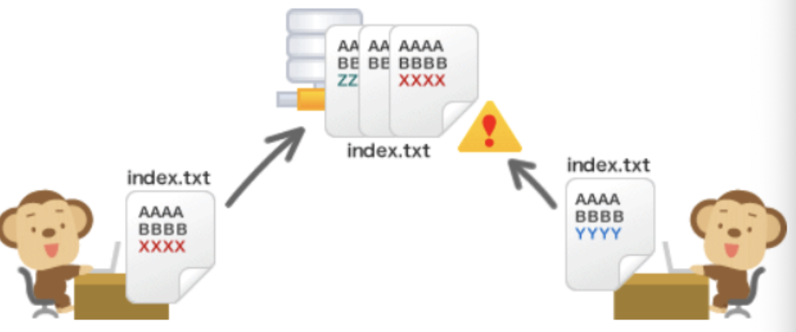
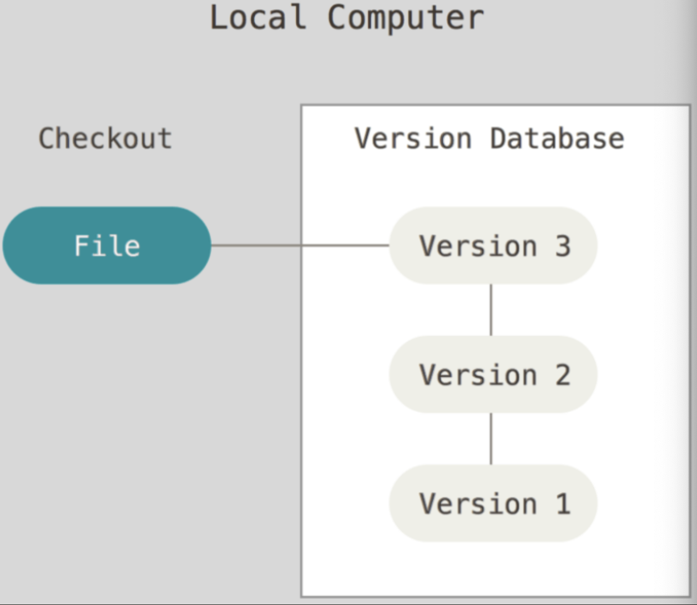
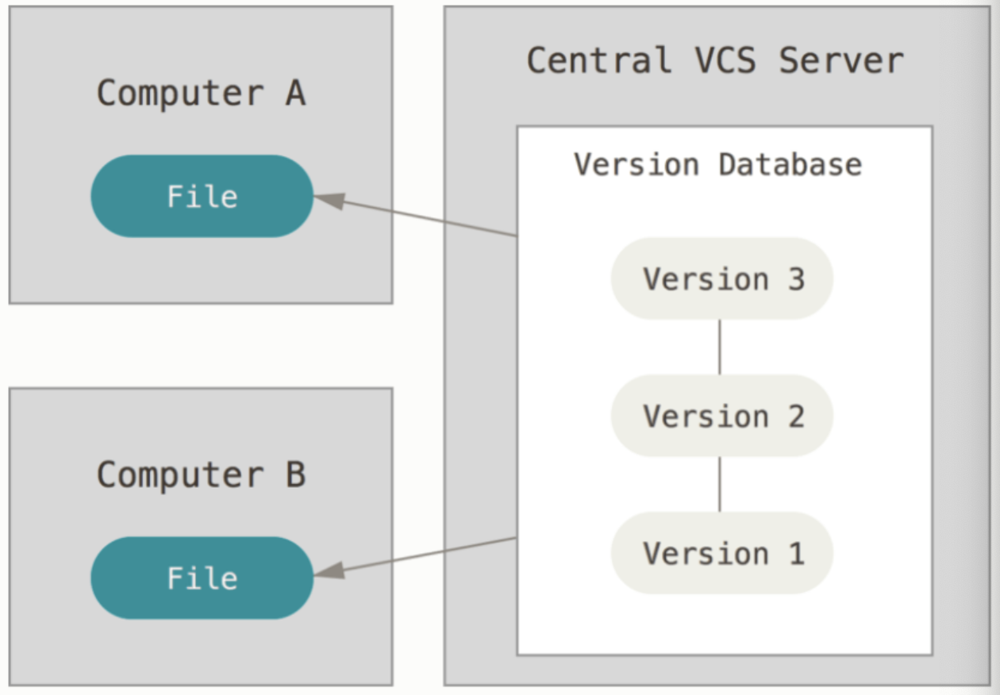
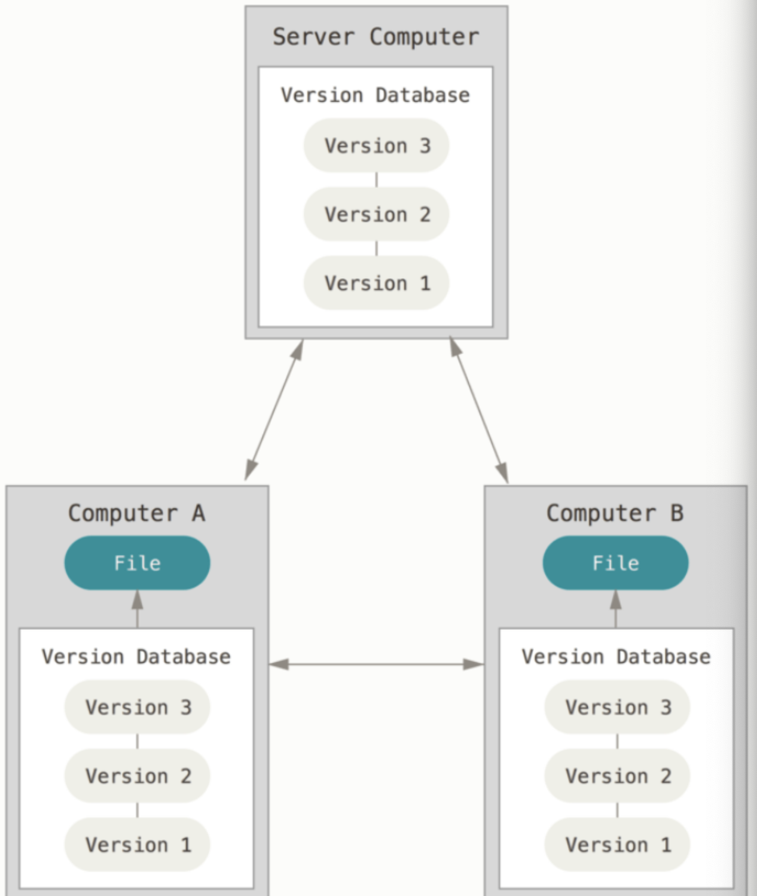

# [버전 관리 시스템](https://namu.wiki/w/%EB%B2%84%EC%A0%84%20%EA%B4%80%EB%A6%AC%20%EC%8B%9C%EC%8A%A4%ED%85%9C)
문서나 설계도, 소스 코드 등의 변경점을 관리해주는 소프트웨어.

---
### 버전 관리 필요성
여러분은 파일을 편집 전 상태로 되돌리고 싶을 때 어떻게 하고 있나요?

가장 간단한 방법은 편집하기 전에 파일을 미리 복사해두는 것입니다. 파일과 폴더명 뒤에 편집한 날짜를 붙여주는 방식이죠. 하지만 파일을 편집할 때마다 매번 복사하는 일은 번거롭기도 하고 실수할 가능성도 많습니다.

---

---
아래 그림을 보세요. 이렇게 여러 명이 공유한 파일을 동시에 편집하는 바람에 다른 사람이 먼저 변경하고 있던 내용을 지워버린 경험은 없나요?

---
내가 올리려는 파일이 누군가 편집한 내용과 충돌한다면, 서버에 업로드 할 때 경고 메시지가 발생됩니다. 누군가가 애써 편집한 내용을 덮어써버리는 실수는 이제 없겠죠!

---
### 버전 관리 장점

소프트웨어 등을 작성할 때 변경점을 관리하는 것은 말할 필요도 없이 아주 중요하다. 버전 관리를 함으로서 얻을 수 있는 것에는 다음과 같은 것들이 있다.

- `변경점 관리:` 어떤 내용을 누가 작성해서 어느 시점에 들어갔는지 확인할 수 있게 해준다.
- `버전 관리:` 특정 시점에 꼬리표(Tag)를 달아 버전을 표시해주고, 브랜치(Branch) 등으로 동시에 여러 버전을 개발할 수 있게 해준다.
- `백업&복구:` 무언가가 잘못되었을 때 다시 특정 시점으로 돌아가게 해주고, 사고로 내용이 날아간 경우에도 복구할 수 있게 해준다.
협업: 같이 일하는 사람들에게 수정사항을 쉽게 공유

---
# [버전 관리 종류](https://git-scm.com/book/ko/v2/%EC%8B%9C%EC%9E%91%ED%95%98%EA%B8%B0-%EB%B2%84%EC%A0%84-%EA%B4%80%EB%A6%AC%EB%9E%80%3F)

### 1. 로컬 버전 관리 
- 많은 사람은 버전을 관리하기 위해 디렉토리로 파일을 복사하는 방법을 쓴다(똑똑한 사람이라면 디렉토리 이름에 시간을 넣을 거다). 
- 이 방법은 간단하므로 자주 사용한다. 그렇지만, 정말 뭔가 잘못되기 쉽다. 작업하던 디렉토리를 지워버리거나, 실수로 파일을 잘못 고칠 수도 있고, 잘못 복사할 수도 있다.

---

---
### 2. 중앙 집중식 버전 관리
- 프로젝트를 진행하다 보면 다른 개발자와 함께 작업해야 하는 경우가 많다. 이럴 때 생기는 문제를 해결하기 위해 CVCS(중앙집중식 VCS)가 개발됐다.
- 그러나 이 CVCS 환경은 몇 가지 치명적인 결점이 있다. 가장 대표적인 것이 중앙 서버에 발생한 문제다. 만약 서버가 한 시간 동안 다운되면 그동안 아무도 다른 사람과 협업할 수 없고 사람들이 하는 일을 백업할 방법도 없다. 그리고 중앙 데이터베이스가 있는 하드디스크에 문제가 생기면 프로젝트의 모든 히스토리를 잃는다. 

---

---
### 3. 분산 버전 관리 시스템
- Git, Mecurial, Bazaar, Darcs 같은 DVCS에서의 클라이언트는 단순히 파일의 마지막 스냅샷을 Checkout 하지 않는다. 
- 그냥 저장소를 히스토리와 더불어 전부 복제한다. 서버에 문제가 생기면 이 복제물로 다시 작업을 시작할 수 있다. 
- 클라이언트 중에서 아무거나 골라도 서버를 복원할 수 있다. Clone은 모든 데이터를 가진 진정한 백업이다.

---

---
# [Github tutorial](./github.md)
Github은 분산 버전 관리 시스템이다.
- Github 저장소
- Git 세 가지 상태
- 브랜치(branch)

---
# [Git 초기 설치 및 세팅방법](./install.md)
- 설치방법 
- 환경설정 방법 

---
# [Git 기본 명령어](./command.md)

---
# branch

---
# gitignore

---
# pull conflict

---
# blame

