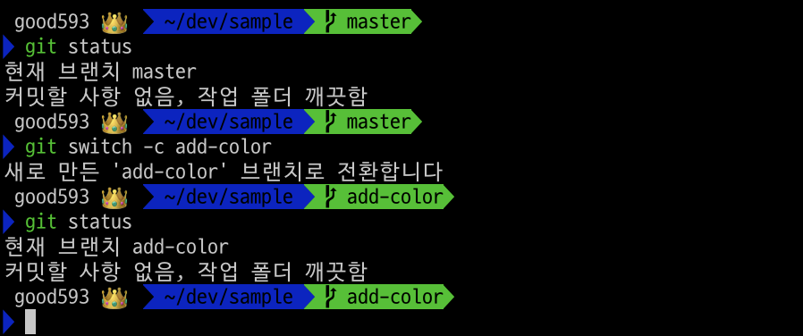
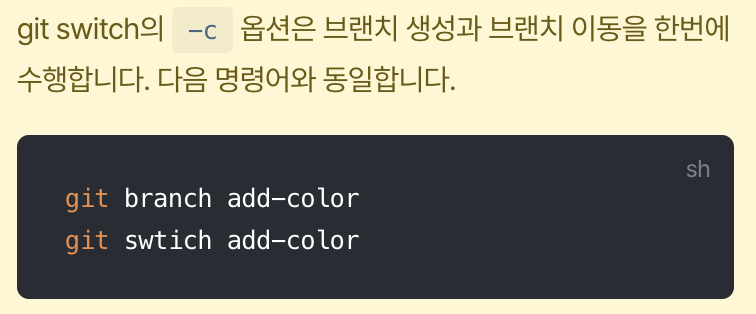
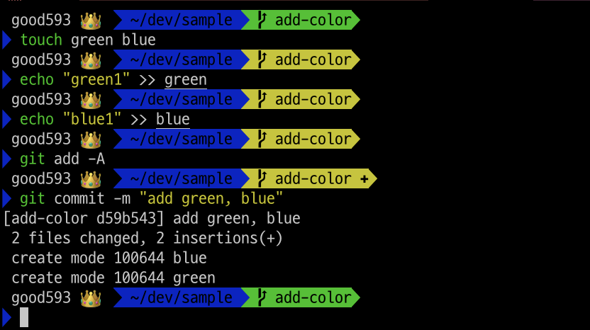
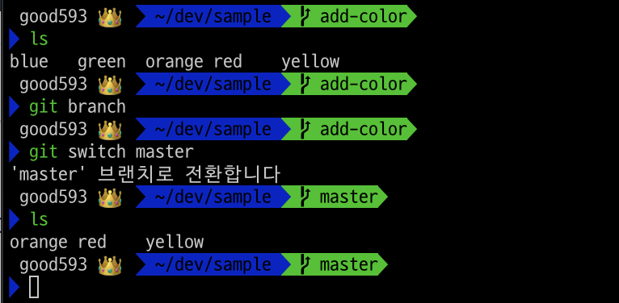
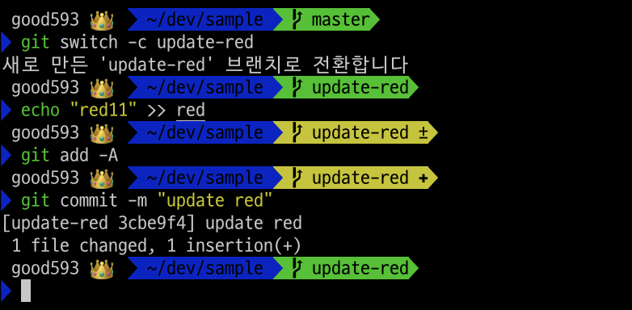
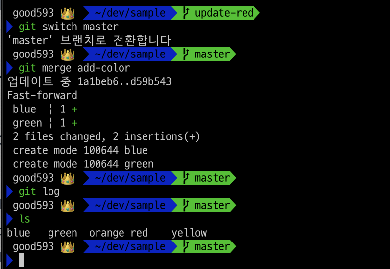
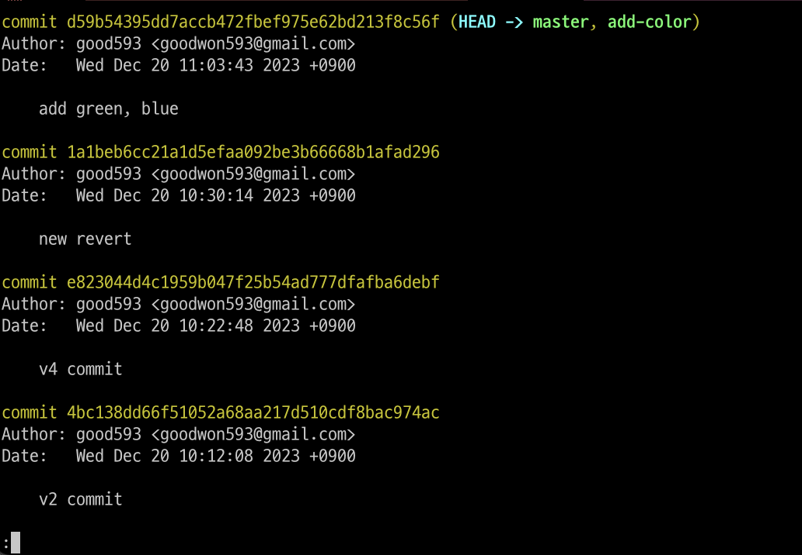
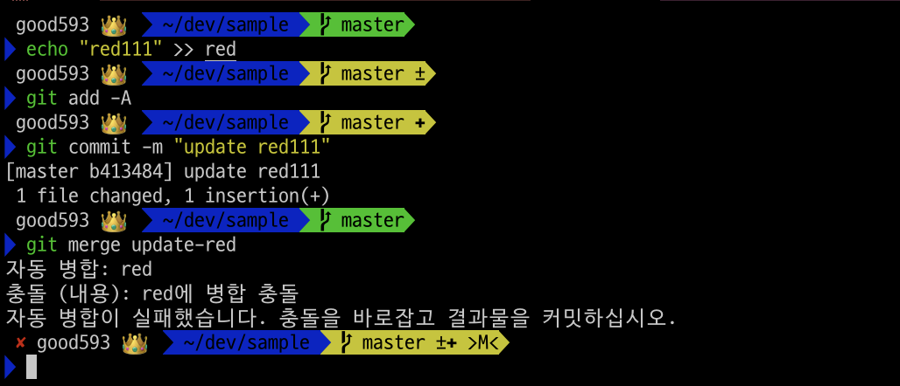
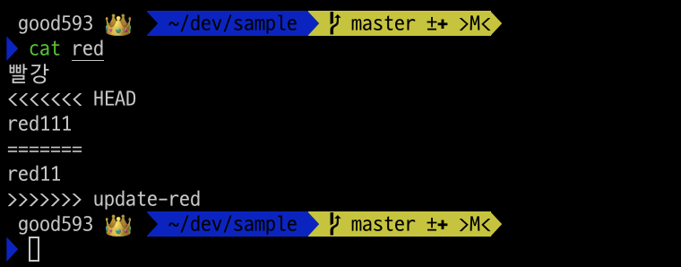
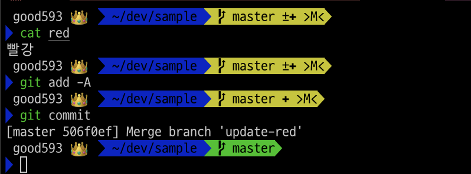

# [Branch 사용법](https://subicura.com/git/guide/branch.html#git-switch-c-%E1%84%87%E1%85%B3%E1%84%85%E1%85%A2%E1%86%AB%E1%84%8E%E1%85%B5-%E1%84%89%E1%85%A2%E1%86%BC%E1%84%89%E1%85%A5%E1%86%BC)

## git switch -c - 브랜치 생성
- 새 브랜치를 만들 때, 현재 브랜치의 상태를 기준으로 만들기 때문에 현재 브랜치가 무엇인지 꼭 확인해야 합니다.

### 작업 
1. 브랜치 확인 
2. 새로운 브랜치(add-color) 생성 

```shell
$ git status # 1.
$ git switch -c add-color # 2.
```
---



---
## add-color 브랜치에서 작업
### 작업 
1. green, blue 파일 추가
2. 전체 변경사항을 인덱스에 추가
3. 커밋 작성

```shell
$ touch green blue # 1.
$ echo "green1" >> green
$ echo "blue1" >> blue 
$ git add -A # 2.
$ git commit -m "add green, blue" # 3.
```

---


---
## git switch - 브랜치 변경
add-color 브랜치에서 진행한 작업이 기존 main 브랜치와 독립적인 것을 확인합니다.
### 작업 
1. 현재(add-color) 파일들 확인
2. 브랜치 리스트 확인 
3. master 브랜치로 이동 
4. 파일들 다시 확인 
  - green, blue 파일이 없음!!

---
```shell
$ ls # 1.
$ git branch # 2. : 나가기; q 
$ git switch master # 3.
$ ls # 4.
```


---
## update-red 브랜치 추가
### 작업 
1. update-red 브랜치 생성 후 이동 
2. red 파일 내용 변경 
3. 전체 변경사항을 인덱스에 추가 
4. 커밋 작성 

```shell
$ git switch -c update-red # 1.
$ echo "red11" >> red # 2.
$ git add -A # 3.
$ git commit -m "update red" # 4.
```
---


---
### 현재 브랜치 상황 
- master: red, orange, yellow
- add-color: red, orange, yellow, green, blue
- update-red: red(변경), orange, yellow

---
## git merge - 브랜치 합치기 
### 작업 
1. master 브랜치로 이동 
2. add-color 브랜치의 수정사항을 master 브랜치로 merge(합치기)
3. add-color에서 작성한 커밋 로그가 master 브랜치에도 추가된 것을 확인 
4. master 브랜치에서 green, blue 파일이 추가된 것을 확인 

---
```shell
$ git switch master # 1.
$ git merge add-color # 2.
$ git log # 3.
$ ls # 4.
```



---


---
### 결과 정리 
- add-color에서 작업한 내용(파일들)이 master 브랜치로 머지됨
- master 브랜치에 green, blue 파일이 추가된 것을 확인 
- add-color에서 작성한 커밋 로그가 master 브랜치에도 추가된 것을 확인 

---
## conflict - 충돌 해결 
update-red 브랜치에서 수정한 red 파일을 master 브랜치에서도 수정하여 충돌 상황을 만듭니다.
### 작업 
1. master 브랜치에서 red 파일 수정 
2. 전체 변경사항을 인덱스에 추가 
3. 커밋 작성 
4. update-red 브랜치를 master 브랜치로 머지(합치기)
  - 충돌발생!!

```shell
$ echo "red111" >> red
$ git add -A
$ git commit -m "update red111"
$ git merge update-red # 충돌발생!!!!
```
---


---
### 충돌내용 확인
- red 파일 확인(충동내용 확인!!)
```shell
$ cat red # 충동내용 확인!!
```


---
### 충돌 해결 
1. red 파일에서 필요없는 내용 모두 삭제(수정)
2. 전체 변경사항을 인덱스에 추가 
3. 커밋 진행(메세지는 생략)
  - vi창이 열리면, `ecs` 키를 누르고 `:x` 를 입력한 후 엔터

```shell
$ git add -A
$ git commit
```


