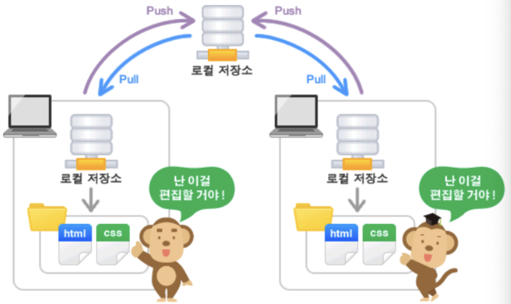
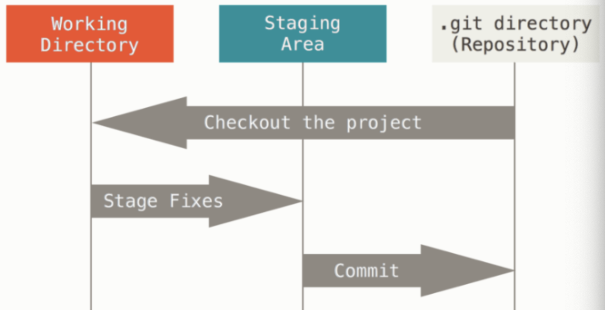
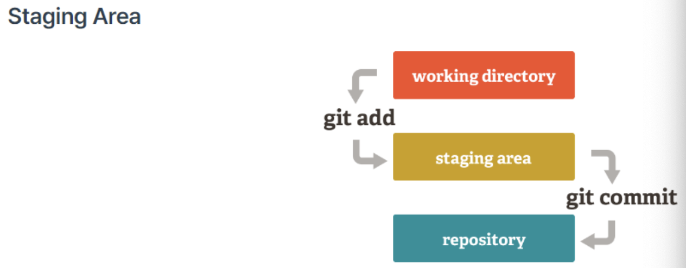
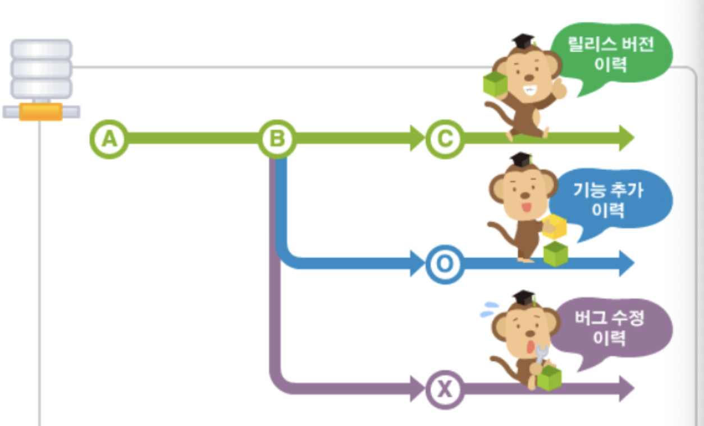
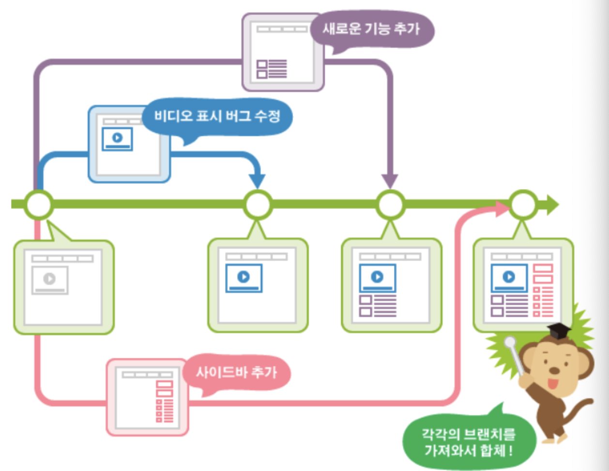

# Github 저장소 
Github은 원격 저장소와 로컬 저장소 두 종류의 저장소를 제공합니다.

- 원격 저장소(Remote Repository): 파일이 원격 저장소 전용 서버에서 관리되며 여러 사람이 함께 공유하기 위한 저장소입니다.
- 로컬 저장소(Local Repository): 내 PC에 파일이 저장되는 개인 전용 저장소입니다.

---

---
# Git 세 가지 상태
Git을 공부하기 위해 반드시 짚고 넘어가야 할 부분이다. Git은 파일을 Committed, Modified, Staged 이렇게 세 가지 상태로 관리한다.

- `Committed`란 데이터가 로컬 데이터베이스에 안전하게 저장됐다는 것을 의미한다.
- `Modified`는 수정한 파일을 아직 로컬 데이터베이스에 커밋하지 않은 것을 말한다.
- `Staged`란 현재 수정한 파일을 곧 커밋할 것이라고 표시한 상태를 의미한다.

---

---
- 다른 버전 관리 시스템과 달리, Git은 커밋 이전에 스테이징staging area 또는 인덱스index라 불리는 상태를 가집니다. 
- 이 상태에서 커밋 내역을 검토하고 특정 파일만 먼저 커밋하고 일부 파일은 나중에 커밋할 수도 있습니다.

---
# [브랜치(branch)](https://backlog.com/git-tutorial/kr/stepup/stepup1_1.html)
- 여러 개발자들이 동시에 다양한 작업을 할 수 있게 만들어 주는 기능이 바로 '브랜치(Branch)' 입니다. 
- 각자 독립적인 작업 영역(저장소) 안에서 마음대로 소스코드를 변경할 수 있지요. 이렇게 분리된 작업 영역에서 변경된 내용은 나중에 원래의 버전과 비교해서 하나의 새로운 버전으로 만들어 낼 수 있습니다.

---
- 또한 이렇게 만들어진 브랜치는 다른 브랜치와 병합(Merge)함으로써, 작업한 내용을 다시 새로운 하나의 브랜치로 모을 수 있습니다.

---
### [브랜치 전략](https://nohack.tistory.com/18) 
Git Flow의 특징은 브랜치가 5가지로 나뉜다는 것입니다.

- `main(master)`: 서비스을 직접 배포하는 역할을 하는 브랜치입니다.
- `feature(기능)`: 각 기능 별 개발 브랜치입니다.
- `develop(개발)`: feature에서 개발된 내용이 저장되는 브랜치입니다.
- `release(배포)`: 배포를 하기 전 내용을 QA(품질 검사)하기 위한 브랜치입니다.
- `hotfix(빨리 고치기)`: main 브랜치로 배포를 하고 나서 버그가 생겼을 때 빨리 고치기 위한 브랜치입니다.

---

