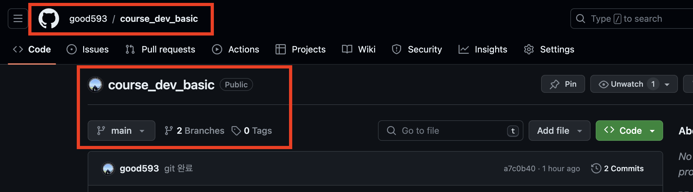
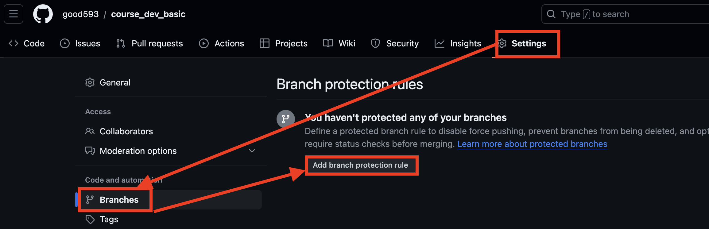
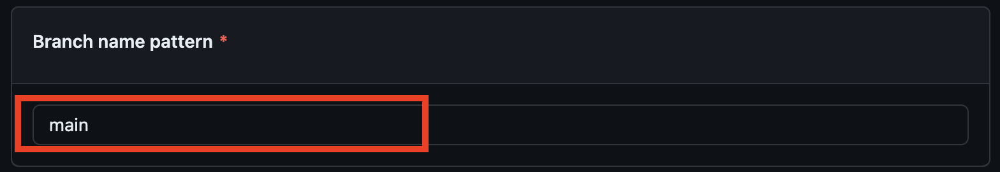
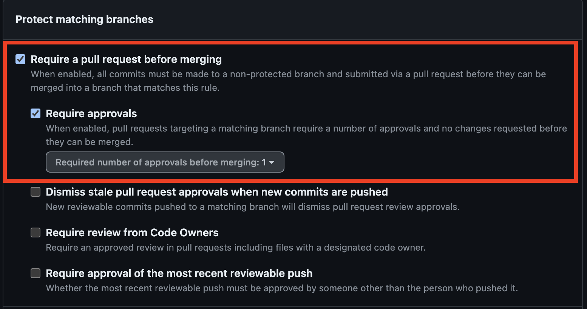
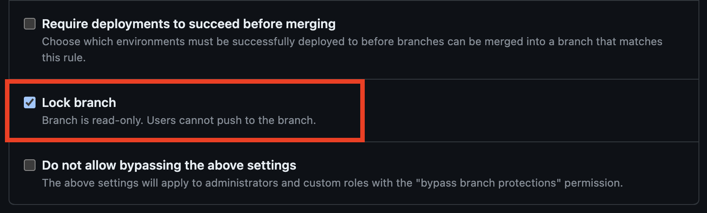
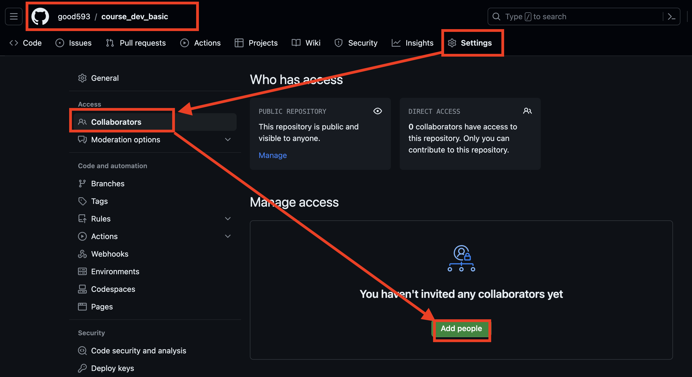

# [Github 팀프로젝트 하기](https://www.youtube.com/watch?v=tkkbYCajCjM)

---
## Github 팀프로젝트 초기세팅 
### 1. 팀프로젝트에 사용할 리포지토리 생성 

---
### 2. 브랜치별 규칙 작성 
- 다른 개발자들과 협업을 하다보면 파일을 머지(합치기)를 하다가 문제가 생길 수 있습니다.
- 따라서 특정(master/main) 브랜치들은 일반 개발자분들이 푸쉬(또는 풀)를 할 수 없도록  규칙을 정할 수 있습니다.
- 다양한 규칙들 중에서 필요한 규칙을 설정 
  - 아래 예제에서는 2가지에 대한 규칙을 설정하였음 

---
- 규칙을 만들 수 있는 화면으로 이동 

---
- 적용될 브랜치 이름 작성 

---
- 머지를 하기전에 Pull Request 발생!!
- 다른 개발자들의 approval이 있는 경우에만 머지 진행!! 

---
- 다른 개발자분들은 수정을 하지 못함!!

---
### 3. 생성된 리포지토리에 팀원 초대하기 

 
