# [vscode를 이용한 git 사용법](https://learn.microsoft.com/ko-kr/azure/developer/javascript/how-to/with-visual-studio-code/clone-github-repository?tabs=activity-bar)

## 1. 리포지토리 생성 방법 
1. vscode를 통해 프로젝트를 작성(생성)

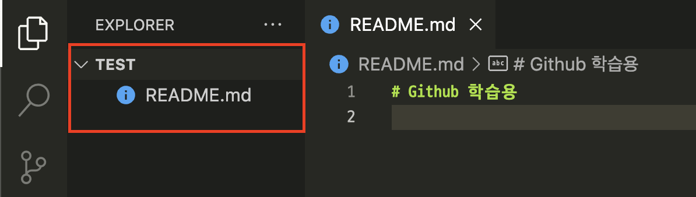

---
2. 리포지토리 초기화를 선택 
>  `git init`: (로컬)저장소 만들기 

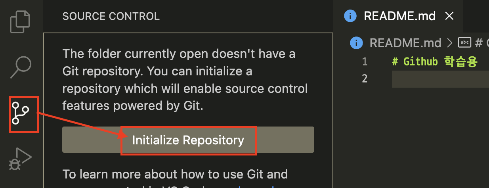

---
- 결과 확인 
> `git status`: 현재 상태 확인 

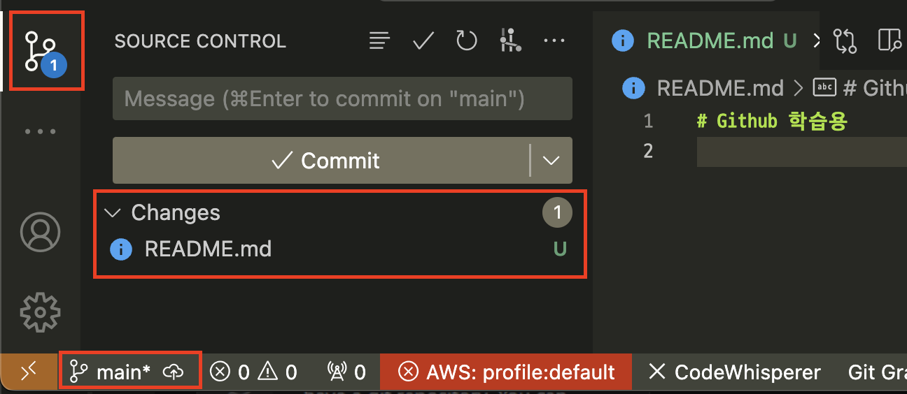

---
3. 변경된 내용 추가하기 
> `git add`: 현재 상태 추적 

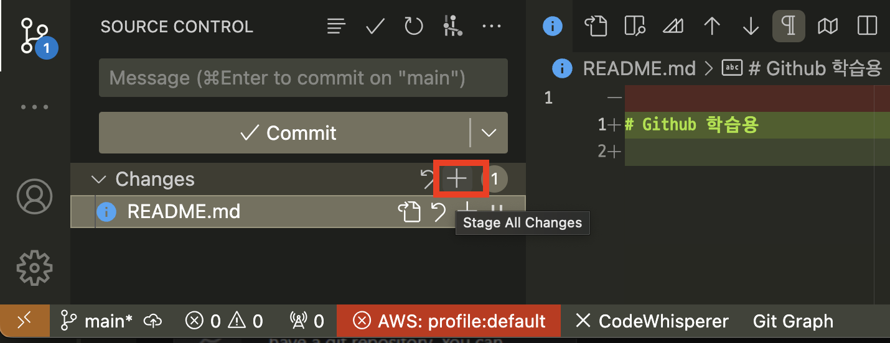

---
- 결과 확인 
> `git status`: 현재 상태 확인 

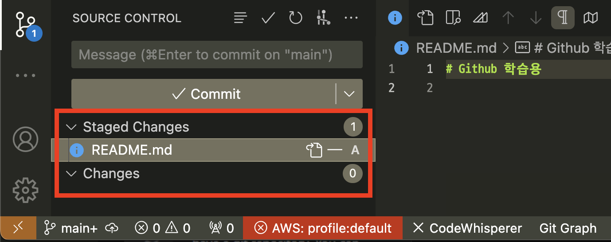

---
4. 변경된 내용 커밋 하기 
> `git commit`: 현재 상태 저장

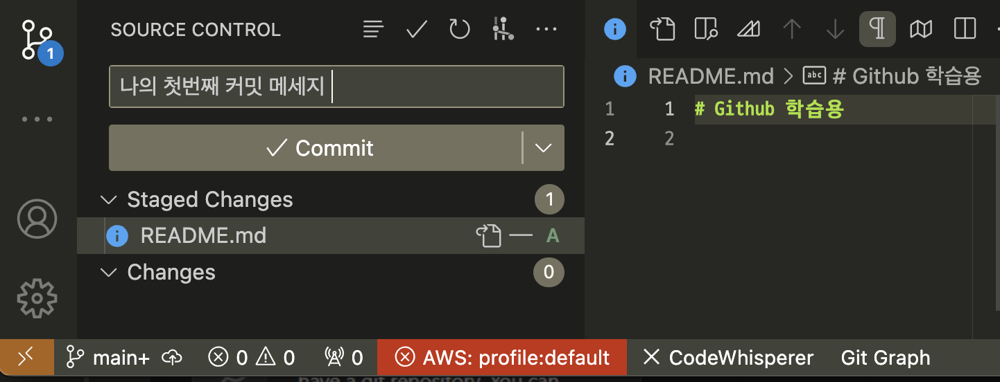

---
5. Github 리포지토리 생성하기 

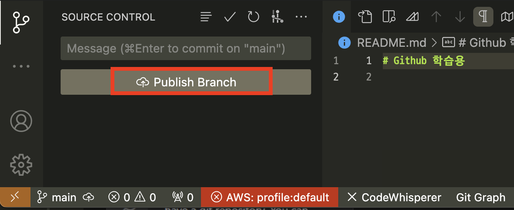

---
6. 생성될 Github 리포지토리 이름 작성 및 public/private 선택 

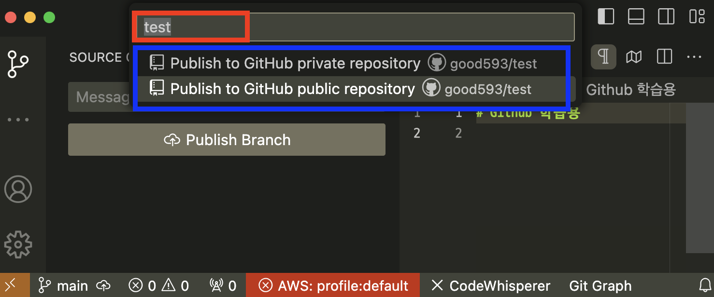

---
7. vscode에서 결과 확인 

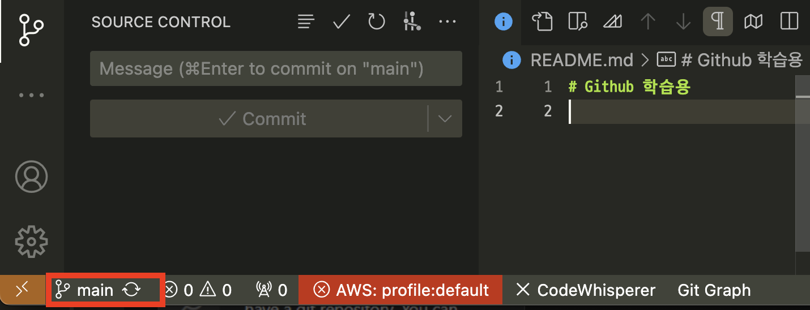

---
8. Github에 접속 및 Repositories 선택 

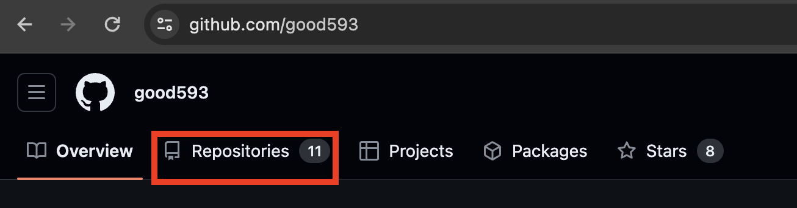

---
9. 생성된 리포지토리 선택 

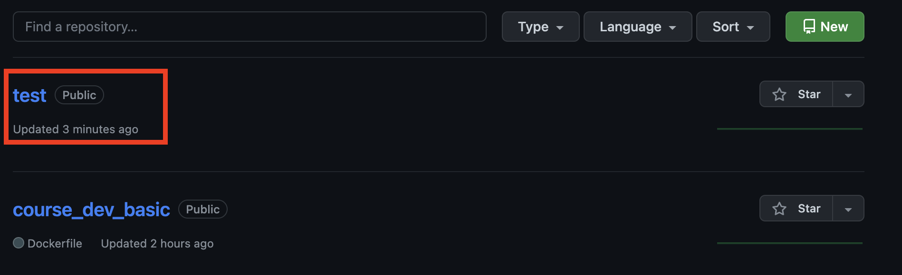

---
10. 반영된 내용 확인 

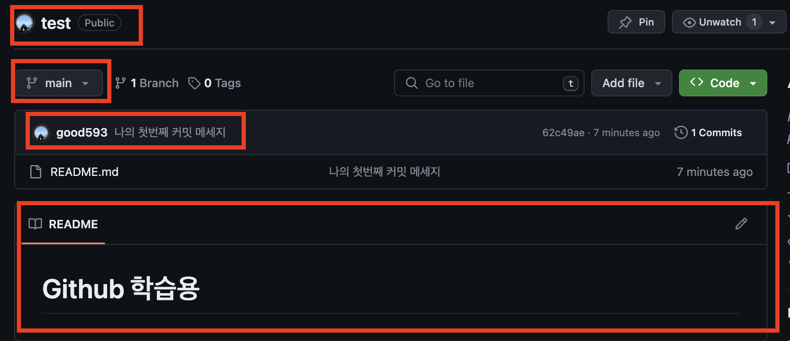

---
## 2. Github 리포지토리 복제 방법
1. 리포지토리 URL을 입력하라는 메시지가 표시되면 GitHub에서 복제를 선택한다. 
  - 즉 주소를 복사한다.

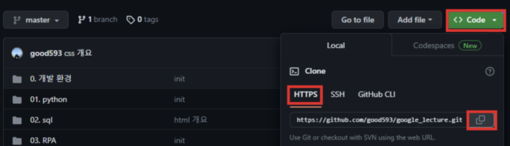

---
2. `Ctrl` + `Shift` + `P`의 키 조합으로 명령 팔레트를 엽니다.
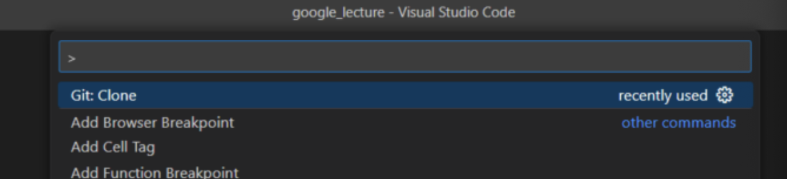

---
3. 명령 팔레트 프롬프트에서 를 입력 gitcl하고 Git: Clone 명령을 선택한 다음 , GitHub에서 복사(1번 참고)한 주소를 입력하고 Enter 키를 누릅니다.
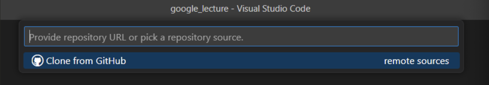

---
4. 만약 GitHub에 로그인하라는 메시지가 표시되면 로그인 프로세스를 완료합니다.
5. 리포지토리를 저장할 폴더를 선택합니다.

---
## 3. 브랜치 만들기(생성하기)
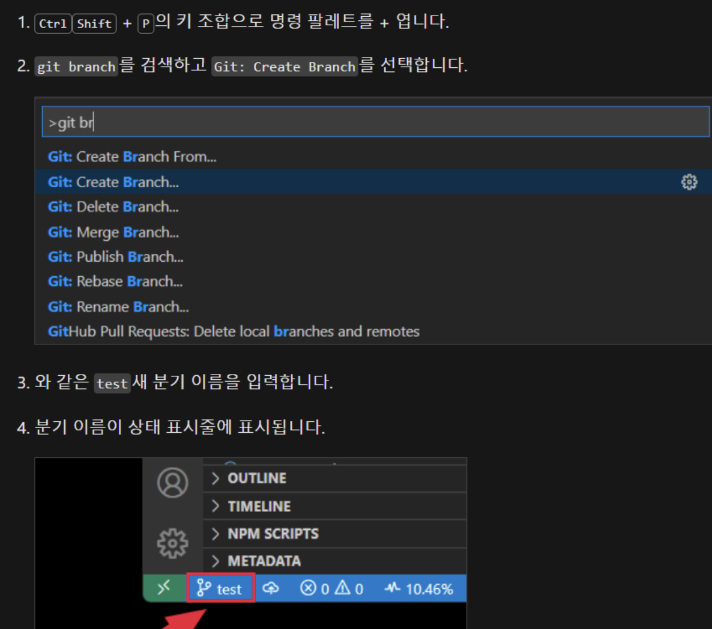

---
## 4. 커밋하기 
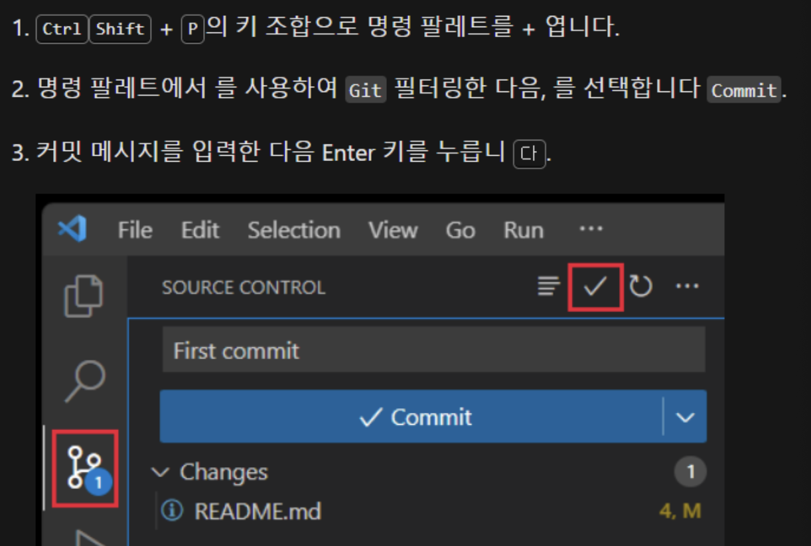

---
## 5. 풀/푸시하기 
`중요: 꼭 pull을 하고 push를 실행!!`

- pull: Github 리포지토리에 있는 소스와 머지(합치기)
- push: 로컬 리포지토리에 있는 소스를 Github 리포지토리에 반영하기 

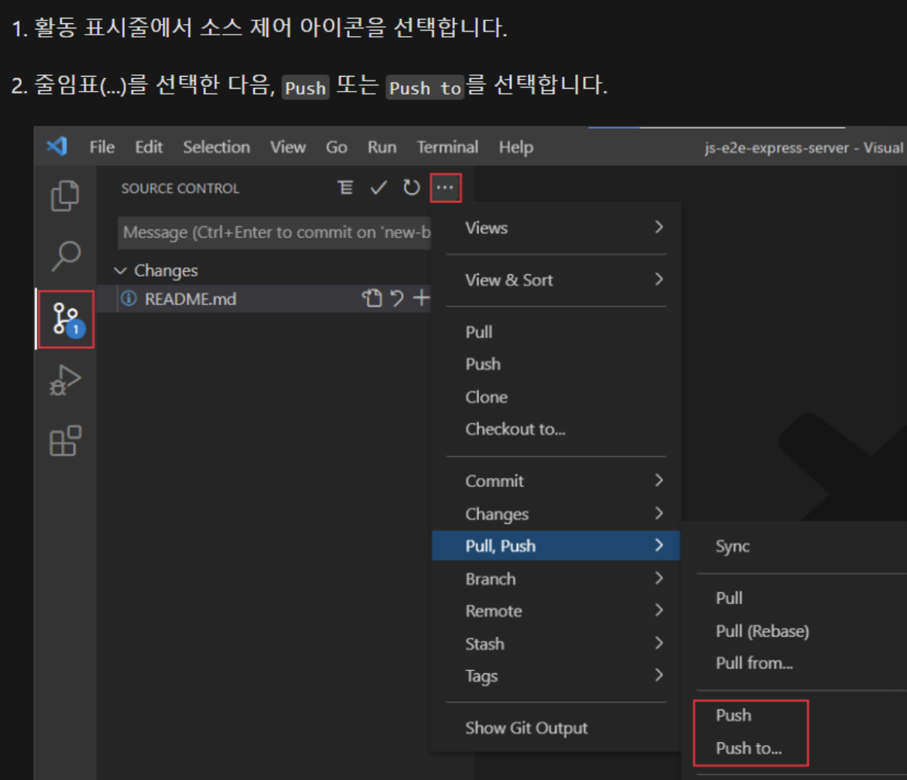

---
# vscode에서 사용하기 좋은 익스텐션 

## 설치하기 
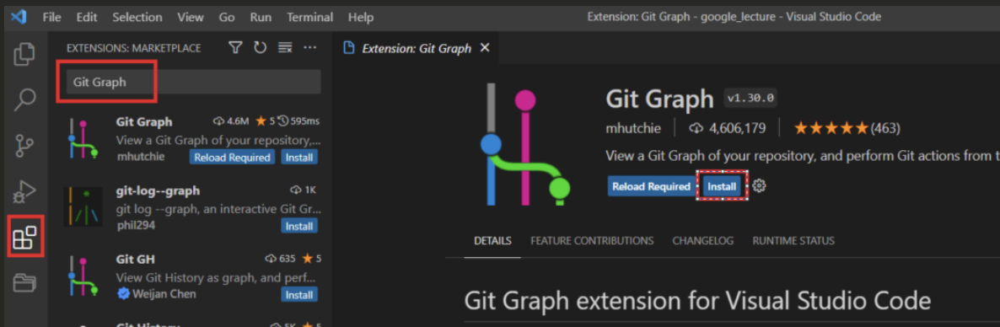

---
## 사용법 

---
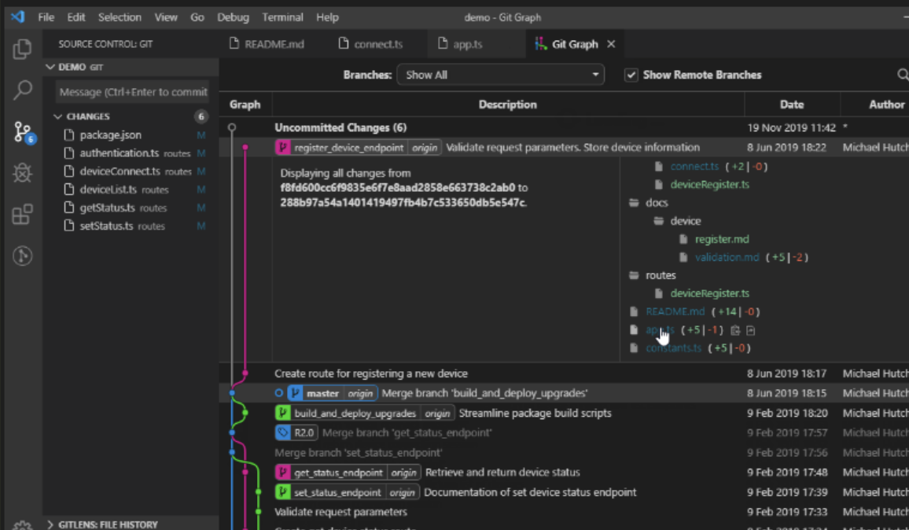

