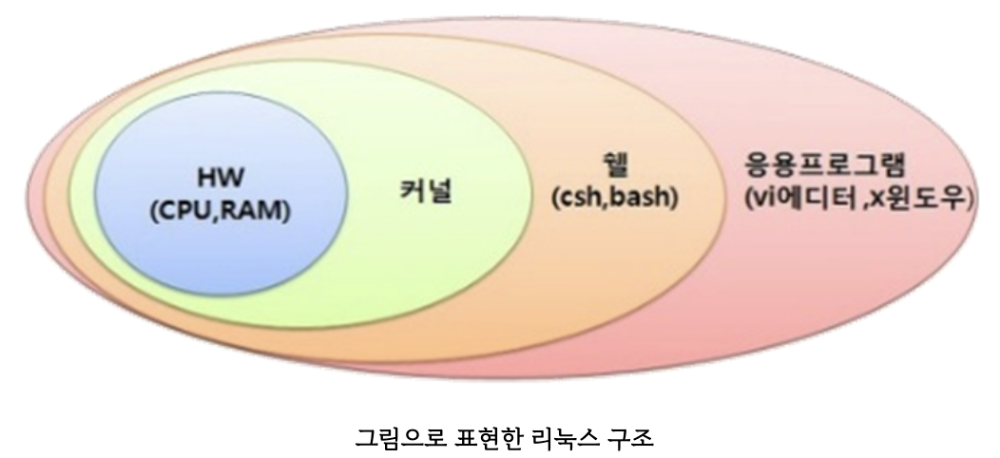

# [Linux](https://onecoin-life.com/45)
리눅스는 컴퓨터 운영체제 중 하나이며, 1991년 9월 17일 핀란드 소프트웨어 개발자인 리누스 토르발스라는 사람이 개발하여 처음 출시한 운영 체제 커널(kernel)인 리눅스 커널에 기반을 둔 오픈소스 유닉스 계열 운영체제이다. 

---
## 리눅스 종류
- Ubuntu Linux 
  - 데스크톱, 서버 버전 모두 무료로 다운로드하여 이용할 수 있으며, 상업적인 서비스를 위한 활용에도 문제가 없다. 
- CentOS
  - 점유율 1위! 가볍고 안정적 운영이 가능하다.
- Kali Linux
  - 수 많은 해킹과 관련된 도구와 설명서가 표함되어 있다.

---
## 리눅스 구조 


---
- 하드웨어(Hardware, H/W)
  - CPU, 키보드, RAM, GPU 등 
- 커널(Kernel)
  - 컴퓨터 운영 체제의 핵심이 되는 프로그램으로, 시스템의 모든 것을 완전히 통제하며, 응용 프로그램 수행에 필요한 여러 가지의 서비스를 제공한다. 
  - 하드웨어를 직접 제어하고, 프로세스 관리, 메모리 관리, 파일 시스템 관리 등을 수행하는 운영체제의 핵심 
  - 응용 프로그램과 하드웨어 사이의 관리자 역할을 수행하며, 쉘과 연관되어 쉘에서 명령하는 작업을 수행하고 수행된 결과를 쉘로 보내는 역할을 한다. 

---
- 쉘(Shell)
  - 쉘은 운영체제 상에서 다양한 운영 체제 기능과 서비스를 구현하는 인터페이스를 제공한다. 
  - 사용자가 입력하는 명령을 대신 해석해 커널에게 전달하여 실행해주는 프로그램이다. 
- 응용프로그램(Application)
  - 응용 소프트웨어 또는 애플리케이션은 운영체제에서 실행되는 모든 소프트웨어를 뜻하는데 리눅스는 각종 프로그래밍 개발도구, 문서편집도구, 네트워크 관련 도구 등 매우 다양한 응용프로그램을 제공한다. 

---
# 리눅스 사용법 

---
- docker를 이용하여 ubuntu 실행 
```shell
docker run -it --name ubuntu_test ubuntu /bin/bash
```


---
## [Shell (bash shell)](./Shell.md)

---
## [Linux 기본 명령어](./basic.md)

---
# [Vim 사용법](./vim.md) 
- 윈도우에서는 메모장을 편집기의 기본으로 지원하는 반면, 리눅스에서는 기본 편집기로 vi 편집기를 지원한다.
- VIM은 Vi IMproved의 약자 이다. 즉, vi에디터를 업그레이드 시킨 것이 vim에디터라고 생각하면 된다.

