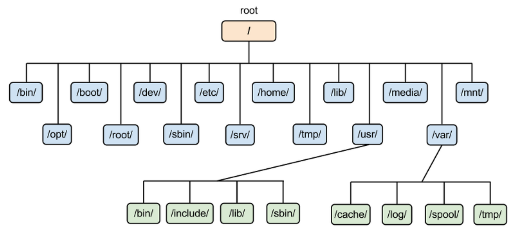

# [Linux](https://onecoin-life.com/45)
리눅스는 컴퓨터 운영체제 중 하나이며, 1991년 9월 17일 핀란드 소프트웨어 개발자인 리누스 토르발스라는 사람이 개발하여 처음 출시한 운영 체제 커널(kernel)인 리눅스 커널에 기반을 둔 오픈소스 유닉스 계열 운영체제이다. 

---
## 리눅스 종류
- Ubuntu Linux 
  - 데스크톱, 서버 버전 모두 무료로 다운로드하여 이용할 수 있으며, 상업적인 서비스를 위한 활용에도 문제가 없다. 
- CentOS
  - 점유율 1위! 가볍고 안정적 운영이 가능하다.
- Kali Linux
  - 수 많은 해킹과 관련된 도구와 설명서가 표함되어 있다.

---
## 리눅스 구조 


---
- 하드웨어(Hardware, H/W)
  - CPU, 키보드, RAM, GPU 등 
- 커널(Kernel)
  - 컴퓨터 운영 체제의 핵심이 되는 프로그램으로, 시스템의 모든 것을 완전히 통제하며, 응용 프로그램 수행에 필요한 여러 가지의 서비스를 제공한다. 
  - 하드웨어를 직접 제어하고, 프로세스 관리, 메모리 관리, 파일 시스템 관리 등을 수행하는 운영체제의 핵심 
  - 응용 프로그램과 하드웨어 사이의 관리자 역할을 수행하며, 쉘과 연관되어 쉘에서 명령하는 작업을 수행하고 수행된 결과를 쉘로 보내는 역할을 한다. 

---
- 쉘(Shell)
  - 쉘은 운영체제 상에서 다양한 운영 체제 기능과 서비스를 구현하는 인터페이스를 제공한다. 
  - 사용자가 입력하는 명령을 대신 해석해 커널에게 전달하여 실행해주는 프로그램이다. 
- 응용프로그램(Application)
  - 응용 소프트웨어 또는 애플리케이션은 운영체제에서 실행되는 모든 소프트웨어를 뜻하는데 리눅스는 각종 프로그래밍 개발도구, 문서편집도구, 네트워크 관련 도구 등 매우 다양한 응용프로그램을 제공한다. 

---
# [리눅스 디렉토리 구조](https://velog.io/@malangcow/AWS-%EB%A6%AC%EB%88%85%EC%8A%A4-%EB%94%94%EB%A0%89%ED%86%A0%EB%A6%AC-%EA%B5%AC%EC%A1%B0)
- 리눅스의 디렉토리 구조는 전체적으로 트리(Tree) 구조를 하고 있으며, 명령어의 성격과 내용 및 사용 권한등에 따라 디렉토리로 구분되어 있습니다.



---
- `/ (루트)`: 리눅스 시스템의 모든 파일과 디렉토리의 최상위 레벨입니다. 모든 다른 디렉토리는 이 루트 디렉토리 아래에 위치합니다.
- `/bin`: 기본적인 사용자 명령어가 들어 있는 디렉토리입니다. 예를 들어 ls, cp, mv 같은 표준 명령어들이 여기에 포함됩니다.
- `/sbin`: 시스템 관리와 관련된 명령어들을 포함하는 디렉토리입니다. 이러한 명령어들은 주로 시스템 관리자에 의해 사용됩니다.
- `/etc`: 시스템 설정 파일들이 저장되는 디렉토리입니다. 여기에는 시스템의 전반적인 설정을 관리하는 파일들이 포함되어 있습니다.
- `/var`: 변동적인 데이터를 저장하는 디렉토리입니다. 로그 파일, 메일 큐, 프린트 큐 등이 이 디렉토리에 저장됩니다.
- `/tmp`: 임시 파일을 저장하는 디렉토리입니다. 시스템이 재부팅될 때 이 디렉토리에 있는 파일들은 대부분 삭제됩니다.
---
- `/usr`: 사용자 관련 프로그램, 라이브러리, 문서 등을 저장하는 디렉토리입니다. 이는 추가 소프트웨어와 데이터를 포함하며, `/usr/bin`, `/usr/sbin`, `/usr/local` 등의 하위 디렉토리를 포함합니다.
- `/home`: 사용자의 홈 디렉토리들이 위치하는 곳입니다. 일반적으로 사용자는 여기서 자신의 파일과 디렉토리를 저장합니다.
- `/boot`: 부팅에 필요한 파일들, 예를 들어 리눅스 커널, 부트 로더 설정 등을 포함하는 디렉토리입니다.
- `/dev`: 장치 파일들이 저장되는 디렉토리입니다. 리눅스에서는 하드웨어 장치를 파일처럼 다루며, 이 디렉토리에는 그러한 장치 파일들이 포함됩니다.
- `/lib`: 필수 시스템 라이브러리와 커널 모듈들이 저장되는 디렉토리입니다.
- `/opt`: 선택적으로 설치한 소프트웨어 패키지들을 위한 디렉토리입니다.
- `/mnt 및 /media`: 외부 저장 장치나 네트워크 파일 시스템을 임시로 마운트하는 데 사용되는 디렉토리입니다.

---
# 리눅스 사용법 

---
- docker를 이용하여 ubuntu 실행 
```shell
docker run -it --name ubuntu_test -u ubuntu ubuntu /bin/bash
```


---
## [Linux 기본 명령어](./basic.md)

---
## [Vim 사용법](./vim.md) 
- 윈도우에서는 메모장을 편집기의 기본으로 지원하는 반면, 리눅스에서는 기본 편집기로 vi 편집기를 지원한다.
- VIM은 Vi IMproved의 약자 이다. 즉, vi에디터를 업그레이드 시킨 것이 vim에디터라고 생각하면 된다.

---
## [Shell (bash shell)](./Shell.md)


