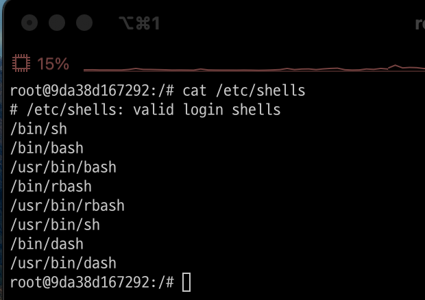
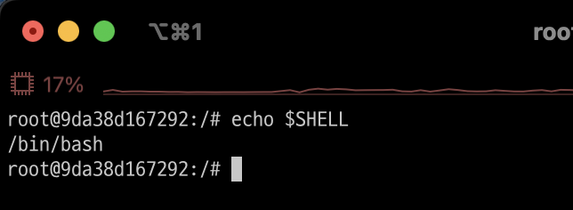

# Shell
- Shell(쉘)은 커널과 사용자 사이를 이어주는 역할을 해준다.
- Shell은 하나의 명령어 처리기(Command Processor)이다.

---
## Shell 종류 
- Bourne-Again Shell (bash): 리눅스에서 가장 많이 사용하는 쉘  
  - 설치 위치: /bin/bash
- Bourne Shell (sh): 최초의 쉘 
  - 설치 위치: /bin/sh 

그 외에도 다양한 쉘이 존재함  

---
# Bash Shell 

---
## Bash Shell 설정 
- 설치된 Shell 확인 
```shell
cat /etc/shells
``` 


---
- 현재 지정된 Shell 확인 
```shell
echo $SHELL
```


---

---
# 참고문서
- https://www.fun-coding.org/post/linux_basic2.html#gsc.tab=0
- https://inpa.tistory.com/entry/LINUX-%EC%89%98-%ED%94%84%EB%A1%9C%EA%B7%B8%EB%9E%98%EB%B0%8D-%ED%95%B5%EC%8B%AC-%EB%AC%B8%EB%B2%95-%EC%B4%9D%EC%A0%95%EB%A6%AC
- https://bangu4.tistory.com/242
- https://pyrasis.com/jHLsAlwaysUpToDateDocker/Unit04


