# [Linux Account](https://kbs4674.tistory.com/134)
- LINUX는 사용자 중심의 시스템으로, 사용자 계정이 있어야 접속할 수 있다.
- root
  - 시스템을 관리할 수 있는 관리자 권한의 계정이자 슈퍼 유저
  - 리눅스 파일 체제의 최상위 디렉토리( / )로도 표현한다.
- 일반 사용자 계정
  - root가 useradd 명령어를 통해 생성한 모든 계정
  - root와 달리 권한이 있는 파일과 디렉토리에 대해서만 읽고 쓸 수 있다.
---
# Linux Account 명령어

---
### 계정확인 
```shell
whoami
```
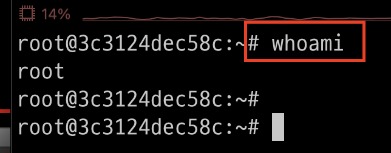

---
### root > 비번 생성(변경)
- `sudo`: 사용자 계정에 root권한을 일시적으로 부여하는 방법
- sudo 오류 발생시 다음 페이지 참고 
```shell
sudo passwd root
```
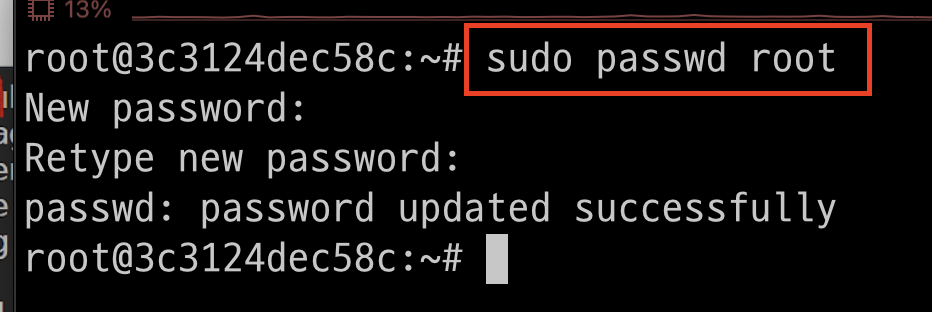

---
- sudo 오류 발생 > 처리 후 다시 passwd 설정 
```shell
apt-get install -y sudo 
```
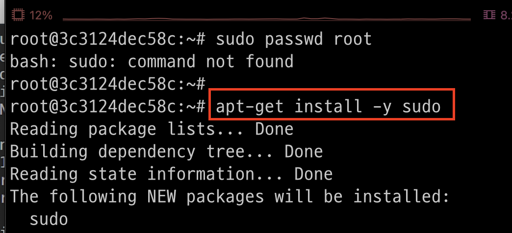

---
### 계정 생성 
- 명령어: adduser <생성될 계정아이디>
```shell
adduser student 
```
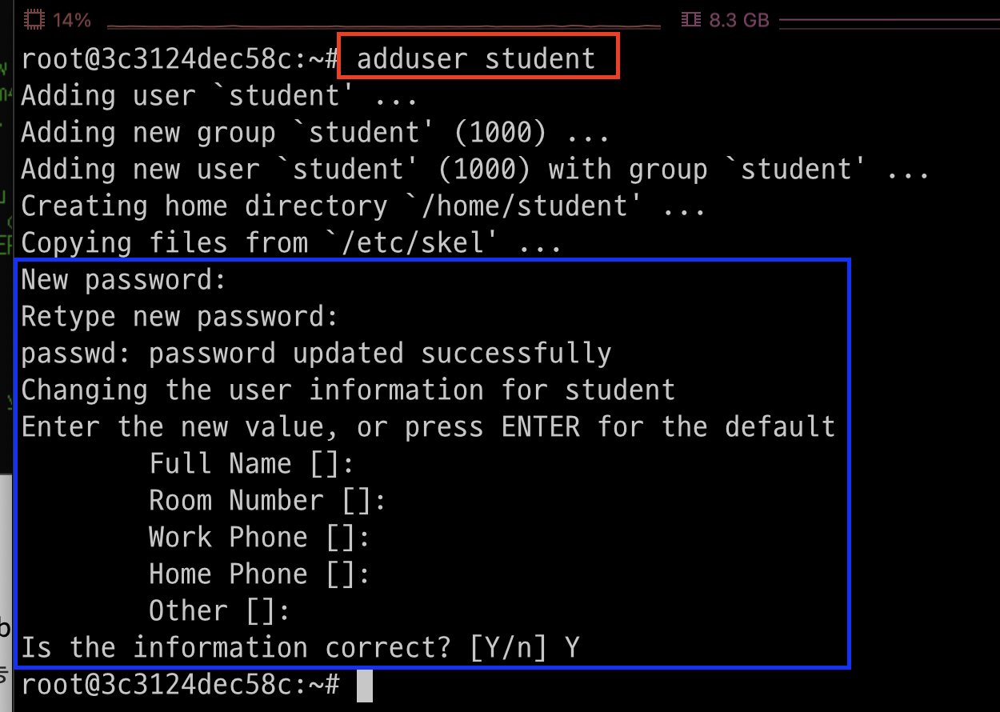

---
### 계정 변경 
- 명령어: su - <계정명>
```shell
su - student
pwd # student의 홈 디렉토리임 
```
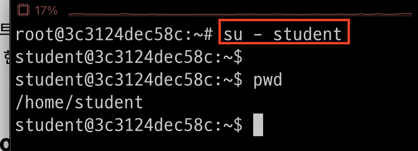

---
### student > 디렉토리 및 파일 생성 
- `test_student.txt`은 student 사용자와 그룹만 수정이 가능함 
```shell
touch test_student.txt
mkdir dir_student
ls -al # 권한 확인 
```
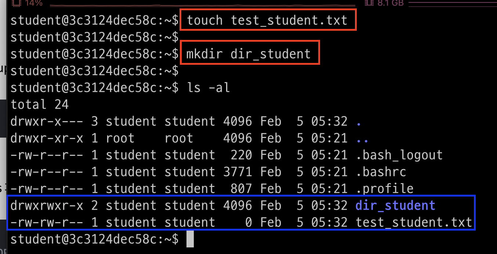

---
### student > 파일 수정 및 읽기 
```shell
# 파일 수정
echo "hello world" > test_student.txt
# 파일 읽기 
cat test_student.txt
```
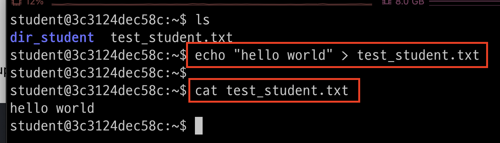

---
### student > sudo 사용하기 
- sudo 권한이 없다는 오류 발생 
```shell
sudo apt-get install python3 python-pip3
```
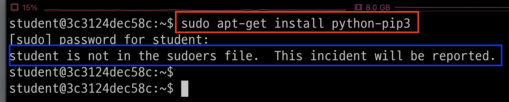

---
- root 계정으로 변경 
- 명령어: su - <계정명>
```shell
su - root
```
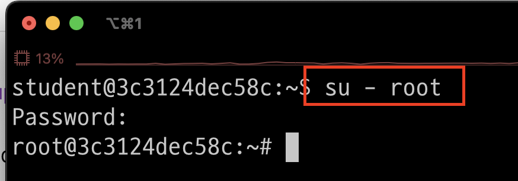

---
- student 계정에 sudo 권한 부여 
```shell
sudo vim /etc/sudoers
# 아래내용 추가 
student ALL=(ALL:ALL) ALL
```
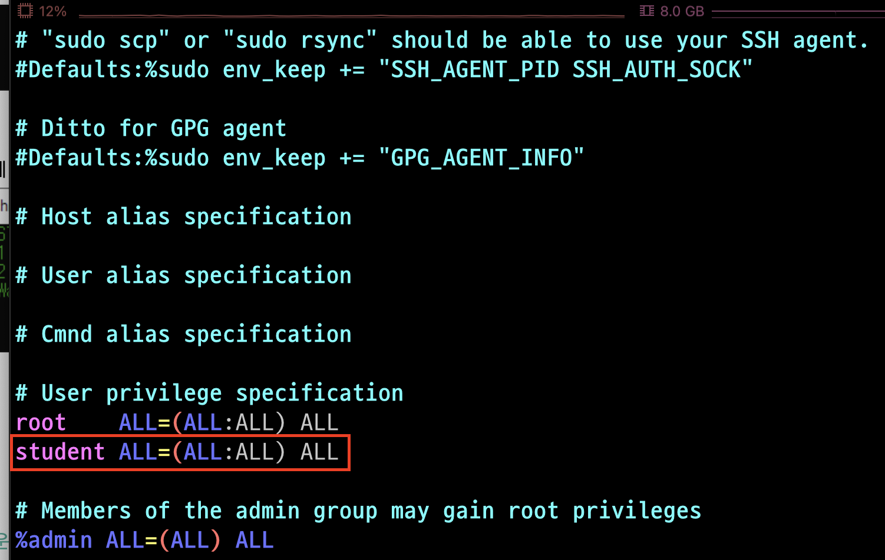

---
- student 계정으로 sudo 실행 
```shell
su - student # student 계정으로 변경 
sudo apt-get install -y python3 python3-pip 
```
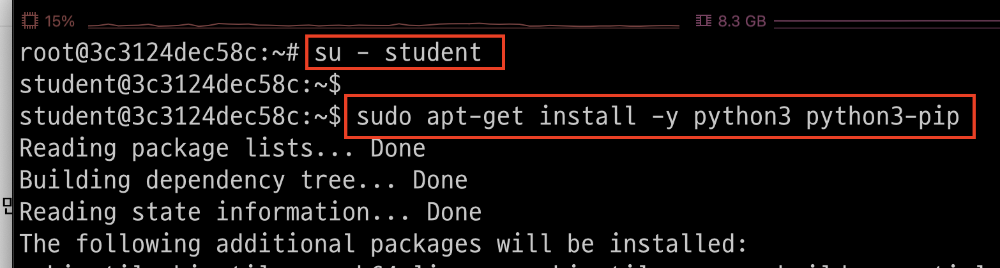

---
### ubunt 계정 조회 
```shell
su - root
cut -f1 -d: /etc/passwd
```


---
### student 계정 삭제 
- 명령어: sudo deluser <계정 아이디>
```shell
sudo deluser student
cut -f1 -d: /etc/passwd # 결과 확인 
```
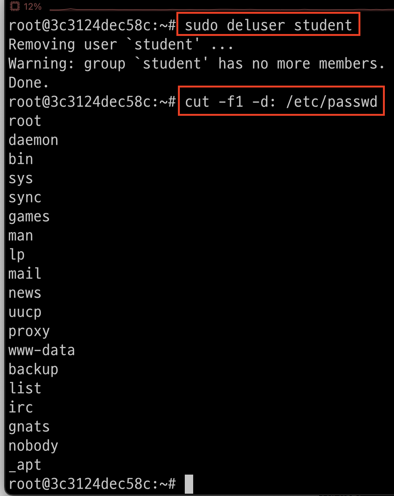

---
- 오류 발생 > student 계정없음 
```shell
su - student
```
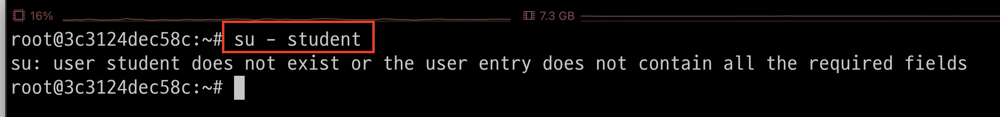


