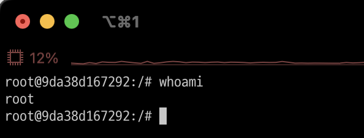

# 기본명령어
- 리눅스 명령어는 결구 쉘이 제공하는 명령어임 
- 따라서 리눅스 기본 명령어는 bash에서 제공하는 명령어임 

---
- whoami: 로그인한 사용자ID를 알려줌 
```shell
whoami
```


---
- pwd: 현재 디렉토리 위치 
```shell
pwd 
```


---
- ls: 파일 목록 출력 
  - a: 모든 파일 표시 
  - l: 파일에 관한 상세 정보 표시 
```shell
ls -al
```


---
- clear: 터미널 화면을 깨끗하게 
```shell
clear
```


---
- cd: 디렉토리 이동 
```shell
cd <디렉토리명>
cd .. # 상위 디렉토리로 이동 
```


---
- cat: 파일보기 
```shell
cat <파일명>
```


---
- mkdir: 폴더 생성 
```shell
mkdir <폴더명>
```


---
- touch: 파일 생성 
```shell
touch <파일명>
```


---
- mv: 이름변경 또는 이동 
```shell
mv <파일명 또는 디렉토리명>
```


---
- cp: 파일이나 디렉토리를 복사 
```shell
cp <파일명> <새로운 파일명>
cp -r <폴더명> <새로운 폴더명>
```


---
- rm: 파일이나 디렉토리 삭제 
```shell
rm <파일명>
rm -r <디렉토리명>
``` 


---
# 참고 문서 
- https://m.hanbit.co.kr/channel/category/category_view.html?cms_code=CMS6390061632
- https://cocoon1787.tistory.com/717
- https://www.fun-coding.org/post/linux_basic2.html#gsc.tab=0


