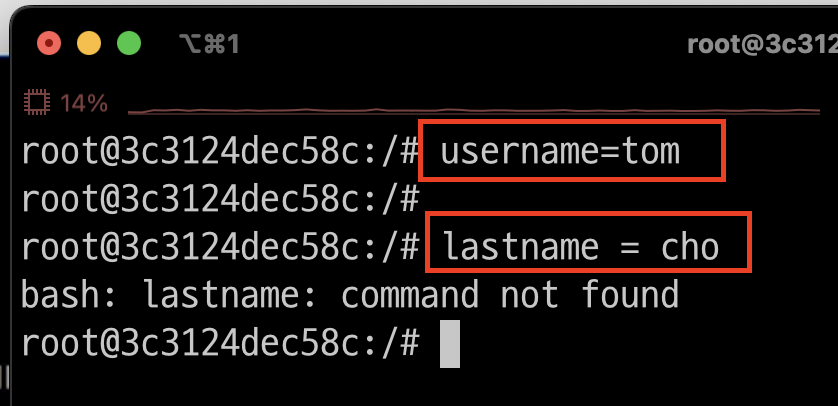
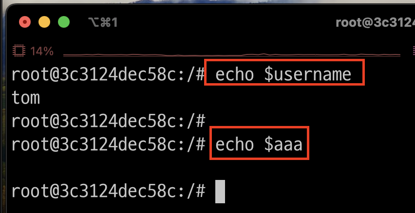
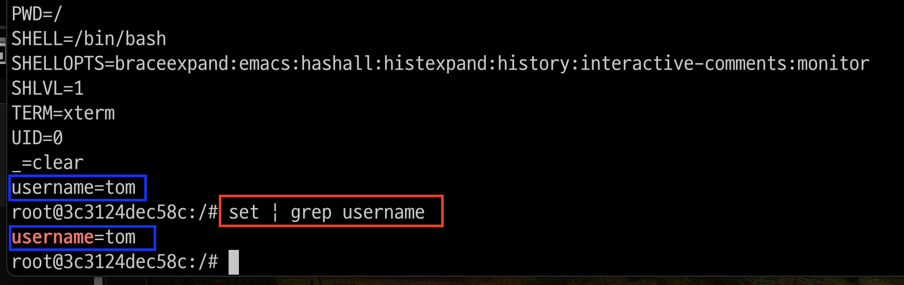
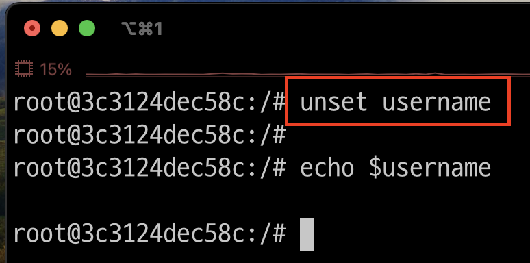
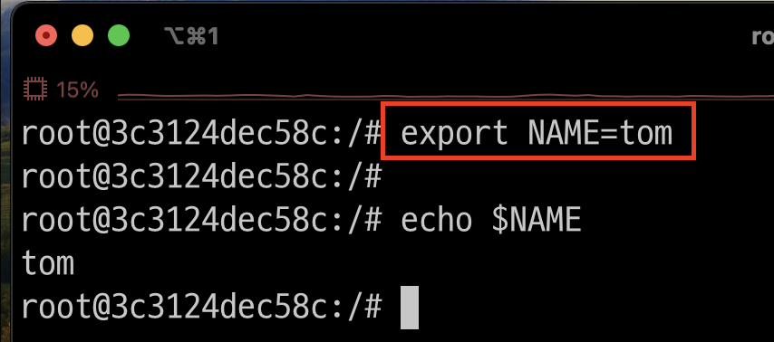
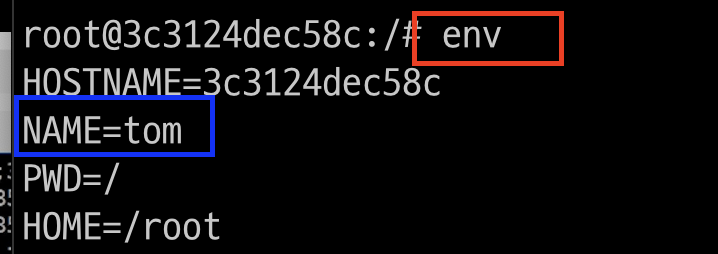
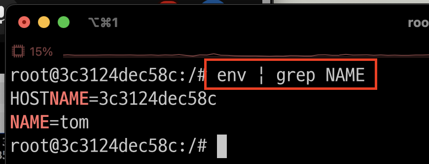

# Bash Shell > 일반 변수 

---
### 단계1: 변수 선언 
- 사용법: <변수명>=<변수값>
- 띄어쓰면, 오류발생 
```shell
username=tom
```


---
### 단계2: 변수 확인  
- 사용법: echo $<변수명>
```shell
echo $username
```


---
### 단계3: 전체 변수 조회 
```shell
set # 전체 변수 조회 
set | grep username # 전체 변수 중 username 조회 
```


---
### 단계4: 변수 삭제 
- 명령어: unset <변수명>
```shell
unset username
```


---
# Bash Shell > 환경 변수 
- 동작되는 프로그램에 영향을 주는 변수 
- 일반적으로 환경변수명은 대문자를 사용함 

---
### 단계1: 환경변수 선언 
- 사용법: export <변수명>=<변수값>
```shell
export NAME=tom
echo $NAME
```


---
### 단계2: 환경변수 전체 조회 
```shell
env # 환경변수 전체 조회 
```


---
- 환경변수 중 NAME 조회 
```shell
env | grep NAME # 환경변수 중 NAME 조회 
```



