# [metacharacters](https://velog.io/@kyy00n/Shell-Special-Characters-Metacharacters-%EC%9E%90%EC%A3%BC%EC%93%B0%EB%8A%94-%EC%89%98-%ED%8A%B9%EC%88%98%EB%AC%B8%EC%9E%90%EB%A9%94%ED%83%80%EB%AC%B8%EC%9E%90-%EC%A0%95%EB%A6%AC)
- Shell 특수기호는 Shell 메타문자로 불리기도 한다. 쉘은 이런 특수기호들을 해석(interpret)하여 명령을 실행한다. 
- 그래서 쉘 메타문자를 잘 알아두고 일반 문자와 같이 사용하지 않도록 조심할 필요가 있다. 

---
### 단계1: 연습용 폴더 생성 
```shell
cd ~
mkdir meta 
cd meta
```
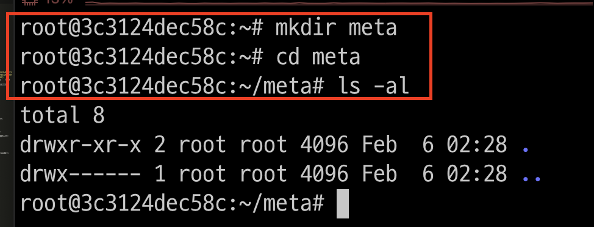

---
### 단계2: 연습용 파일 생성
```shell
touch test1 test2 test3 test11 test12 test13 
ls   
```
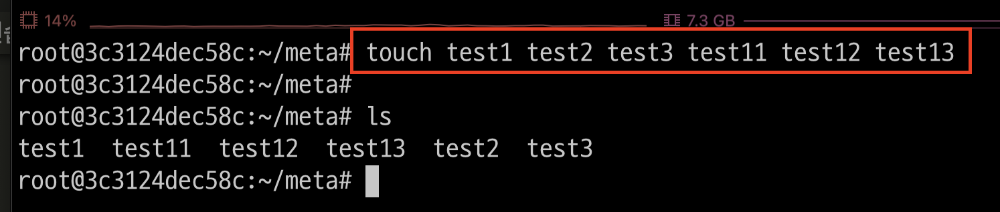

---
## 1. File Name Extension
- 파일 이름을 확장하는 데 사용되는 메타문자들이다.

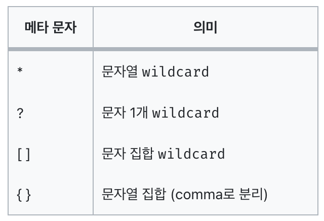

---
### 단계1: *
```shell
ls * # 전체 파일 
ls te* # te로 시작하는 전체 파일 
ls test1* # test1로 시작하는 전체 파일 
```
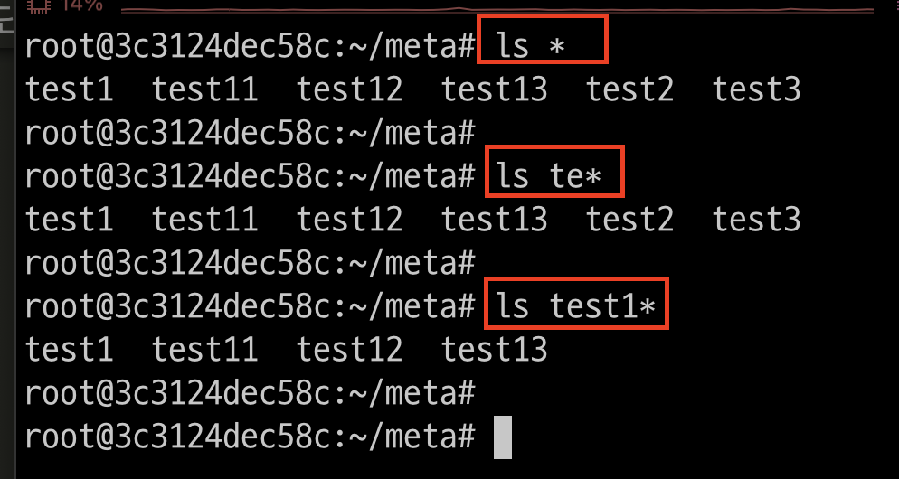

---
### 단계2: ?
```shell
ls test? # test + 하나의 글자 > 조회  
ls t?st1 # t + 하나의 글자 + st1 > 조회
ls test1? # test1 + 하나의 글자 > 조회 
```
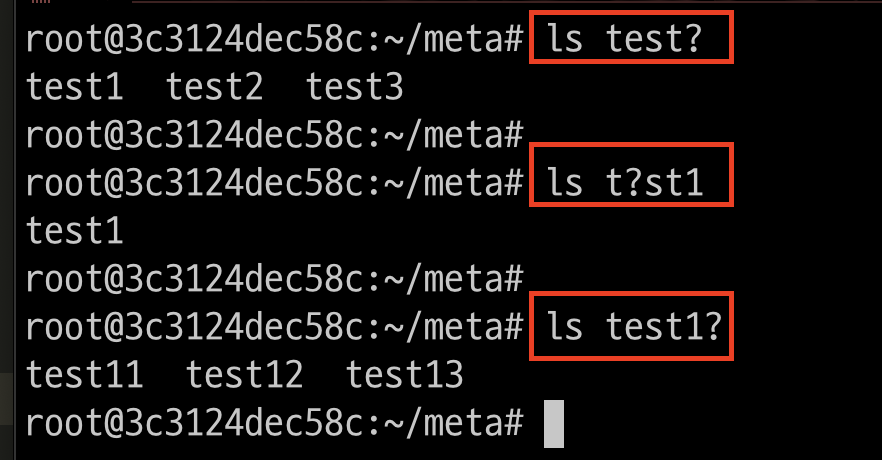

---
### 단계3: []
```shell
# test + (1 또는 2) > 조회  
ls test[12] 

# test + (1 또는 2) + (1 또는 3) > 조회  
ls test[12][13] 
```
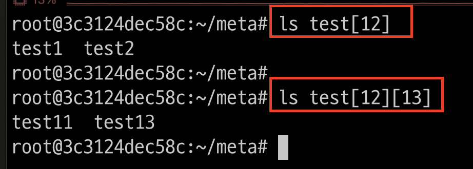

---
### 단계4: {}
```shell
# test + (1 또는 3) > 조회  
ls test{1,3}

# test + (1 또는 3 또는 12) > 조회  
ls test{1,3,12} 
```
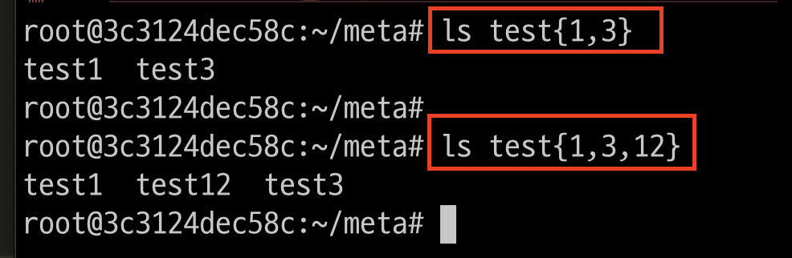

---
## 2. Command Substitution
- 커맨드 대치는 back-quote (``) 안의 문자열을 명령어로 실행한다.
```shell
date # date 명령어 실행 

# d 변수에 date 명령어의 실행 결과 적용 
d=`date` 
echo $d # 확인 
```
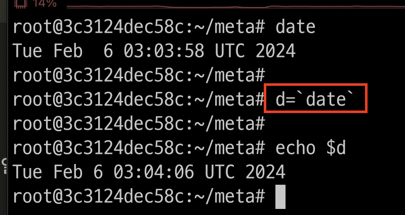

---
## 3. Escape character
- 이스케이프 문자는 쉘이 해석하는 것을 원하지 않을 때 사용하는 것이다. 
- 우리가 입력한 그대로의 문자열이 명령의 인자로 들어가게끔!

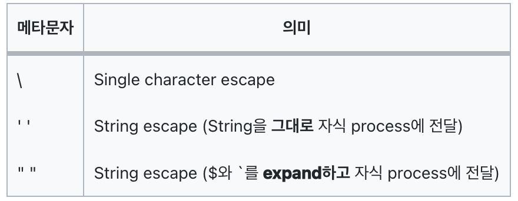

---
### 단계1: \
```shell
ls * # 특수문자로 인식 > 전체 데이터 조회  
ls \* # 단순문자로 인식 
touch * # 특수문자로 인식 > 파일 생성 x
touch \* # 단순문자로 인식 > 파일 생성 o
```
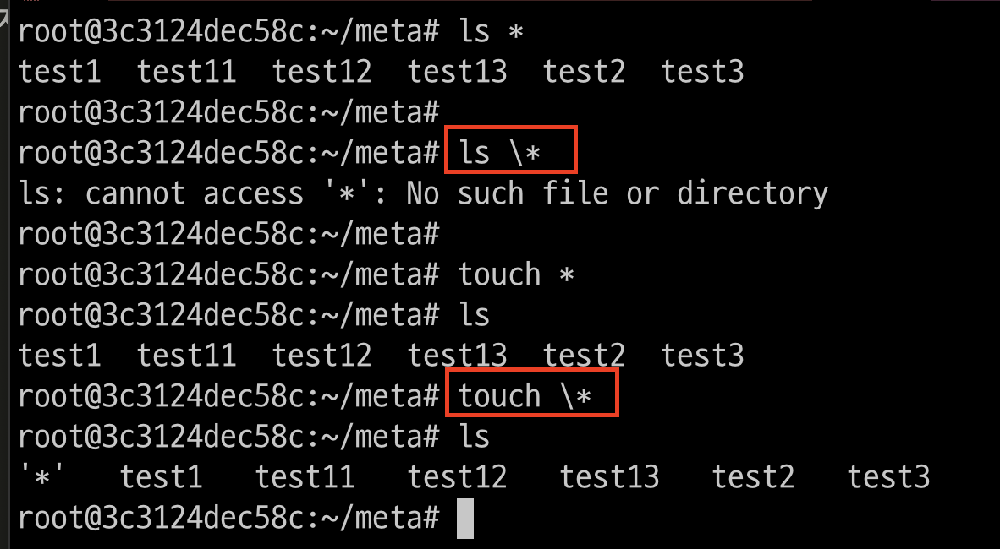

---
### 단계2: ""
```shell
echo "hello world `date`"
echo "hello world $(date)"
```
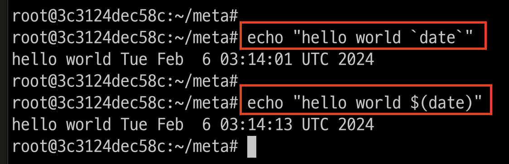

---
### 단계3: ''
```shell
echo 'hello world `date`'
echo 'hello world $(date)'
```
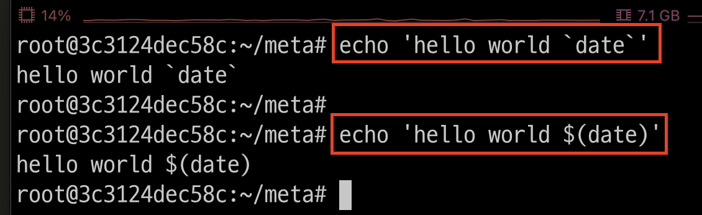


---
## 4. Job control meta characters
- Subshell
  - 현재 쉘 안에서 실행되는 쉘로, 현재 쉘의 자식 프로세스로 실행

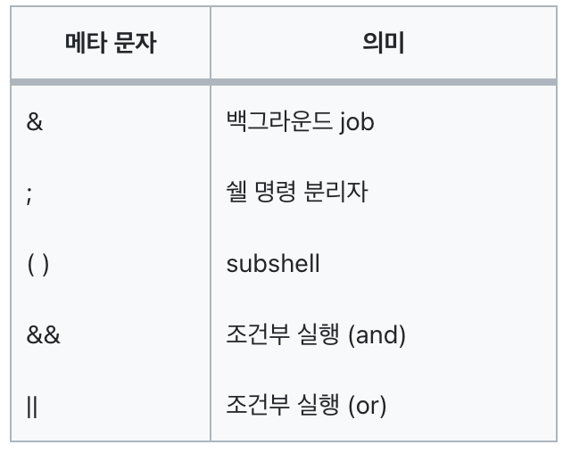

---
### 단계1: ;
```shell
date; pwd
date; pwd; ls
```
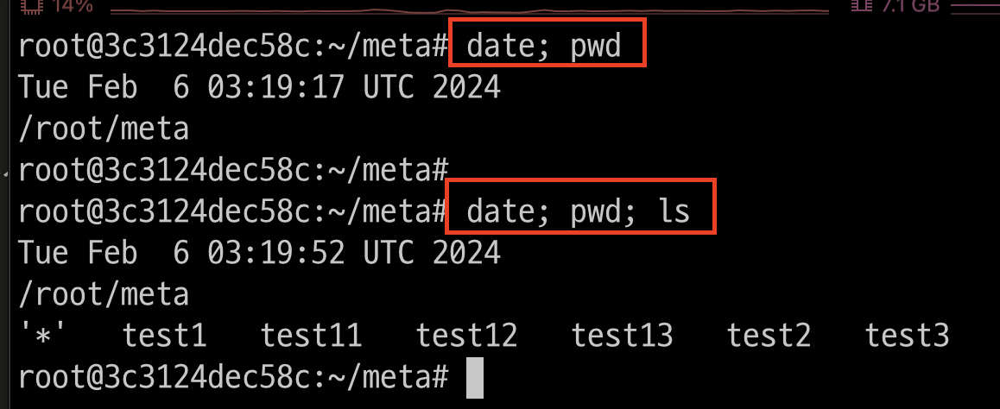

---
### 단계2: && 
```shell
# 출력: data 오류 & pwd 결과 
data; pwd 

# 출력: data 오류 > pwd 생략 
data && pwd 

# 출력: date 결과 & pwd 결과 
date && pwd 
```
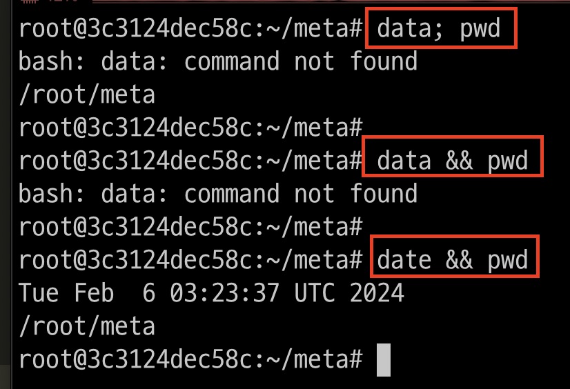

---
### 단계2: ||
```shell
# data 오류 발생 > pwd 실행 
data || pwd 

# date 성공 > pwd 생략 
date || pwd 
``` 
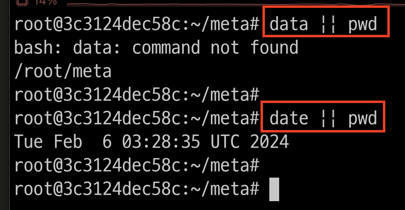

---
## 5. I/O 관련
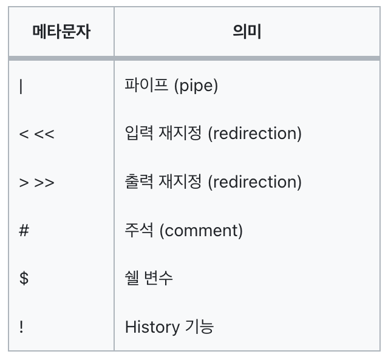

---
### 단계1: |
```shell
# 전체 변수 출력 
set 
# 전체 변수 중에서 OP 문자 출력 
set | grep OP
# 전체 변수 중에서 OP 문자 출력의 count
set | grep OP | wc -l
```
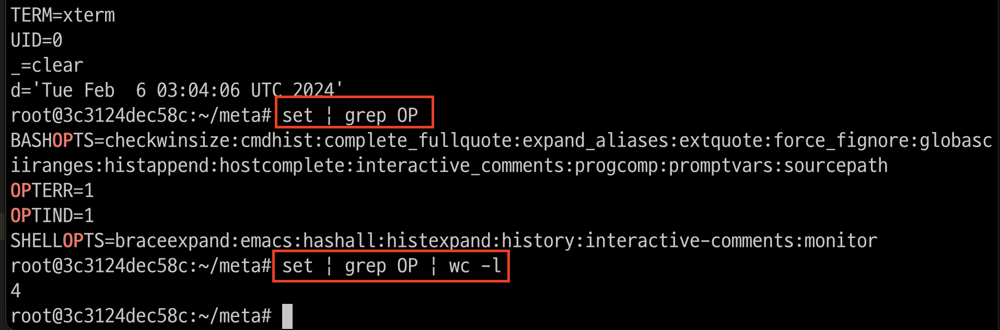

---
### 단계2: >, >>
```shell
echo "hello world" > sample1

# overwrite 발생
echo "good morning" > sample1  

# append 발생 
echo "hello world" >> sample1 
```
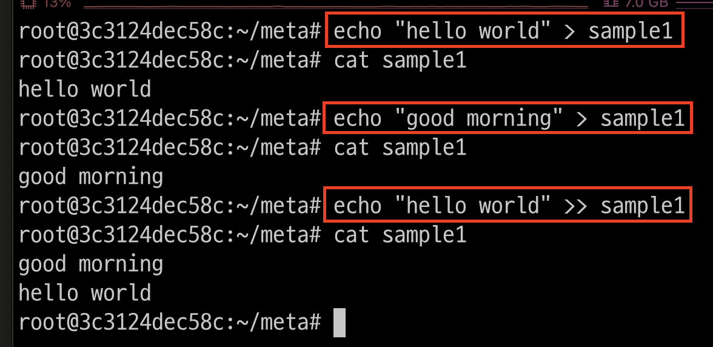

---
### 단계3: <
```shell
cat < sample1
cat < sample1 | grep hello
```
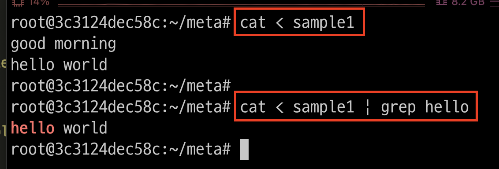


