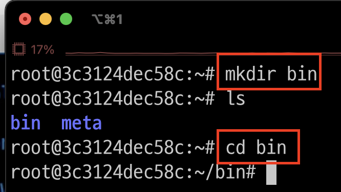
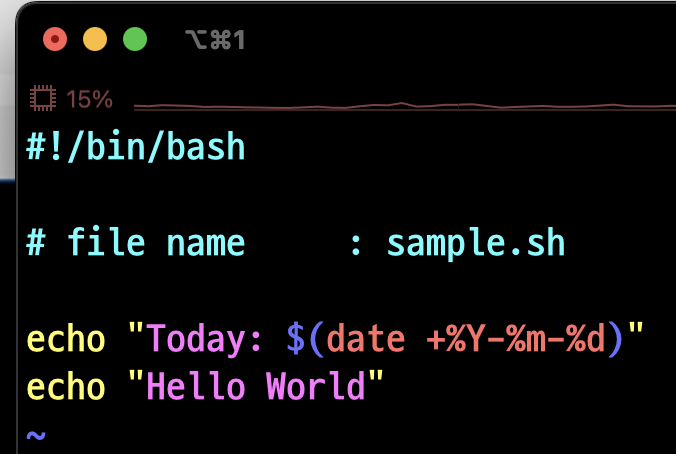
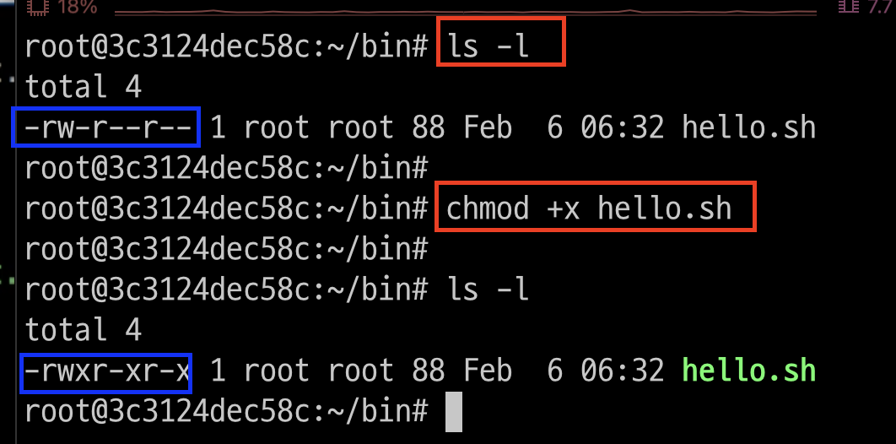
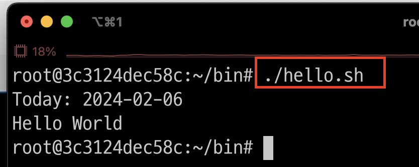
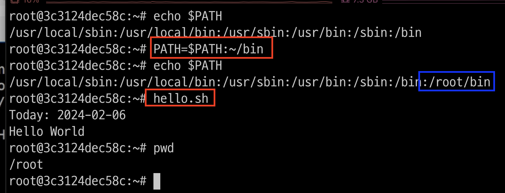

# shell script
- 셸 스크립트는 셸이나 명령 줄 인터프리터에서 돌아가도록 작성되었거나 한 운영 체제를 위해 쓰인 스크립트이다. 
- 실행 퍼미션을 할당해야 실행 가능 

---
### 단계1: bin 디렉토리 생성 및 이동 
```shell
cd ~
mkdir bin
cd bin
```


---
### 단계2: hello.sh 
```shell
vim hello.sh
# 아래내용 작성 
```
- `#!/bin/bash`: bash 선언
```shell
#!/bin/bash
# file name	: sample.sh
echo "Today: $(date +%Y-%m-%d)"
echo "Hello World"
```


---
### 단계3: hello.sh > 실행권한 부여 
```shell
ls -l
# 실행권한 부여 
chmod +x hello.sh
ls -l
```


---
### 단계4: hello.sh > 실행 
```shell
./hello.sh
```


---
### 단계5: PATH 적용 후 실행 
- PATH에 bin 디렉토리를 등록하면, 다른 곳에서도 shell script명을 이용해서 쉽게 실행할 수 있음 
```shell
PATH=$PATH:~/bin # PATH 추가 
hello.sh # 다른 디렉토리에서도 쉽게 실행 가능함 
```



