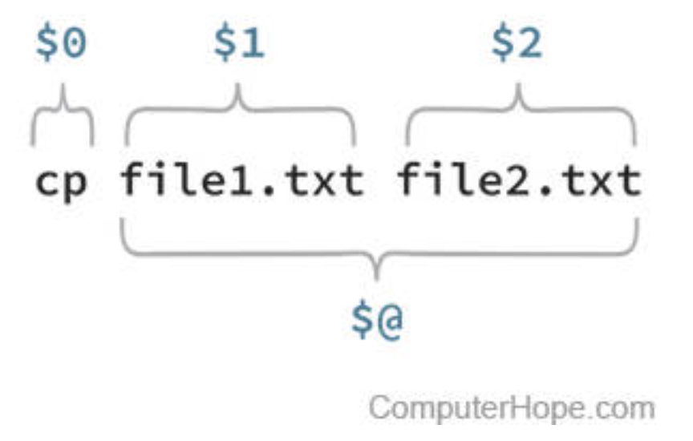
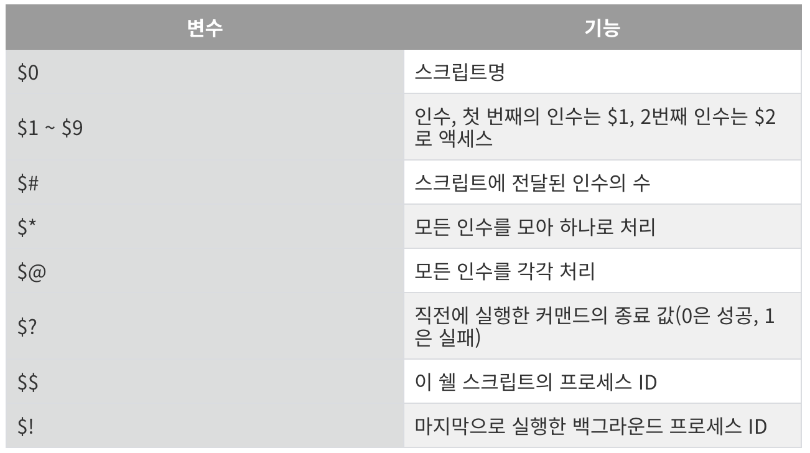
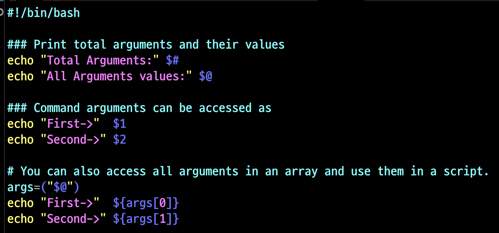
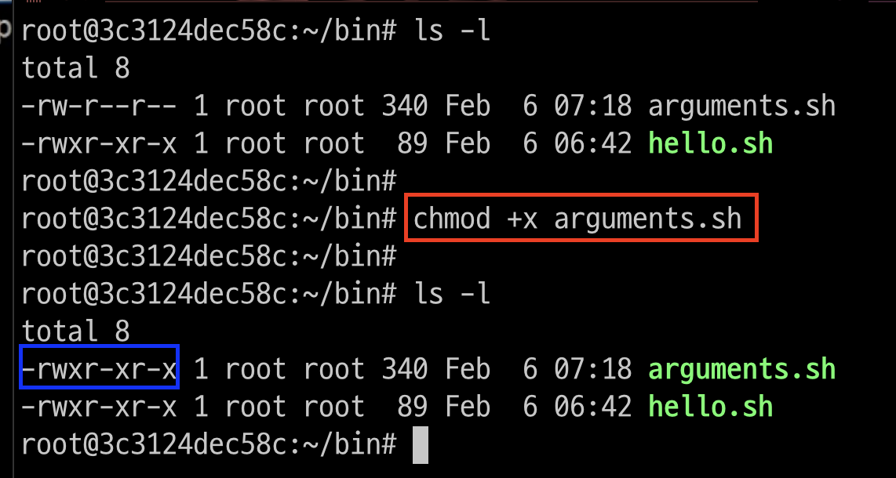
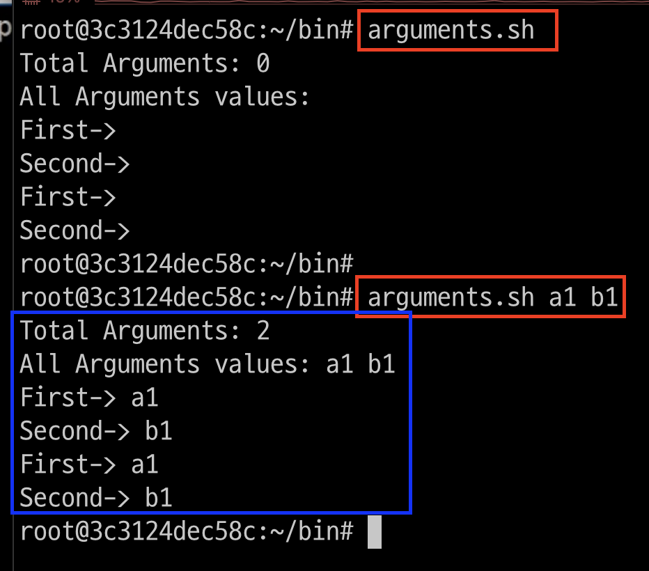

# Positional parameters
- `$0`: 스크립트명 / `$1`: 첫번째 파라미터



---
### 그외 특수 변수들 


---
# 예제

---
### 단계1: arguments.sh 작성 
```shell
cd ~/bin 
vim arguments.sh
# 아래내용 작성 
```
```shell
#!/bin/bash
 
### Print total arguments and their values
echo "Total Arguments:" $#
echo "All Arguments values:" $@
 
### Command arguments can be accessed as
echo "First->"  $1
echo "Second->" $2
 
# You can also access all arguments in an array and use them in a script.
args=("$@")
echo "First->"  ${args[0]} 
echo "Second->" ${args[1]}
```
---


---
### 단계2: 실행권한 부여 
```shell
ls -l
# 실행권한 부여 
chmod +x arguments.sh
ls -l
```


---
### 단계3: 실행 
```shell
arguments.sh
arguments.sh a1 b1
```



