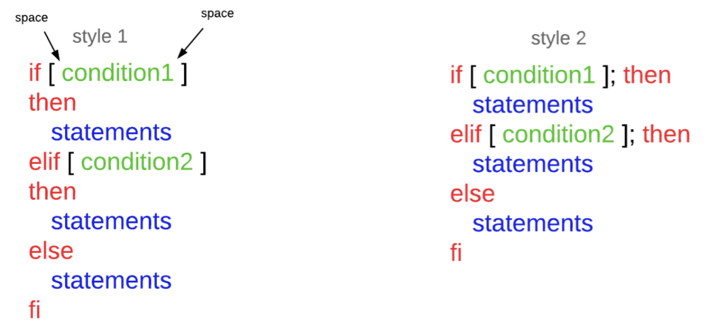
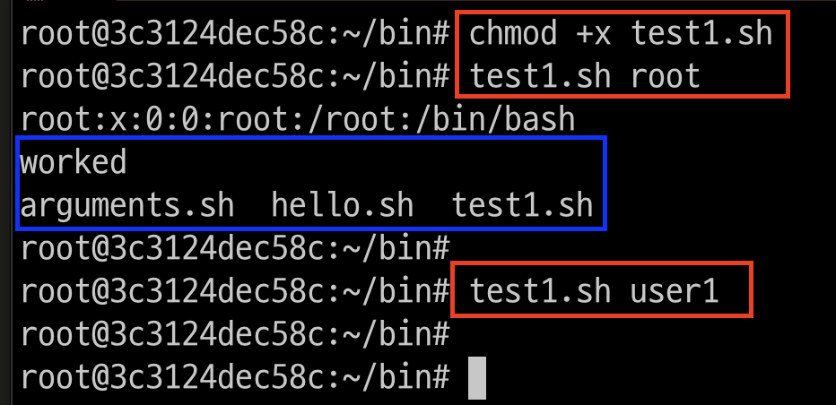
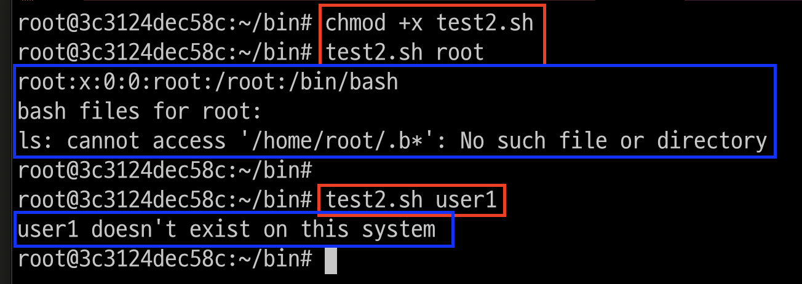
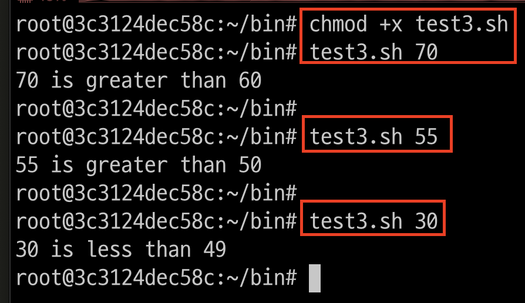

# if then fi 구문 
- 스크립트에서 사용하는 조건문에는 if-then 구문이 있습니다.



---
# 예제1: if문 

---
### 단계1: test1.sh 작성
```shell
cd ~/bin
vim test1.sh
```
```shell
#!/bin/bash
user=$1
if grep $user /etc/passwd
then
  echo "worked"
  ls
fi
```
---
### 단계2: test1.sh 권한 변경 및 실행 
```shell
chmod +x test1.sh
test1.sh root
test1.sh user1
```


---
# 예제2: if else문 
---
### 단계1: test2.sh 작성
```shell
cd ~/bin
vim test2.sh
```
```shell
#!/bin/bash
user=$1
if grep $user /etc/passwd
then
  echo "bash files for $user: "
  ls -a /home/$user/.b*
else
  echo "$user doesn't exist on this system"
fi
```
---
### 단계2: test2.sh 권한 변경 및 실행 
```shell
chmod +x test2.sh
test2.sh root
test2.sh user1
```


---
# 예제3: 비교연산자
비교연산자를 이용할 때 조건문은 [ 조건문 ]으로 작성합니다.
- `-eq` : 같다 / `-ne` : 같지 않다 / `-ge` : 이상
- `-gt` : 초과 / `-le` : 이하 / `-lt` : 미만

---
### 단계1: test3.sh 작성
```shell
cd ~/bin
vim test3.sh
```
```shell
#!/bin/bash
num=$1
if [ $num -gt 60 ]
then
  echo "$num is greater than 60 "
elif [ $num -gt 50 ]
then
  echo "$num is greater than 50"
else
  echo "$num is less than 49"
fi
```
---
### 단계2: test3.sh 권한 변경 및 실행 
```shell
chmod +x test3.sh
test3.sh 70
test3.sh 55
test3.sh 30
```



