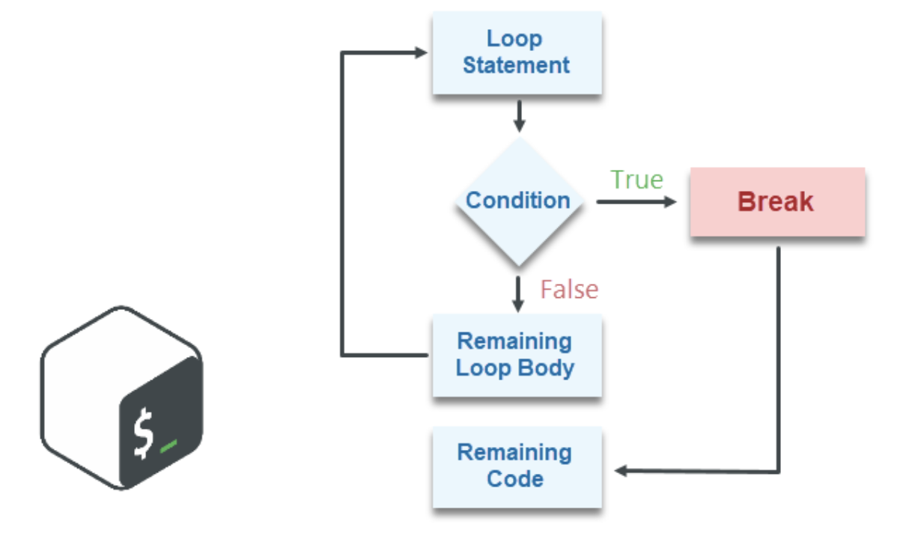
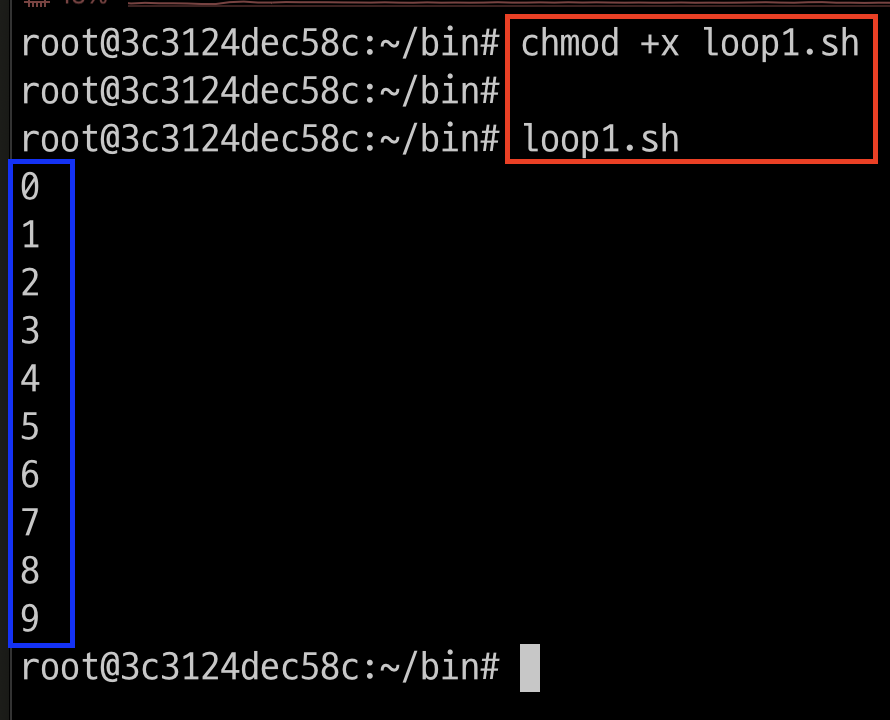
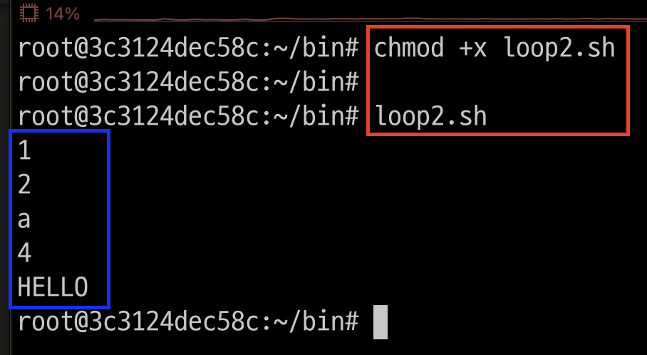
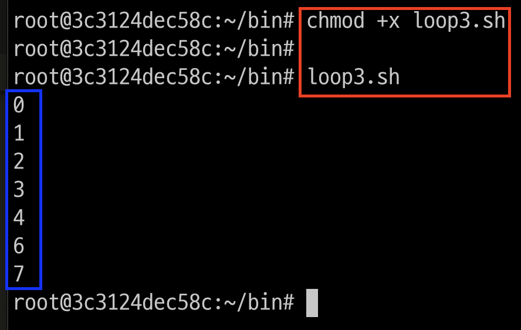

# 반복문 


---
## while loop
- while 반복문은 조건이 발생할 때까지 명령을 지속적으로 실행한다.

---
### 단계1: loop1.sh 작성
```shell
cd ~/bin
vim loop1.sh
```
```shell
#!/bin/sh

a=0
while [ $a -lt 10 ]
do
  echo $a
  a=`expr $a + 1`
done
```
---
### 단계2: loop1.sh 권한 변경 및 실행 
```shell
chmod +x loop1.sh
loop1.sh
```


---
## for loop
- for 반복문은 리스트에 저장된 명령이 실행할 때까지 반복적으로 실행한다.

---
### 단계1: loop2.sh 작성
```shell
cd ~/bin
vim loop2.sh
```
```shell
#!/bin/bash

for var in 1 2 a 4 HELLO
do
  echo $var
done
```
---
### 단계2: loop2.sh 권한 변경 및 실행 
```shell
chmod +x loop2.sh
loop2.sh
```


---
## break continue
- break: 반복문 종료 
- continue: 해당 반복 상황을 종료하고 다음 조건상태로 반복문 실행 

---
### 단계1: loop3.sh 작성
```shell
cd ~/bin
vim loop3.sh
```
```shell
#!/bin/bash

for ((i=0; i<=10; i++))
do 
  if [ $i -eq 5 ]
  then
    continue
  fi

  if [ $i -eq 8 ]
  then
    break
  fi

  echo $i

done
```
---
### 단계2: loop3.sh 권한 변경 및 실행 
```shell
chmod +x loop3.sh
loop3.sh
```


