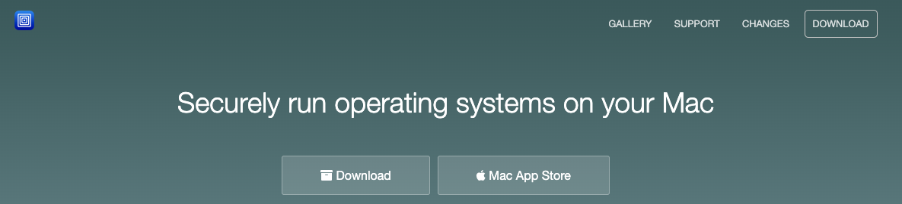
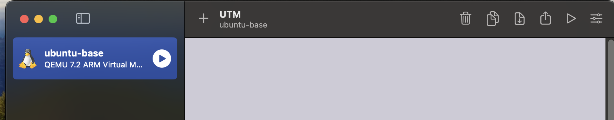
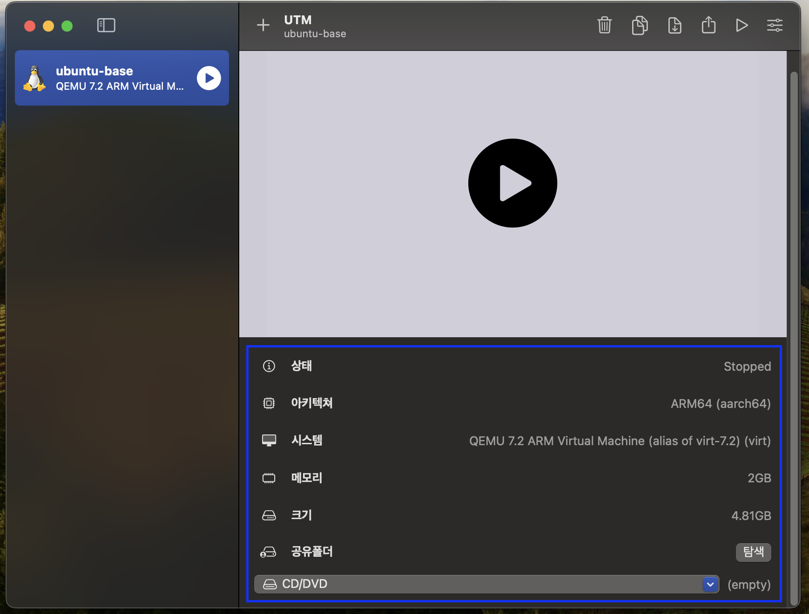
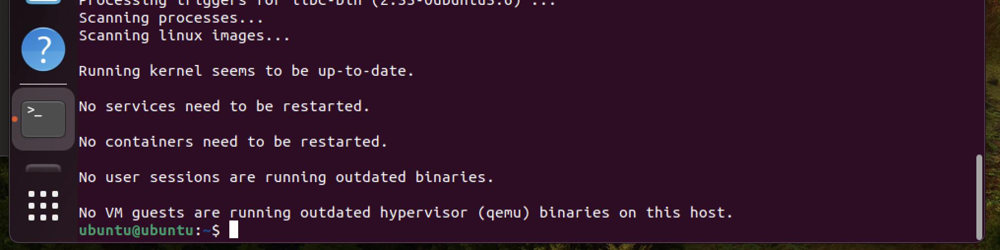
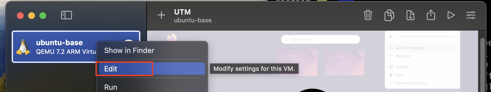
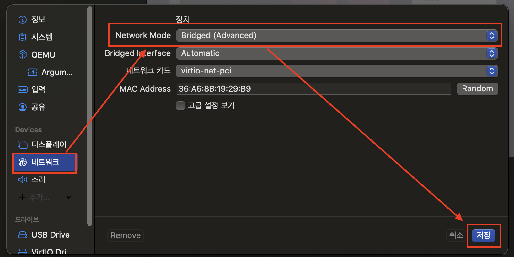
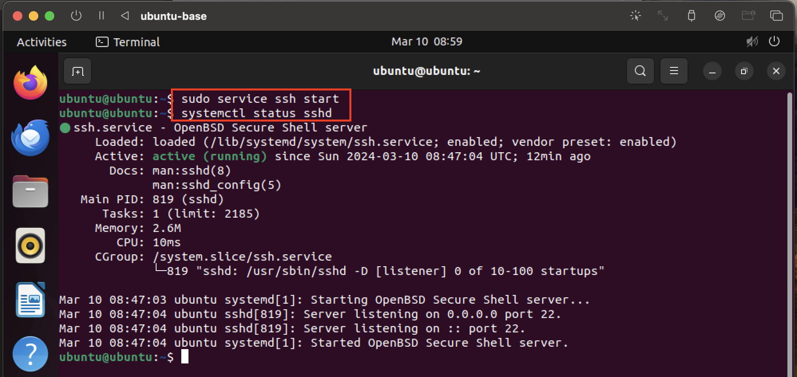
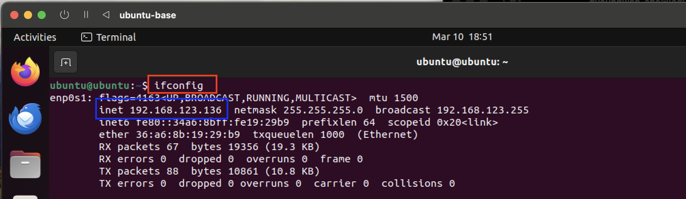
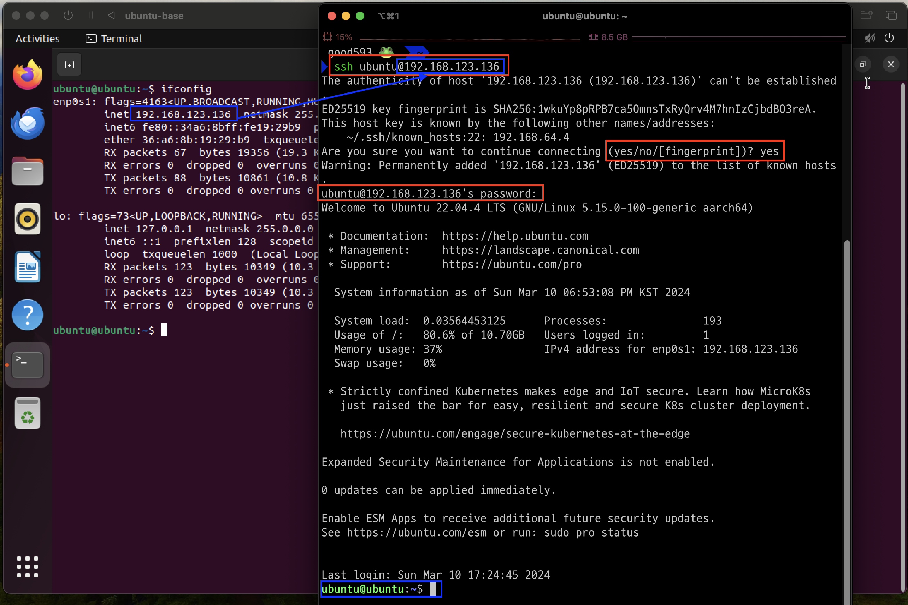

# [UTM](https://github.com/utmapp/UTM)
- VirtualBox는 M1에서는 작동되지 않는다.
- VMWare는 유료이며, 회원가입을 통해 개인 라이선스를 발급받아서 사용해야 한다.
- UTM은 완전 무료이며, 오픈소스이고, M1을 지원한다. 
---
### 1단계: [UTM 설치](https://formulae.brew.sh/cask/utm) 
- homebrew
```shall
brew install --cask utm
```
- [UTM 공식 싸이트 다운로드](https://mac.getutm.app/)



---
### 2단계: Download Ubuntu for ARM
- [우분투 공식 싸이트](https://ubuntu.com/download/server/arm)
- [UTM 공식 싸이트](https://mac.getutm.app/gallery/ubuntu-20-04)

### 3단계: [새 가상머신 만들기](./utm.md)


---
# 우분투 설정

---
### 1단계: [우분투 초기설정](./ubuntu.md)


---
### 2단계: [우분투 데스크탑설정](./ubuntu%20desktop.md)


---
# ssh 통신 

---
### 단계1: 중지 후 인스턴스 설정 수정 


---
### 단계2: 네트워크 > Bridged 설정  


---
### 단계3: 인스턴스 실행 > ssh 실행 및 확인 
```shell
# ssh 실행 
sudo service ssh start
# ssh 실행 확인 
systemctl status sshd
```


---
### 단계4: ip 확인
```shell
ifconfig
```


---
### 단계5: ssh 통신 
```shell
ssh [서버의 유저명]@[서버의 hostname]
```



