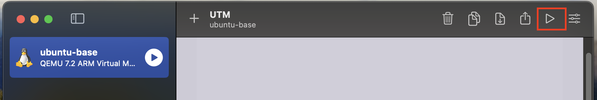
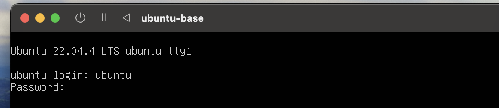
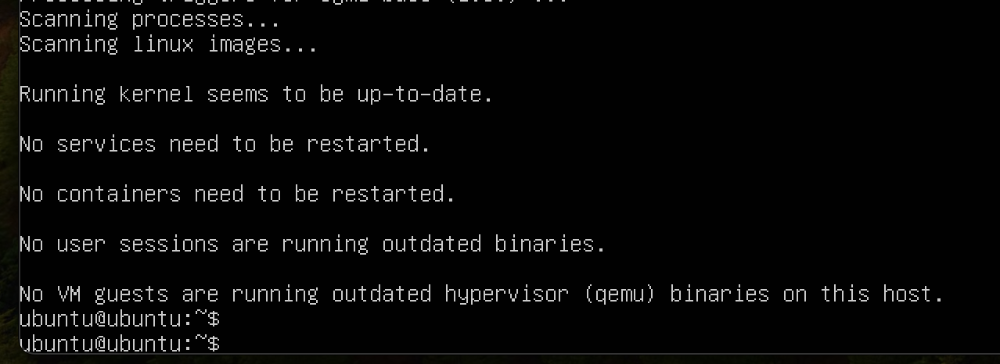
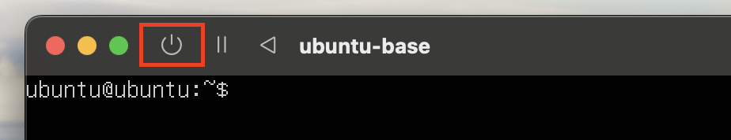
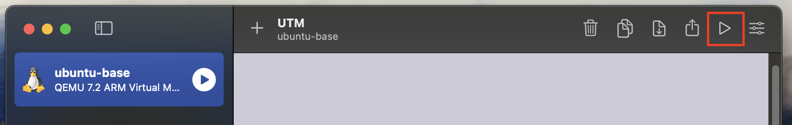
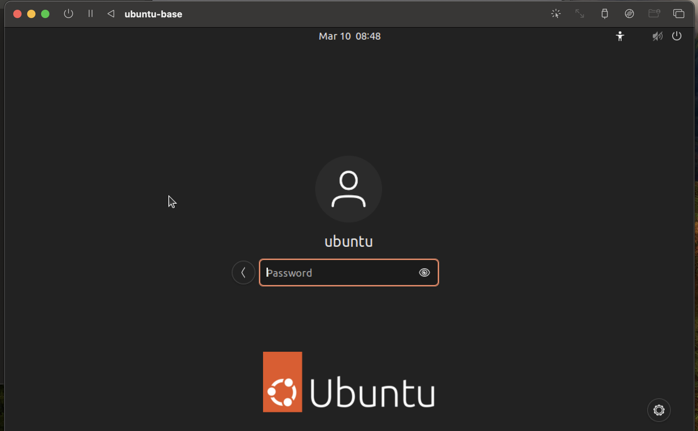
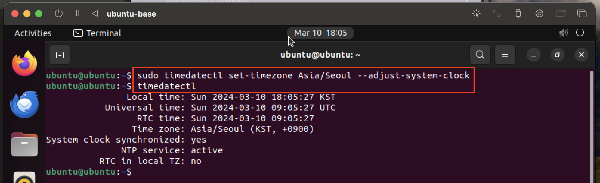

### 1단계: 우분투 접속 


### 2단계: ubuntu 계정으로 로그인 


---
### 3단계: GUI 우분투 설치
```shell
sudo apt-get -y update
sudo apt-get -y install ubuntu-desktop
```


---
### 4단계: 종료 


### 5단계: 다시 실행 


---
### 6단계: ubuntu 계정 접속 


---
### 7단계: 터미널 > 필수 라이브러리 설치 
```shell
# 업데이트 목록 갱신
sudo apt-get -y update
# 현재 패키지 업그레이드 
sudo apt-get -y upgrade
# 신규 업데이트 설치 
sudo apt-get -y dist-upgrade
# 필수 라이브러리 설치 
sudo apt-get install -y vim wget unzip ssh openssh-* net-tools
```


---
### 8단계: 우분투 시간 설정 
```shell
sudo timedatectl set-timezone Asia/Seoul --adjust-system-clock
timedatectl
```



