### 단계1: 가상머신 시작 > Enter 
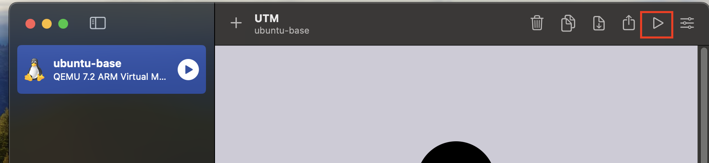

---
### 단계2: Install Ubuntu Server > Enter
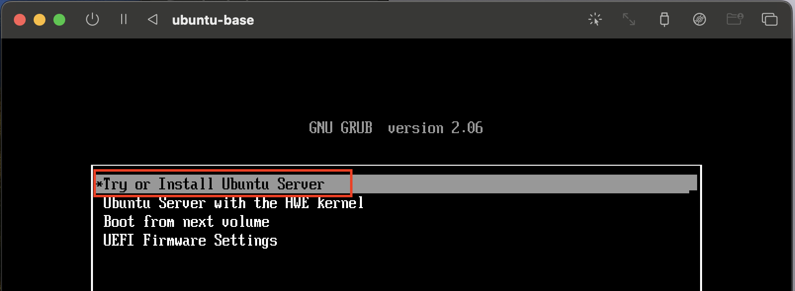

---
### 단계3: 언어 선택 > Enter 
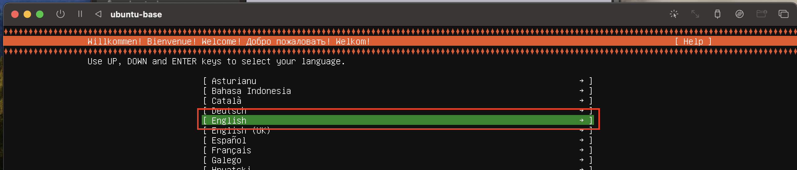

---
### 단계4: 키보드 설정 > Enter
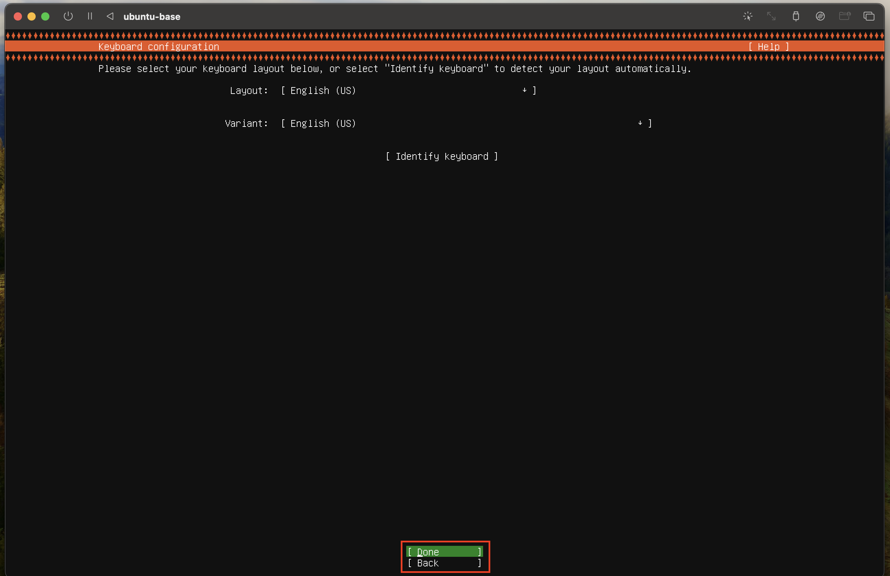

---
### 단계5: install 설정 > Enter
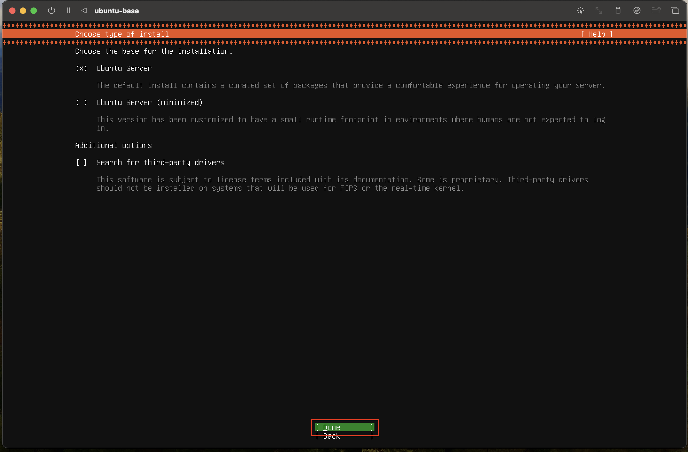

---
### 단계6: 네트워크 설정 > Enter
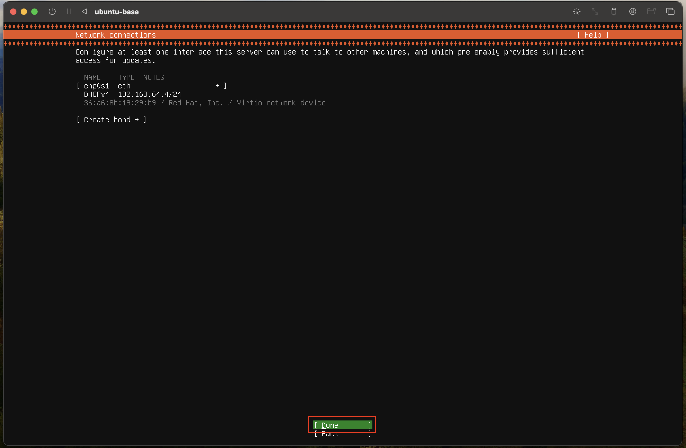

---
### 단계7: Proxy 설정 > Enter
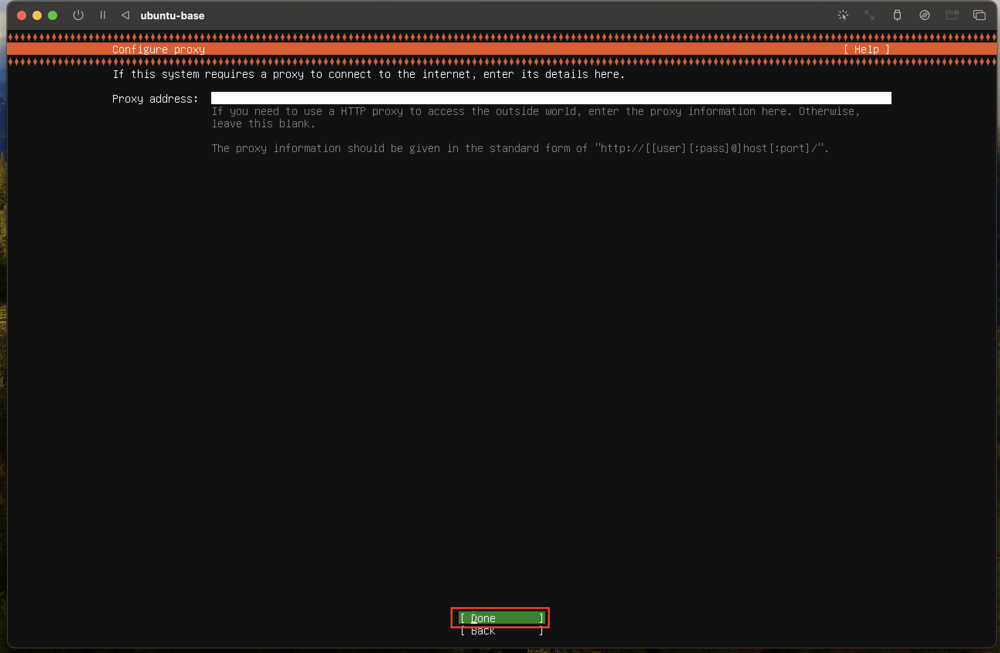

---
### 단계8: 우분투 아카이브 미러서버 설정 > Enter
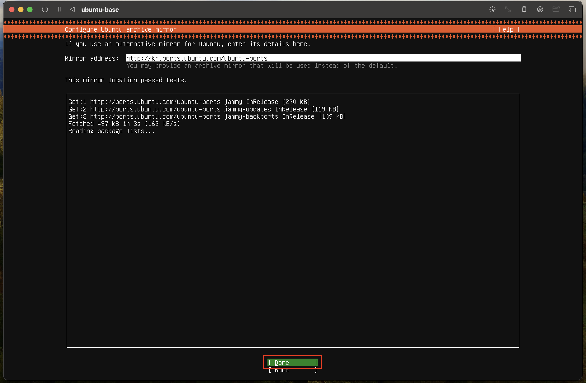

---
### 단계9: 저장용량 설정 > Enter
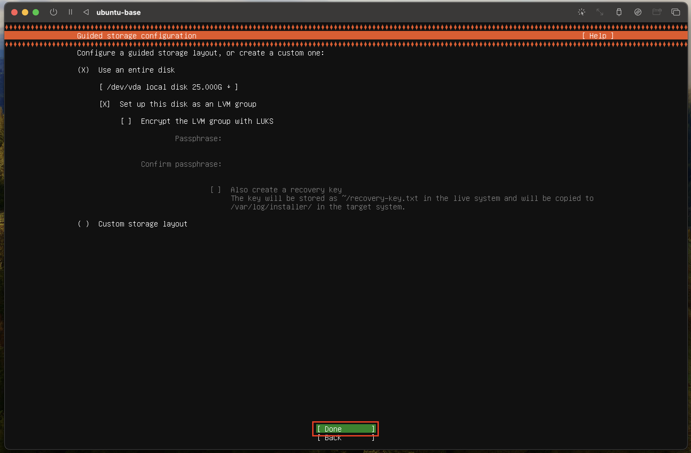

---
### 단계10: 디렉토리 용량 설정 > Enter
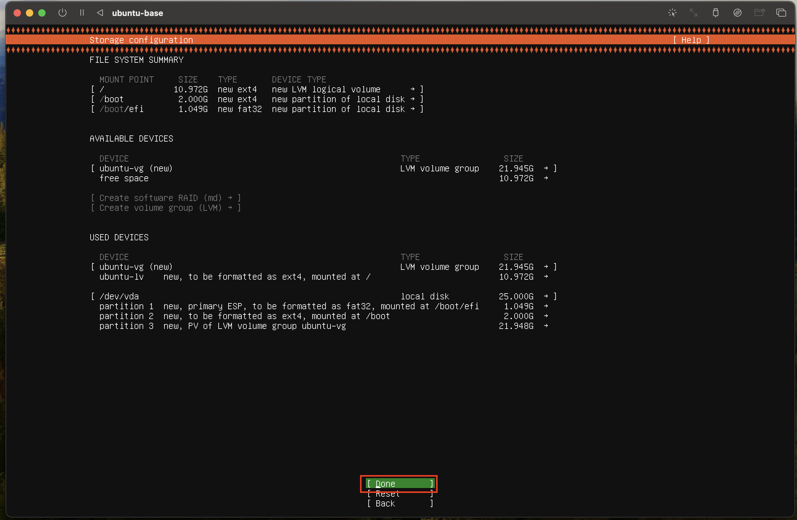

---
### 단계11: 확인창 > Enter
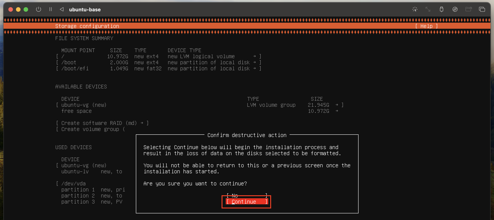

---
### 단계12: 계정 설정 > Enter
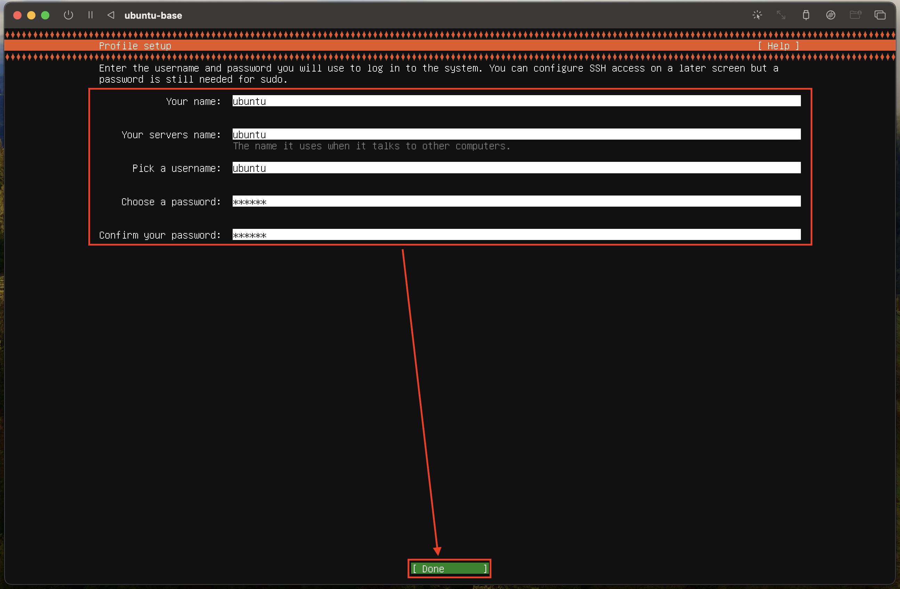

---
### 단계13: 우분투 업그레이드 생략 > Enter
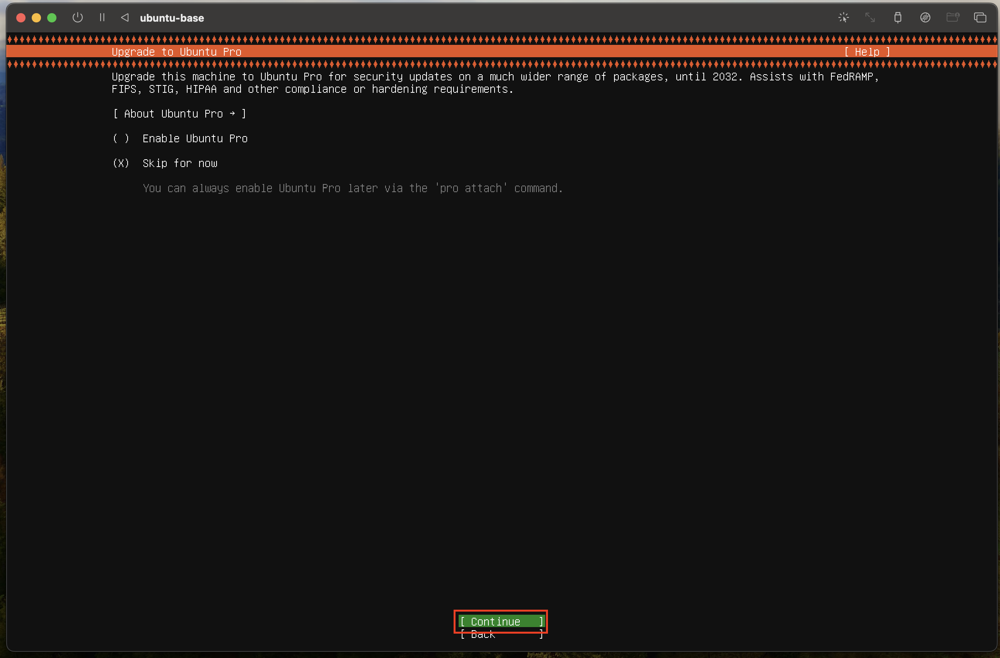

---
### 단계14: OpenSSH 설정 > Enter

---
### 단계15: 필요 Package 설정 > Enter
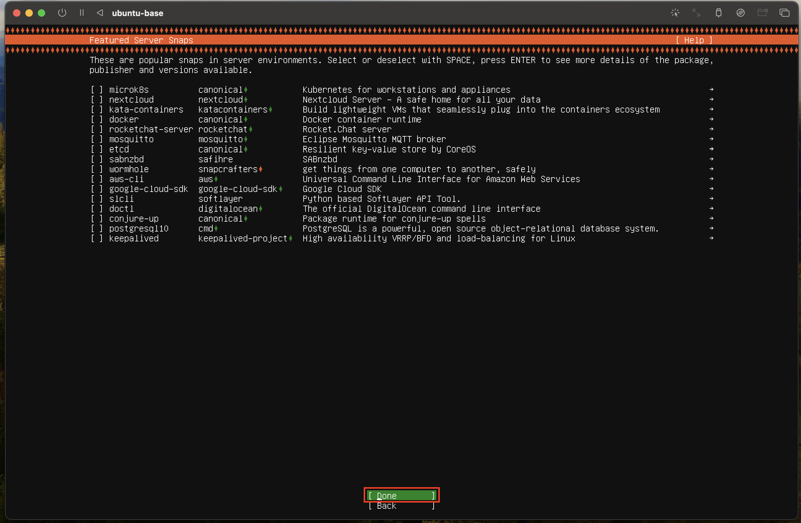

---
### 단계16: 설치 완료 후 reboot > Enter
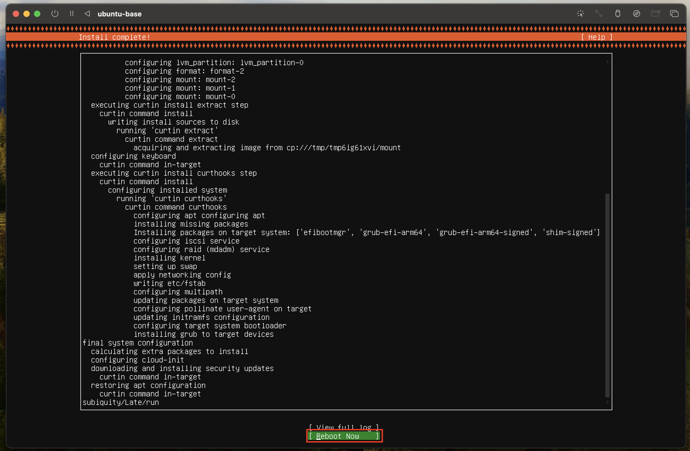

---
### 단계17: 종료 후 닫기
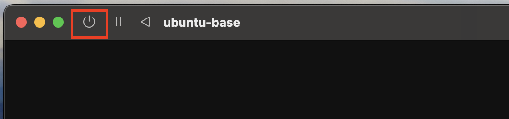

---
### 단계18: 우분투 설치파일 제거 
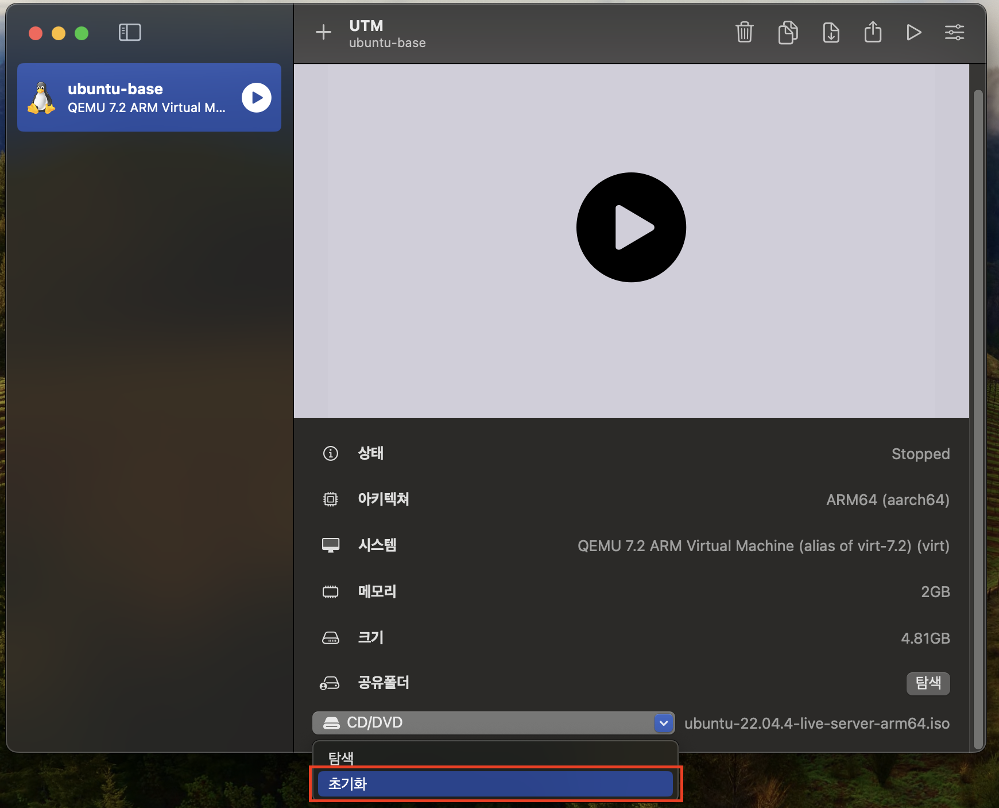

