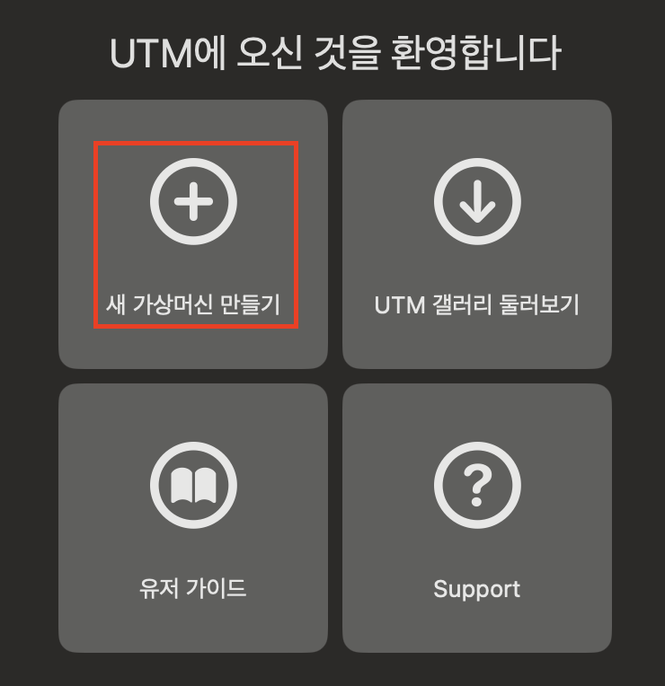
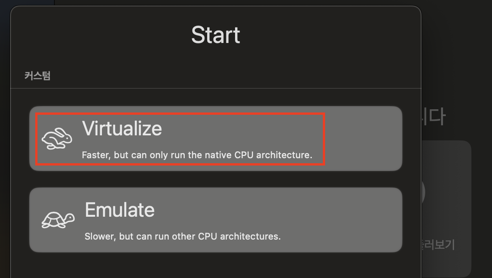
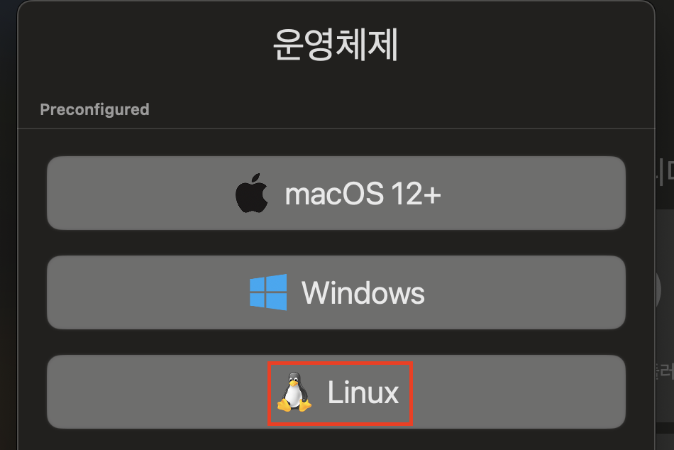
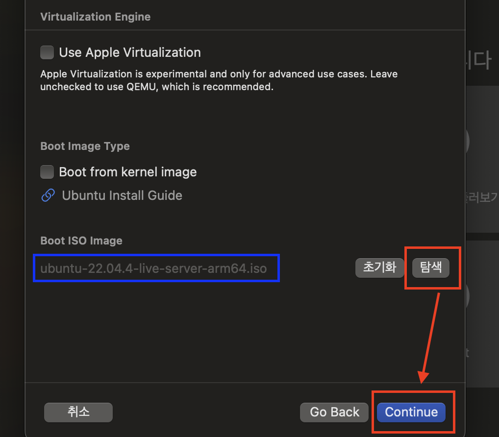
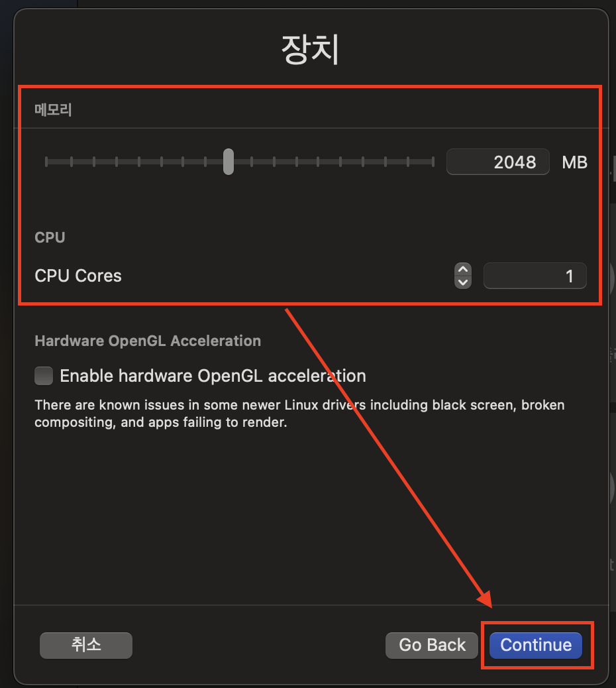
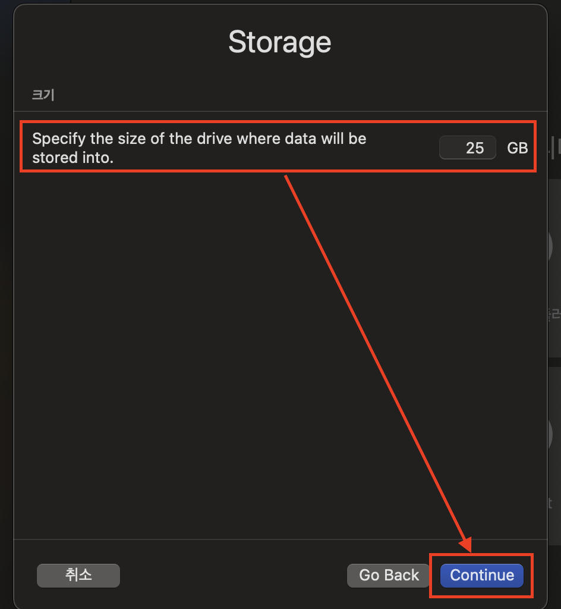
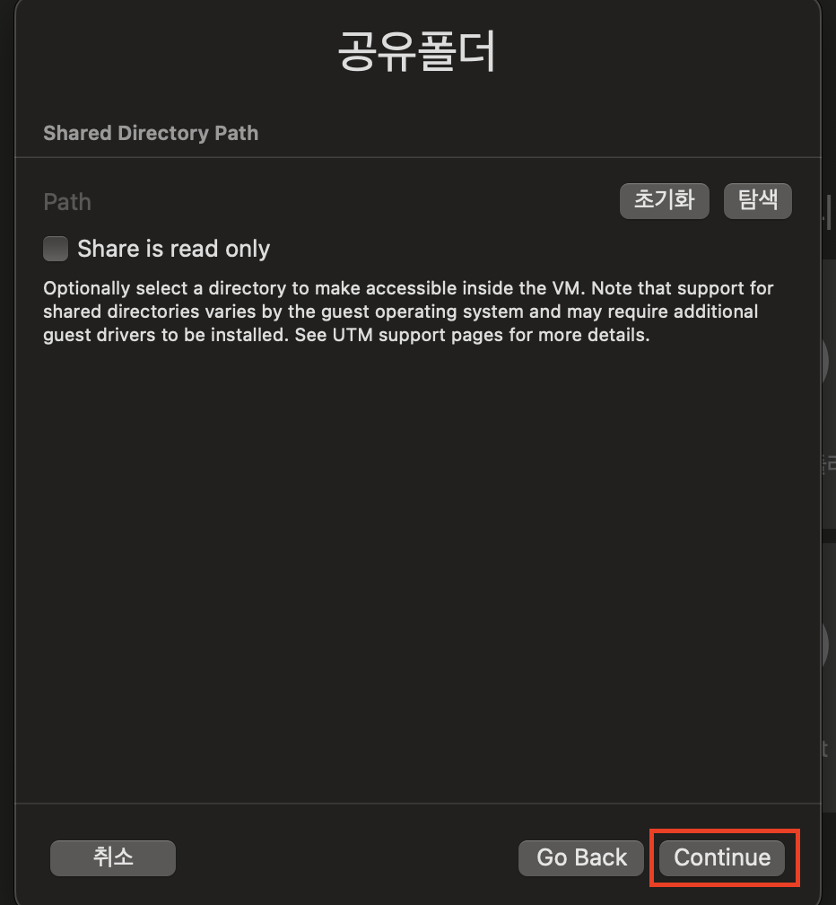
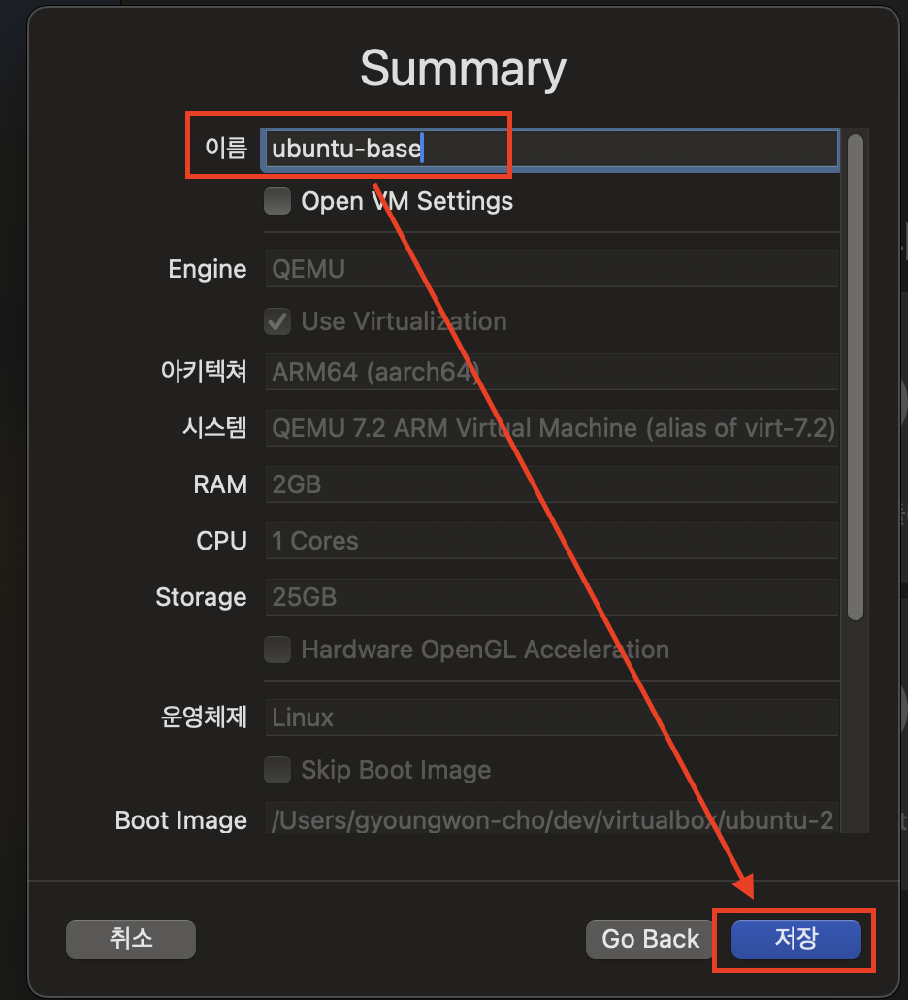

### 1단계: 새 가상머신 만들기 

---
### 2단계: Virtualize 선택 
- Virtualize
  - arm64(즉, M1)용 우분투 이미지 구동 
  - 매우 빠르게 구동됨 
- Emulate
  - x86(즉, 인텔)용 우분투 이미지 구동 
  - 호환 과정에 의한 추가 연산으로 느림 

---
### 3단계: Linux 선택 
- 우분투는 리눅스 배포판임 

---
### 4단계: 우분투 이미지 적용
- 탐색 -> Continue

---
### 5단계: 장치 설정
- 메모리: 2048 MB
- CPU: 1

---
### 6단계: 하드디스크 설정 

---
### 7단계: 공유폴더 > 생략 

---
### 8단계: 이름 작성 

