# [VirtualBox란?](https://www.oracle.com/kr/virtualization/virtualbox/)
- VirtualBox는 사용자가 호스트 운영 체제에서 가상 머신을 생성하고 실행할 수 있게 해주는 가상화 소프트웨어다. 
- VirtualBox는 Windows, macOS, Linux 및 다양한 Unix 기반 시스템을 포함한 광범위한 호스트 및 게스트 운영 체제와 호환된다.


---
# 설치 
### [단계1: visual c++ 2019 설치](https://learn.microsoft.com/ko-kr/cpp/windows/latest-supported-vc-redist?view=msvc-170)


---
### [단계2: VirtualBox 설치](https://www.virtualbox.org/wiki/Downloads)


---
# ubuntu 생성 예제 
### 단계1: [이미지 다운로드](https://releases.ubuntu.com/focal/)


---
### 단계2: 새로 만들기 
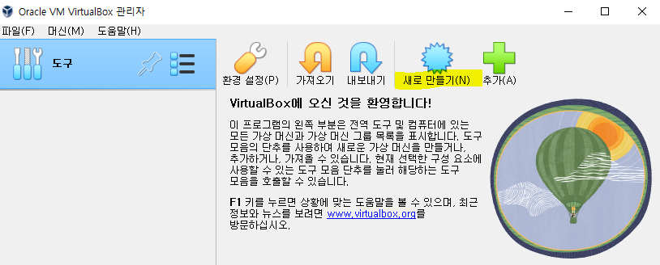

---
### 단계3: 가상 머신 이름과 운영 체제  


---
### 단계4: 하드웨어 
- 메모리와 프로세서 설정  
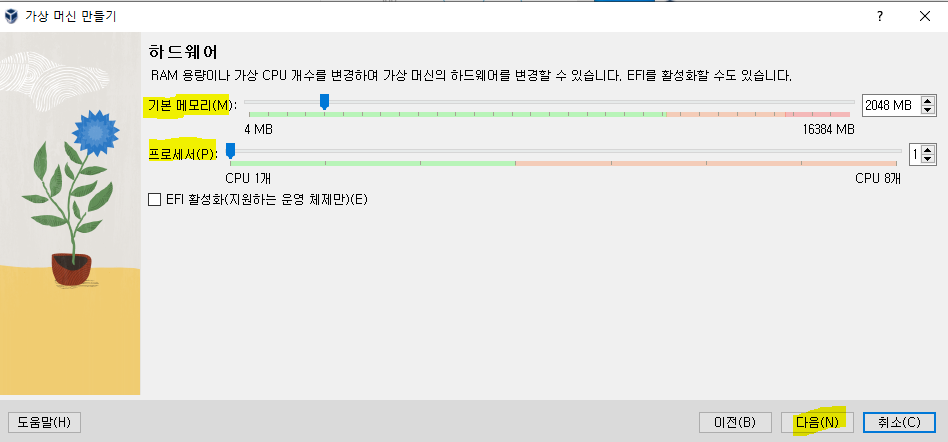


---
### 단계5: 가상 하드 디스크 
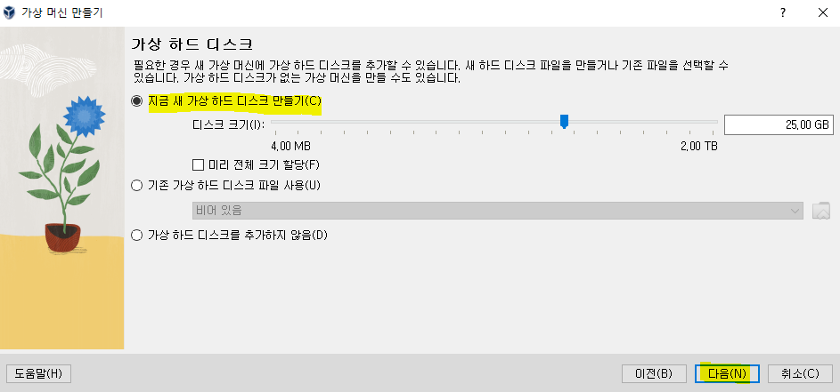

---
### 단계6: 만들기


---
### 단계7: 시작하기  
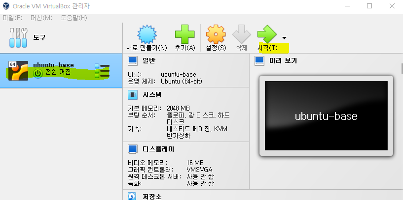

---
### 단계8: 다운로드한 우분투 이미지 추가  
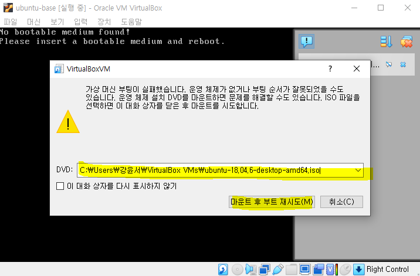

---
### 단계9: install ubuntu
- continue-continue-install now-continue-continue 
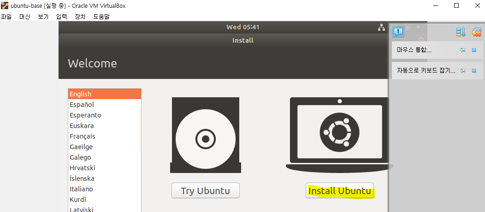

---
### 단계10: 유저 생성 및 restart
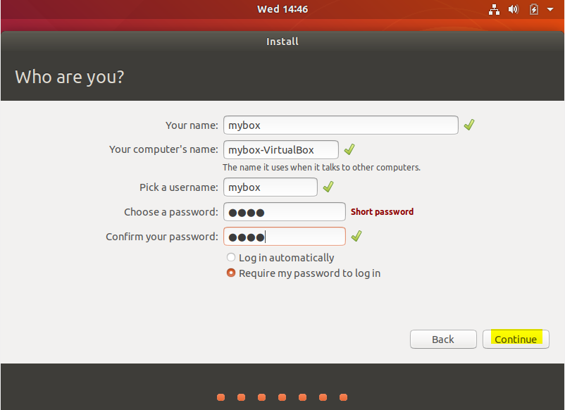

---
### 단계11: 우분투 접속 


---
# [클립보드](https://sidepower.tistory.com/61)
- Ctrl + c / Ctrl + v 

### 단계1: [Virtual Box 게스트 확장 프로그램 설치](https://sidepower.tistory.com/43) 
- 우분투 접속 > 장치 > 게스트 확장 CD 이미지 삽입
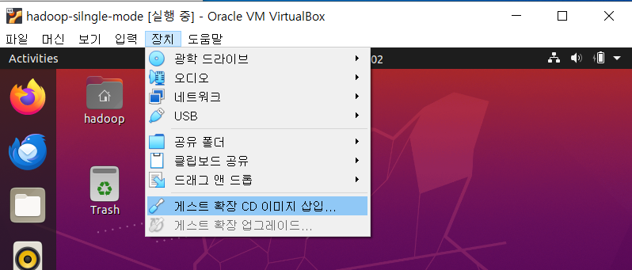

---
- Run
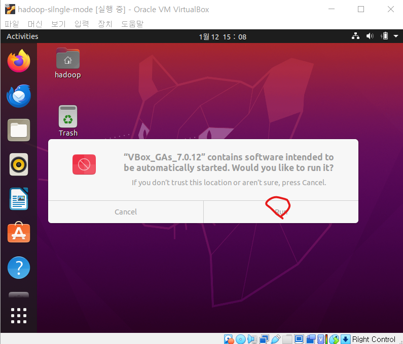

---
- Enter


---
### 단계2: 클립보드 양방향 설정
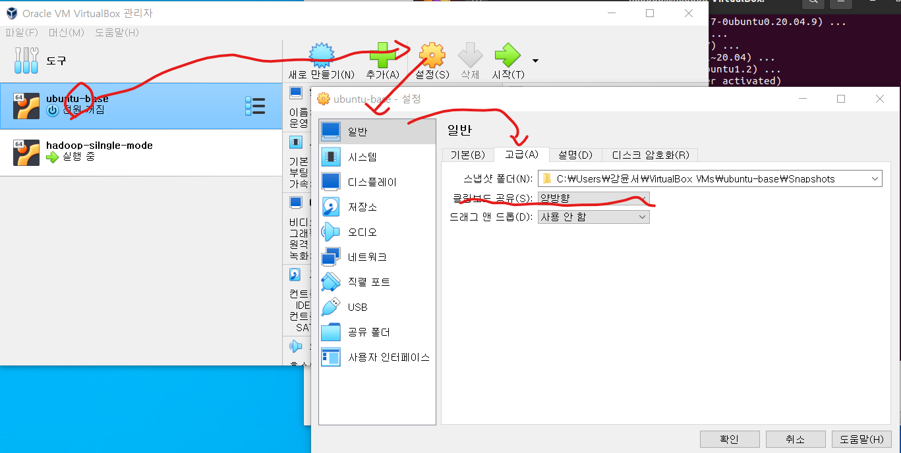

---
# ssh  통신하기
### 단계1: terminal 조회 및 접속 


---
### 단계2: 필수 라이브러리 설치 
- 필수 라이브러리
  - `vim` : 텍스트 편집기 
  - `wget` : 웹 서버로부터 파일 다운로드
  - `unzip` : 파일 압축/해제
  - `ssh / openssh-*` : 리눅스 원격 접속
  - `net-tools` : 네트워크 툴
```shell
# 업데이트 목록 갱신
sudo apt-get -y update
# 현재 패키지 업그레이드 
sudo apt-get -y upgrade
# 신규 업데이트 설치 
sudo apt-get -y dist-upgrade
# 필수 라이브러리 설치 
sudo apt-get install -y vim wget unzip ssh openssh-* net-tools
```


---
### 단계3: ssh 실행 및 확인 
```shell
# ssh 실행 
sudo service ssh start
# ssh 실행 확인 
systemctl status sshd
```
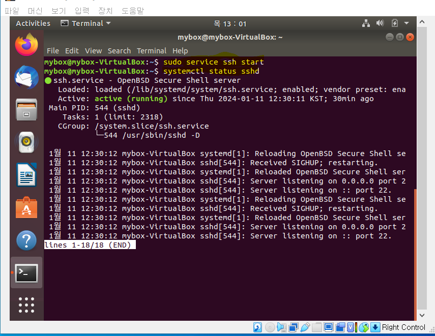

---
### 단계4: ip확인 
- cmd > host pc
```shell
ipconfig/all
```
- ubuntu > guest pc
```shell
ifconfig
```
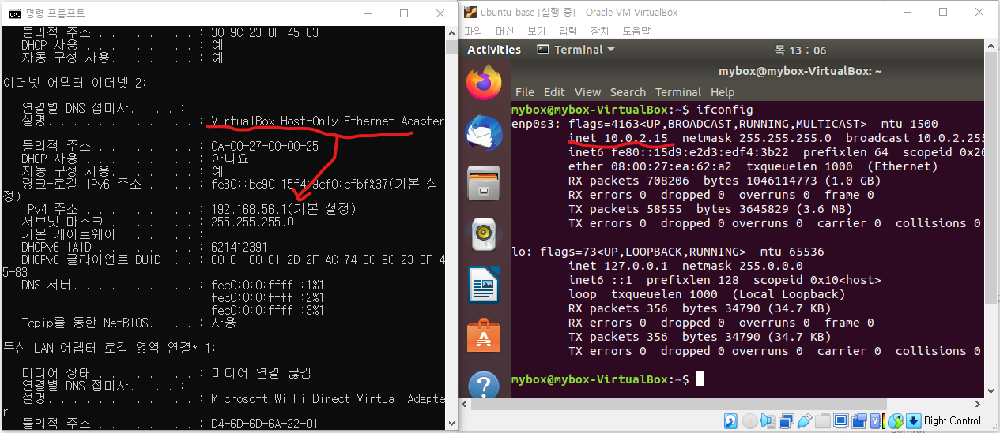

---
### 단계5: 포트포워딩 설정 
- 호스트IP: host ip
- 게스트IP: guest ip


---
### 단계6: ubuntu 재기동 
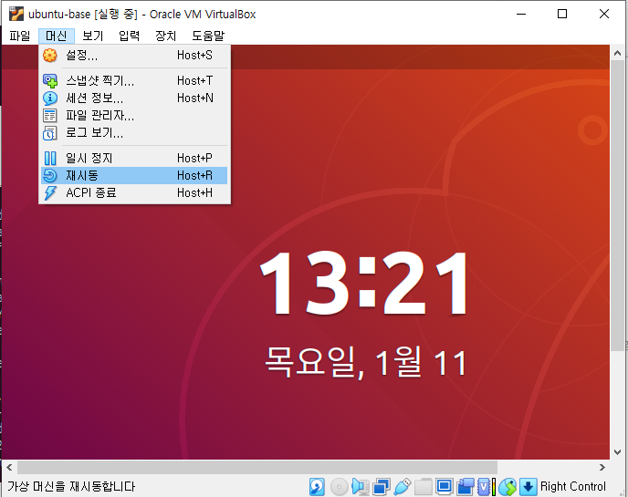

---
### 단계7: config 파일 
- Git Bash를 실행 
- .ssh 생성 
```shell
mkdir ~/.ssh
```
- config 생성 및 작성 
```shell
vim ~/.ssh/config

# 아래 내용 작성 
Host 게스트명 
  HostName 호스트IP
  User 게스트명
```

---
### 단계8: 게스트pc 접속 및 나오기
- Git Bash를 실행 & ubuntu 접속
```shell
ssh 게스트명
```
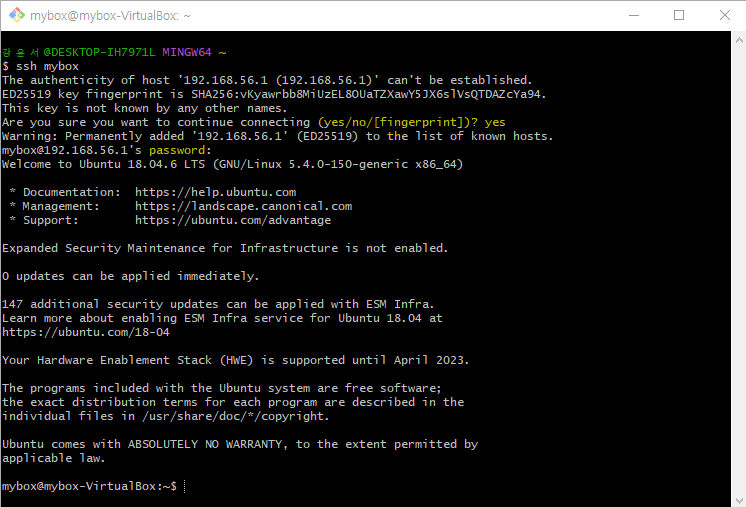
- ubuntu 에서 나오기
```shell
exit
```


