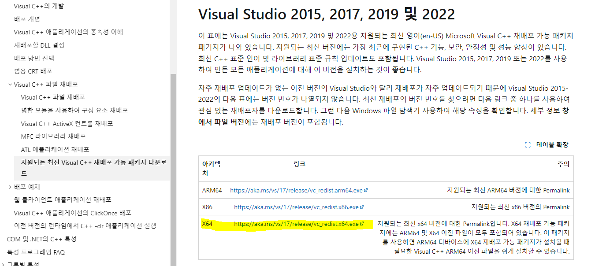
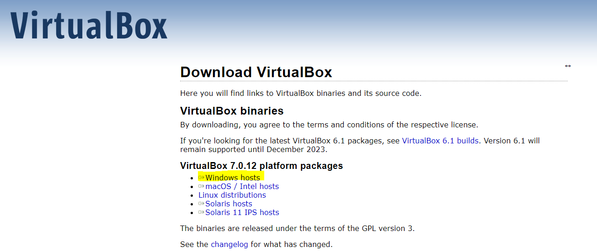
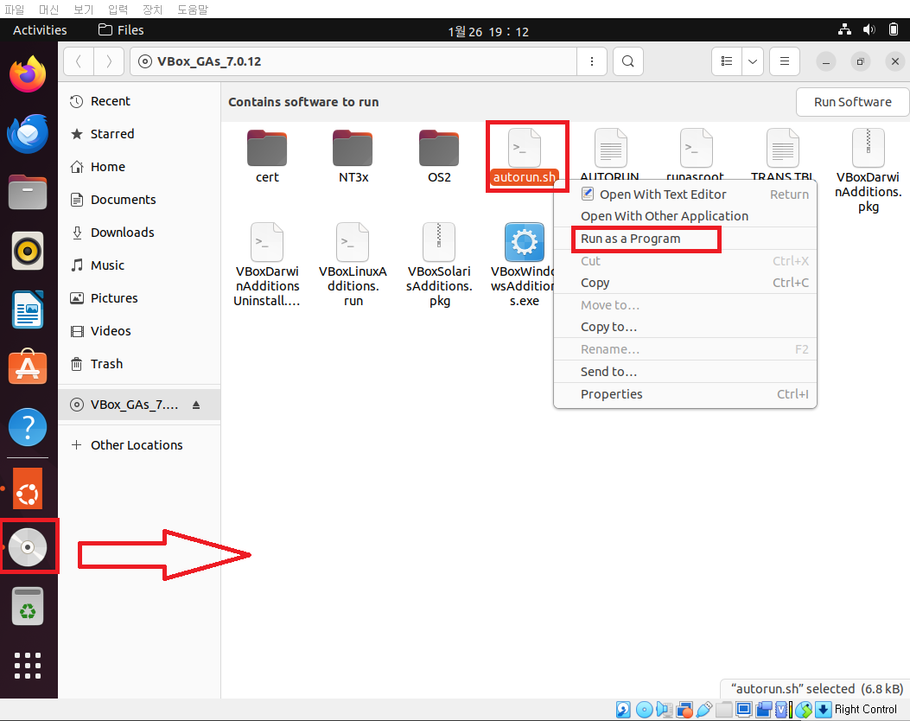
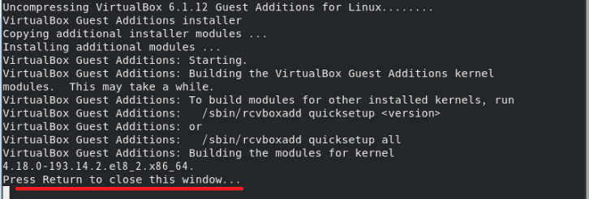

# [VirtualBox란?](https://www.oracle.com/kr/virtualization/virtualbox/)
- VirtualBox는 사용자가 호스트 운영 체제에서 가상 머신을 생성하고 실행할 수 있게 해주는 가상화 소프트웨어다. 
- VirtualBox는 Windows, macOS, Linux 및 다양한 Unix 기반 시스템을 포함한 광범위한 호스트 및 게스트 운영 체제와 호환된다.

---
# [네트워크 기초](../네트워크%20기초.md) 
- 네트워크란 그물을 뜻하는 Net과 Work의 합성어로, 그물처럼 서로 긴밀하게 연결되어 있는 것을 뜻합니다. 
- 보통 IT에서 사용되는 정의로 보자면 두 대 이상의 컴퓨터들을 연결하고 서로 통신할 수 있는 것을 말합니다. 

### [virtualbox 네트워크](./virtualbox%20네트워크.md)

---
# 설치 
### [단계1: visual c++ 2019 설치](https://learn.microsoft.com/ko-kr/cpp/windows/latest-supported-vc-redist?view=msvc-170)

---
### [단계2: VirtualBox 설치](https://www.virtualbox.org/wiki/Downloads)

---
# [우분투 생성 예제](./우분투%20생성%20예제.md)

---
# [ssh 통신 예제](ssh%20통신%20예제.md)

---
# [클립보드](https://sidepower.tistory.com/61)
- Ctrl + c / Ctrl + v 

### 단계1: [Virtual Box 게스트 확장 프로그램 설치](https://sidepower.tistory.com/43) 
- 우분투 접속 > 장치 > 게스트 확장 CD 이미지 삽입

---
- Run

---
- 만약 실행이 안된다면,

---
- Enter

---
### 단계2: 클립보드 양방향 설정

